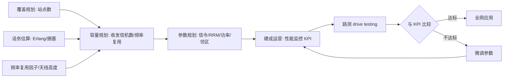

# 容量初步与参数规划优化

> 本页属于：CEG5104 / Week 01
> 前置知识：[[CEG5104-Week01-覆盖与传播模型]]
> 预计阅读时间：5 分钟

**容量规划**决定所需基站的**数量**与各自的**容量**。其中，某区域所需的基站个数来自**覆盖规划**，而所需的收发信机（transceiver）数量则来自**容量规划**，且依赖**频率复用因子**。频率复用因子定义为“频率能被再次复用之前，可以先布置多少个基站”。容量规划的三个关键参数：**估算话务量、天线高度、频率复用**。（来源：1_network_planning.pdf 第 67 页。）

**话务估算（traffic estimation）**：基于理论估算或假设，并参考既有网络的研究（经验）。基本单位是 **Erlang（erl）**：$1\text{ Erl}$ = 一个用户占用一个话务信道一小时所产生的业务量。**移动性（mobility）**：静态用户与动态用户的比值最初约 0.7，现在接近 1.0。**拥塞（blocking）**：用户因资源不足而无法接通被叫。（来源：1_network_planning.pdf 第 68 页。）需要注意的是，Erlang/泊松/排队等细致的话务模型（如 Erlang-B/C、阻塞概率）留到 **Week 2** 展开，本页只做入门。

**参数规划（parameter planning）**：无线网里的参数分**固定**与**实测**两类，涵盖信令、无线资源管理（RRM）、功率控制、邻区等。所谓**信令（signalling）**，是为让数据到达目的地所需的额外信息。举例：手机初次尝试入网时，需要**频率校正信道（FCCH）**和**同步信道（SCH）**；手机要向基站发送信息时，通过**随机接入信道（RACH）**发起请求。（来源：1_network_planning.pdf 第 69 页。）

| 规划环节 | 输入/依据 | 输出 |
| --- | --- | --- |
| 覆盖规划 | 地理区域、传播模型、链路预算 | 基站（站点）数量与位置 |
| 容量规划 | 估算话务、频率复用因子、天线高度 | 每基站收发信机数量、信道配置 |
| 参数规划 | 信令/RRM/功率/邻区参数 | 参数集（固定+实测） |
| 无线网络优化 | KPI、路测、误码/掉话指标 | 微调后全网参数 |

**无线网络优化（optimization）**：即对已建成并运营的网络**监控、验证、改进**性能。做法是把实际性能与选定的**关键性能指标（KPI）**比较，KPI 覆盖语音、数据、视频质量；其它度量包括**误比特率（BER）**、**误帧率（FER）**、**掉话率（DCR）**。性能监控围绕容量与覆盖这两条主线评估关键参数。**路测（drive testing）**是最常见的实地验证手段：开车带着设备沿路测量，检验规划结果是否达标，再据此微调参数后再全网应用。（来源：1_network_planning.pdf 第 70–72 页。）

图 1：容量规划→参数规划→优化闭环（自制，依据 1_network_planning.pdf 第 67–72 页；核对 2026-09-07）。

## 下一步

- 上一页：[[CEG5104-Week01-覆盖与传播模型]]
- 下一页：[[CEG5104-Week02-多址接入与容量]]
- 返回：[[Home]]

## 来源与更新日志

- 来源：[1_network_planning.pdf](https://github.com/Kytolly/NUS-coursework-wiki/releases/download/CEG5104/1_network_planning.pdf)，slide 67–69（容量规划/话务估算/参数规划）、70–72（无线网络优化/路测）。
- 2026-09-07：从 Week 1 课件拆出该主题短页。
- 2026-09-07：补全内容并新增图解与原图（容量/优化闭环 Mermaid 图、规划环节对比表）。
