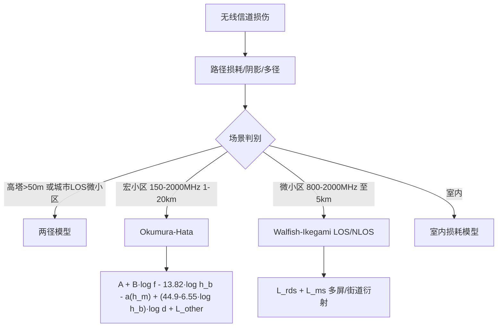

# 覆盖与传播模型

> 本页属于：CEG5104 / Week 01
> 前置知识：[[CEG5104-Week01-网络规划流程与链路预算]]
> 预计阅读时间：6 分钟

覆盖好坏既取决于**自然因素**（地形、传播条件），也取决于**人为因素**（城市/郊区/乡村的景观、用户行为）。衡量覆盖质量的根本标尺是**位置概率（location probability）**：即目标区域内场强高于灵敏度**水平**的概率。为此要在规划期尽可能准确地预测传播；规划员可以自建传播模型，也可以直接采用现有标准模型。（来源：1_network_planning.pdf 第 44 页。）

**无线信道损伤**：无线电波经**视距（LOS）**、**反射**、**衍射**、**散射**传播，多径叠加产生**多径衰落**与**阴影衰落**；收发双方的相对运动使场强随时间变化。三类损伤：

| 损伤 | 成因 | 类型 | 尺度 |
| --- | --- | --- | --- |
| 路径损耗（path loss） | 随距离衰减 | 大尺度/慢 | 平均场强随 20 m–20 km 变化 |
| 阴影（shadowing） | 山、楼、树叶、墙体等遮挡 | 慢衰落 | 长期（秒~分钟级） |
| 多径（multipath） | 多次反射/散射叠加 | 快衰落 | 短时（几波长/几秒级） |

**传播建模的两个目标**：① 对给定收发间距（20 m–20 km）预测平均接收场强；② 预测短距离/短时间（几个波长或几秒）内场强的起伏大小与速度。在 1 GHz 下 $\lambda = c/f = 0.3$ m，接收场强可剧烈摆动 30–40 dB。（来源：1_network_planning.pdf 第 50 页。）

**两径模型（two-ray）**：适合高于 50 m 的高塔系统，以及城市中对视距传输的微小区系统。（来源：1_network_planning.pdf 第 61 页。）

**宏小区模型——Okumura–Hata**：适用于 150–1000 MHz 与 1500–2000 MHz、距离 1–20 km：

$$
L = A + B \log f - 13.82 \log h_b - a(h_m) + (44.9 - 6.55 \log h_b) \log d + L_{\text{other}}
$$

其中 $f$ 为频率（MHz），$h_b$（课件正文又写作 $h_{\text{bts}}$）为 BTS 天线高度（m），$h_m$ 为 MS 天线高度，$d$ 为 km，$L_{\text{other}}$ 为地物衰减。常数：150–1000 MHz 时 $A=69.55$、$B=26.16$；1000–2000 MHz 时 $A=46.3$、$B=33.9$。$a(h_m)$ 对小/中城市取 $(1.1\log f_c-0.7)h_m-(1.56\log f_c-0.8)$；大城市分频段取 $8.29(\log 1.54h_m)^2-1.1$（$\le 300\text{ MHz}$）或 $3.2(\log 11.75h_m)^2-4.97$（$\ge 300\text{ MHz}$）。注意：这里 $a(h_m)$ 是单独减去的一项，**不是**乘到距离系数上（常见易错点）。（来源：1_network_planning.pdf 第 62–63 页。）

**微小区模型——Walfish–Ikegami**：适用于 800–2000 MHz、建筑高度到 50 m、距离到 5 km。视距：

$$
P = 42.6 + 26 \log d + 20 \log f
$$

非视距（NLOS）：

$$
P = 32.4 + 20 \log f + 20 \log d + L_{\text{rds}} + L_{\text{ms}}
$$

$L_{\text{rds}}$ 为屋顶到街道衍射损耗，$L_{\text{ms}}$ 为多屏损耗。（来源：1_network_planning.pdf 第 64 页。）

| 模型 | 适用场景 | 频率/距离 | 关键参数 |
| --- | --- | --- | --- |
| 两径 | 高塔 >50 m、城市 LOS 微小区 | 视距为主 | 直射+地面反射 |
| Okumura–Hata | 宏小区 | 150–2000 MHz、1–20 km | A、B、h_b、a(h_m)、L_other |
| Walfish–Ikegami | 微小区 | 800–2000 MHz、≤5 km、楼高≤50 m | LOS / NLOS、L_rds、L_ms |

**室内损耗模型**：课件在第 65–66 页另列室内场景模型，作为室内覆盖的补充（如多楼层/多墙、家具与隔断损耗）；具体公式在课件中为图，此处保留“室内补充分支”，不再逐项复制。

图 1：传播模型选择与应用链路（自制，依据 1_network_planning.pdf 第 50、61–66 页；核对 2026-09-07）。

## 下一步

- 上一页：[[CEG5104-Week01-网络规划流程与链路预算]]
- 下一页：[[CEG5104-Week01-容量初步与参数规划优化]]
- 返回：[[Home]]

## 来源与更新日志

- 来源：[1_network_planning.pdf](https://github.com/Kytolly/NUS-coursework-wiki/releases/download/CEG5104/1_network_planning.pdf)，slide 44–66（覆盖/无线电传播/信道损伤/Okumura–Hata/Walfish–Ikegami/室内损耗）。
- 2026-09-07：从 Week 1 课件拆出该主题短页。
- 2026-09-07：补全内容并新增图解与原图（传播模型选择 Mermaid 图）、修正 Hata 公式并补对比表。
