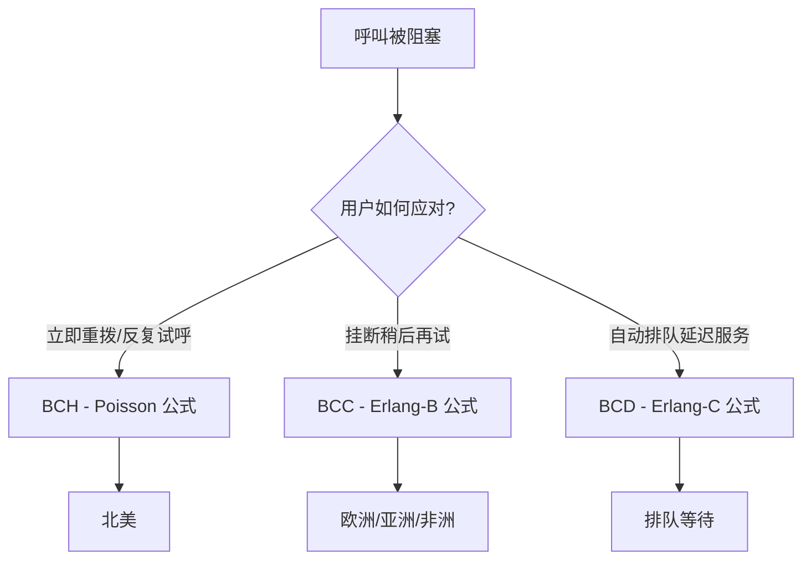

# 业界呼损模型与例题

> 本页属于：CEG5104 / Week 02
> 前置知识：[[CEG5104-讲义与笔记索引]]
> 预计阅读时间：7 分钟

传统话务工程用三种模型处理“呼叫丢失”：

- **BCH（Blocked Call Held）**：用户接到拥塞信号后**立即重拨**并继续反复试呼；用 **Poisson 公式**；北美采用。
- **BCC（Blocked Call Cleared）**：用户挂断，等一段时间再试；用 **Erlang-B 公式**；欧洲、亚洲、非洲采用。
- **BCD（Blocked Call Delayed）**：用户自动排队，设备空闲时再服务；用 **Erlang-C 公式**。

（来源：2_capacity_analysis.pdf 第 62 页。）

**Poisson 公式（BCH）**：假设无限个独立信源、每信源话务密度相等、丢失呼叫被“持有”。呼损：

$$
p_b = e^{-A} \sum_{i=N+1}^{\infty} \frac{A^i}{i!}
$$

（$A$ 为提供话务，$N$ 为中继线/信道数。来源：2_capacity_analysis.pdf 第 63 页。）

**Erlang-C 公式（BCD）**：无限独立信源、丢失呼叫被“延迟”、服务时间指数、按到达顺序服务：

$$
C(N, A) = \frac{\frac{A^N}{N!} \frac{1}{1-A/N}}{\sum_{i=0}^{N-1} \frac{A^i}{i!} + \frac{A^N}{N!} \frac{1}{1-A/N}}
$$

（来源：2_capacity_analysis.pdf 第 64 页。）Erlang-B 即 M/M/c/c 的无等待阻塞概率 $B(c,A)=\frac{A^c/c!}{\sum_{i=0}^{c}A^i/i!}$，在 Week 2 排队论页已给出。

图 1：三种业界呼损模型选择（自制，依据 2_capacity_analysis.pdf 第 62–64 页；核对 2026-09-07）。

三者区别在于对“被阻塞呼叫”的处理不同：BCH 认为用户会不停地重拨，因此更贴近话务量大、用户粘性强的北美场景；BCC 认为用户会挂断等待后再试，给出的是“呼叫被立即清除”时的呼损，即 Erlang-B，是欧洲/亚洲/非洲的常用口径；BCD 假定用户愿意排队，因此适合有等待空间的系统（如客服中心、动态信道分配）。工程上 Erlang-B 因结论对 M/G/c/c 也成立、且有现成 Erlang 表可查而最常被采用。

**课堂例题**：

- **例 1（Erlang 话务与 MSC 数）**：总人口 20 万、渗透率 25% → 5 万用户。移动→固定/固定→移动：保持 $100\text{ s}$、$3\text{ 次/时}$；移动→移动：保持 $80\text{ s}$、$4\text{ 次/时}$；话务占比 50% / 40% / 10%。做法：每类话务强度 = 呼叫率 × 保持时间（小时），按占比加权后再乘用户数得总 Erlang；每个 MSC 承载 $1800\text{ Erl}$，所需 $\text{MSC} = \lceil \text{总 Erlang} / 1800 \rceil$。

  计算（重建）：每用户话务 $= 3 \times (100/3600) \times 0.50 + 3 \times (100/3600) \times 0.40 + 4 \times (80/3600) \times 0.10 \approx 0.0839\text{ Erl} \implies 50000 \times 0.0839 \approx 4194\text{ Erl} \implies \text{MSC} = \lceil 4194/1800 \rceil = 3\text{ 个}$。（课件只给数据与思路，未给最终值；此值为按上述方法重建。）

- **例 2（M/M/3/6 稳态）**：$\lambda = 40/\text{min}$、$\mu = 30/\text{min}$，$c = 3$、$K = 6$，$\rho = \frac{\lambda}{c\mu} = \frac{40}{90} = \frac{4}{9}$。画状态转移图，解 M/M/c/K 平衡方程得 $p_0 \dots p_6$；提供话务 $a = \frac{\lambda}{\mu} = \frac{4}{3}\text{ Erl}$；**有效话务** = 提供话务 $\times (1 - \text{呼损})$，**阻塞话务** = 提供话务 $\times \text{呼损}$。（来源：2_capacity_analysis.pdf 第 66 页。）

- **例 3（BS-BSC MMS 队列）**：基站为 MMS 预留 3 信道，忙时最多再等 4 条，故为 M/M/3/7 有限容量队列；峰值 $\lambda = 1\text{ 条/s}$、平均服务 $6\text{ s}$。用 M/M/c/K 稳态求系统内平均消息数、平均等待时间（Little 定律 $L = \lambda W$）与丢失比例。（来源：2_capacity_analysis.pdf 第 67 页。）

应用提醒：三个公式都假设“大量独立的微小信源”，当用户数很少或呼叫高度相关时偏差较大；工程上常以 Erlang-B 为核心，用 Erlang-C 评估允许排队的系统，再结合实测数据标定。

## 下一步

- 上一页：[[CEG5104-Week02-排队论基础与Erlang]]
- 下一页：[[CEG5104-Week03-空间复用与SIR分析]]
- 返回：[[Home]]

## 来源与更新日志

- 来源：[2_capacity_analysis.pdf](https://github.com/Kytolly/NUS-coursework-wiki/releases/download/CEG5104/2_capacity_analysis.pdf)，slide 67–72（业界呼损模型与三个课堂例题）。
- 2026-09-07：从 Week 2 课件拆出该主题短页。
- 2026-09-07：补全内容并新增图解与原图（三种呼损模型 Mermaid 图、例 1 计算重建）。
