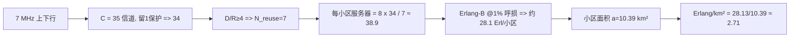

# 例题与小结

> 本页属于：CEG5104 / Week 03
> 前置知识：[[CEG5104-讲义与笔记索引]]
> 预计阅读时间：6 分钟

## Worked Problem 1

**题目**（课件 3_frequency_allocation.pdf 第 76 页）：GSM 运营商租用 $7\text{ MHz}$ 频谱（上下行各 $7\text{ MHz}$），要求 $D/R \ge 4$，小区半径 $R = 2\text{ km}$（六边形），目标呼损 $1\%$。求网络每平方公里的 Erlang 数。

课件只给出题目、未给解法；以下按 Week 2 的 Erlang-B 搭配 Week 3 的频率复用思路重建：

1. **信道数 $C$**：$7\text{ MHz} \div 200\text{ kHz}$（GSM 信道间隔）$= 35$，留一个保护信道，取 $C = 34$（每方向；上下行通常共用同一 $C$）。
2. **复用因子**：$D/R = \sqrt{3 N_{\text{reuse}}} \ge 4 \implies N_{\text{reuse}} \ge 5.33 \implies$ 取最小可用的 $N_{\text{reuse}} = 7$（由 3_frequency_allocation.pdf 第 27 页，$N=7 \implies D/R \approx 4.58$）。
3. **每小区服务器数**：$s = 8$（每载波时隙），$K = 1$（无扇区），则 $\frac{sC}{N_{\text{reuse}} K} = \frac{8 \times 34}{7} \approx 38.9$。
4. **每小区 Erlang 负载**：查 Erlang-B 表（或公式）求 $1\%$ 呼损、约 39 服务器对应的承载业务量，用 Erlang-B 公式 $B(c,A)=\frac{A^c/c!}{\sum_{i=0}^{c}A^i/i!}$ 数值求解得 **$A \approx 28.1\text{ Erl}$**。
5. **六边形小区面积**：$a = \frac{3\sqrt{3}}{2} R^2 = \frac{3\sqrt{3}}{2} \times 2^2 \approx 10.39\text{ km}^2$。
6. **每平方公里 Erlang** = 每小区 Erlang $\div a \approx 28.13 / 10.39 \approx$ **$2.71\text{ Erl/km}^2$**。

> Open：课件印出的 Erlang 表只到 20 个服务器，38.9 需用 Erlang-B 公式/完整表；服务器数取整（$38.9 \to 39$）会产生约 $0.1\text{--}0.2\text{ Erl}$ 的差异，最终约 $2.7\text{ Erl/km}^2$ 为按公式重建值，待与课件答案核对。

**为什么这样算**：Erlang-B 给出的是“给定服务器数与呼损目标时每个小区能承载多少 Erl 话务”。把每小区承载除以复用因子可换算成整网频谱的平均贡献——但注意这里的 $C$ 已经是整段可用频谱分给每个簇的信道数，因此每小区服务器数 $= \frac{sC}{N_{\text{reuse}} K}$ 已隐含“全部频谱分成 $N_{\text{reuse}}$ 簇、每簇内一个小区拿到 $C/N_{\text{reuse}}$ 个载波”；再乘 $s$ 个时隙即得该小区可同时服务的信道数。最后除以六边形面积 $a$，就把“容量”归一化为单位面积话务密度，便于跨地区、跨制式比较。

图 1：Worked Problem 1 求解链（自制，依据 3_frequency_allocation.pdf 第 76 页 + Week 2 Erlang-B；核对 2026-09-07）。

## 本章小结

- **空间复用**：同频小区必须隔开足够远的 $D/R$，以把同频干扰压到目标之内。
- **SIR 分析**：最坏情况分析给出所需 $D/R \implies$ 六边形簇大小 $N_{\text{reuse}} = i^2 + ij + j^2$、$D/R = \sqrt{3 N_{\text{reuse}}}$；**扇区化**降低有效同频干扰源数（$\Psi \approx \frac{1}{2(D/R)^{-\eta}}$）。
- **频谱效率** $\nu = \frac{\Lambda}{AW}$ 在簇大小、扇区数、小区面积之间折中；**小区分裂**（4:1、3:1）提升容量但增加切换与信令。
- **信道分配**：在 FCA（固定，含借用 SB/SBR/BA/BAR/BFA）、DCA（动态，集中/分布式）、HCA（混合，最优固定:动态$\approx 3:1$）以及弹性 FCA、1D 复用划分、重叠小区方案中权衡复用率与灵活性。
- **定量工具链**：Week 2 的 Erlang-B 提供“给定服务器数 + 呼损 $\to$ 承载话务”；把该系统容量除以复用因子与小区面积即可得每平方公里 Erlang（见 Worked Problem 1）。

把 Week 01–03 串起来看：覆盖与链路预算决定**小区半径**，话务与 Erlang-B 决定**每小区容量**，频率复用/扇区化/信道分配决定**如何用有限频谱撑起容量**；Worked Problem 1 正是这条主线的一次综合练习。

## 下一步

- 上一页：[[CEG5104-Week03-频谱效率与信道分配]]
- 下一页：[[CEG5104-当前进度与待补内容]]
- 返回：[[Home]]

## 来源与更新日志

- 来源：[3_frequency_allocation.pdf](https://github.com/Kytolly/NUS-coursework-wiki/releases/download/CEG5104/3_frequency_allocation.pdf)，slide 76–77。
- 2026-09-07：从 Week 3 课件拆出该主题短页。
- 2026-09-07：补全内容并新增图解与原图（Worked Problem 1 求解链 Mermaid 图、定量重建结果）。
