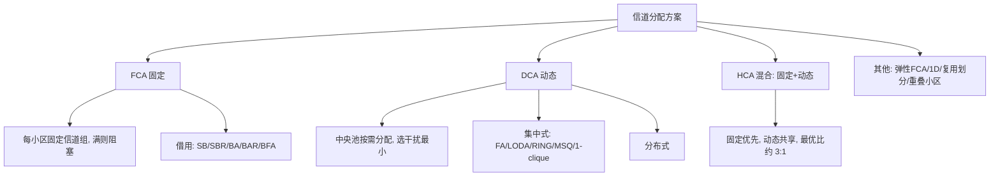

# 频谱效率与信道分配

> 本页属于：CEG5104 / Week 03
> 前置知识：[[CEG5104-讲义与笔记索引]]
> 预计阅读时间：7 分钟

## 频谱效率的关键量

$W$ 为总频谱，$C$ 为信道（载波），$s$ 为每信道时隙数，$K$ 为每小区扇区数，$N_{\text{reuse}}$ 为簇大小。$C$ 个载波分成 $N_{\text{reuse}}$ 个簇，每簇再按扇区分成 $K$ 组（理想化：无移动、无切换）。（来源：3_frequency_allocation.pdf 第 36 页。）于是：

- 每扇区服务器数 $= \frac{sC}{N_{\text{reuse}} K}$。
- $g_\varepsilon(n)$ 表示目标呼损 $\varepsilon$、$n$ 个服务器时**每个服务器可承载的业务量**（Erlang-B 每服务器负载）。每小区负载 $= g_\varepsilon(\cdot) \cdot \left[\frac{sC}{N_{\text{reuse}} K}\right] \cdot K$；系统容量 $\Lambda = \left(\frac{A}{a}\right) \cdot g_\varepsilon(\cdot) \cdot \frac{sC}{N_{\text{reuse}}}$。（来源：3_frequency_allocation.pdf 第 37–38 页。）

## 频谱效率定义

$$
\begin{aligned}
\nu &= \frac{\Lambda}{A W} \\
    &= \left(\frac{1}{a}\right) \left(\frac{sC}{W}\right) g_\varepsilon\left( \frac{sC}{W} \cdot \frac{W}{N_{\text{reuse}} K} \right) \left(\frac{1}{N_{\text{reuse}}}\right)
\end{aligned}
$$

- $sC/W$ 由可用频谱固定，不可变。
- $g_\varepsilon(\cdot) \cdot (1/N_{\text{reuse}})$ 随 $N_{\text{reuse}}$ 与 $K$ 增大而下降——簇越大/扇区越多，每组信道越少，中继效率越低。
- $N_{\text{reuse}}$ 与 $K$ 同时决定 SIR，所以效率与干扰要折中。
- 减小单小区面积 $a$ 可提高 $\nu$（更小蜂窝→更高容量）；代价是切换增多、信令负载上升、需更多基站。（来源：3_frequency_allocation.pdf 第 39–40 页。）

## 小区分裂

重流量小区可分裂成更小的小区，增加信道复用。**4:1 分裂**：新小区位于两小区边界，半径为旧 $1/2$、面积为 $1/4$；**3:1 分裂**：位于三小区角落，半径为旧 $1/\sqrt{3}$、面积为 $1/3$。按复用因子选法：$N=3 \to 4:1$，$N=4 \to 3:1$，$N=7 \to 3:1\text{ 或 } 4:1$，$N=9 \to 4:1$。（来源：3_frequency_allocation.pdf 第 41–46 页。）

图 1：信道分配方案分类树（自制，依据 3_frequency_allocation.pdf 第 47–75 页；核对 2026-09-07）。

## 信道分配

问题：把频谱切成互不相交信道，可同时使用且最小化邻道干扰。

- **FCA（固定）**：每小区固定一组信道，满则阻塞；最小信道组数 $N = \frac{D}{\sqrt{3} R}$。短期波动下 QoS 差，可向邻区借信道（SB/SBR/BA/BAR/BFA）。（来源：3_frequency_allocation.pdf 第 49–54 页。）
- **DCA（动态）**：信道放中央池、按需分配，选干扰最小者；分集中与分布式。集中式理论最优但开销大、延迟高、不实用；代表 FA/LODA/RING/MSQ/1-clique。（来源：3_frequency_allocation.pdf 第 55–62 页。）
- **对比**：FCA 重负载较好、最大复用、适大蜂窝；DCA 轻重负载好、灵活、无频率规划、适微蜂窝。（来源：3_frequency_allocation.pdf 第 63–64 页。）

| 维度 | FCA | DCA |
| --- | --- | --- |
| 重流量 | 较好 | 一般 |
| 轻/中流量 | 一般 | 较好 |
| 复用度 | 最大 | 不一定最大 |
| 灵活性 | 低 | 高 |
| 频率规划 | 复杂、费时 | 无需 |
| 计算/信令开销 | 低 | 中–高 |
| 适用环境 | 大蜂窝 | 微蜂窝 |

- **HCA（混合）**：信道分“固定+动态”，固定优先、动态共享；最优固定:动态≈3:1（50% 话务优于固定，15–40% 话务 HCA 更好）。（来源：3_frequency_allocation.pdf 第 66–67 页。）
- **弹性 FCA**：固定 + 紧急集，分 Scheduled（预先估计）与 Predictive（实时监测）。（来源：3_frequency_allocation.pdf 第 68 页。）
- **1D 系统**：选一个“到下一小区时刚好释放”的信道（如 cell 1 用信道 e，因 cell 7 移动台移走后释放）。（来源：3_frequency_allocation.pdf 第 69 页。）
- **复用划分**：小区分同心区，内区近基站、可用更小功率。（来源：3_frequency_allocation.pdf 第 70 页。）
- **重叠小区**：分裂为 micro/pico 蜂窝；快速移动台分到大蜂窝（减少切换），低移动台分到 micro/pico；重叠区无需切换，最坏可借邻区空闲信道。（来源：3_frequency_allocation.pdf 第 71–75 页。）

## 下一步

- 上一页：[[CEG5104-Week03-六边形布局与扇区化]]
- 下一页：[[CEG5104-Week03-例题与小结]]
- 返回：[[Home]]

## 来源与更新日志

- 来源：[3_frequency_allocation.pdf](https://github.com/Kytolly/NUS-coursework-wiki/releases/download/CEG5104/3_frequency_allocation.pdf)，slide 36–46（频谱效率与小区分裂）、47–75（信道分配）。
- 2026-09-07：从 Week 3 课件拆出该主题短页。
- 2026-09-07：补全内容并新增图解与原图（信道分配分类树 Mermaid 图、FCA/DCA 对比表）。
