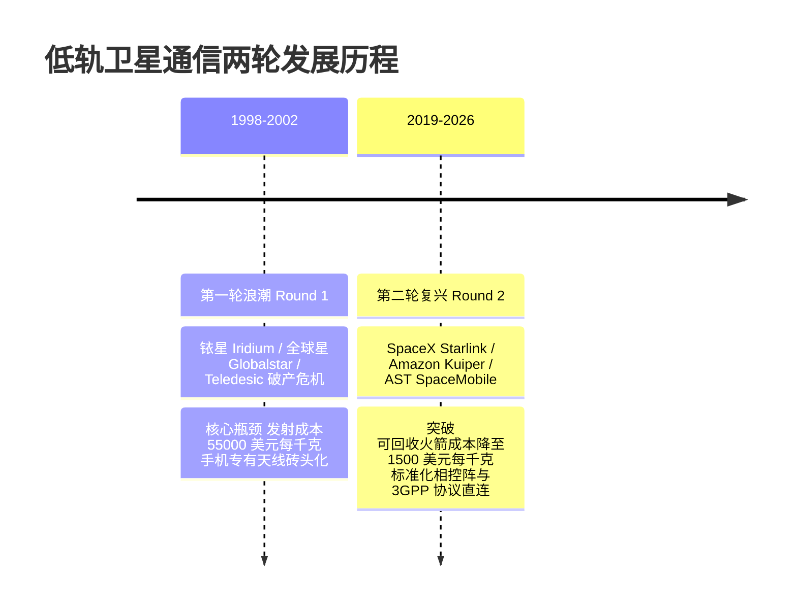
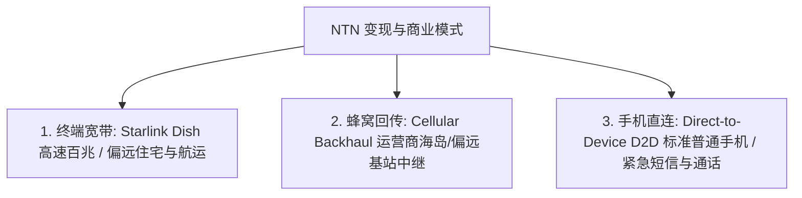

# NTN 产业格局与商业模式

> 本页属于：CEG5104 / Week 04
> 前置知识：[[CEG5104-Week04-NTN标准化与Beyond-5G演进]]
> 预计阅读时间：7 分钟

---

## 1. 两次低轨卫星浪潮：历史教训与技术转折 (Round One vs Round Two)

人类对低轨卫星全球通信的探索经历过两次历史浪潮：

### 为什么第二轮浪潮能够取得颠覆性商业突破？

1. **进入太空的成本断崖式下降 (Launch Costs)**：
   - 20 世纪 90 年代，运载火箭入轨成本高达 $\approx \$55,000 / \text{kg}$（如航天飞机时代）。
   - 随着 SpaceX Falcon 9 可重复使用一级火箭及星舰（Starship）的成熟，入轨成本已下降至 $\approx \$1,500 / \text{kg}$，降幅超过 97%。
2. **工业化卫星量产 (Mass Production)**：
   - 传统航天采用“手工定制、单颗耗资数亿美元”的作坊模式。
   - 现代巨型星座采用汽车流水线装配，Starlink 单星成本压降至数十万美元，单次发射可部署数十甚至上百颗卫星。
3. **标准化与消费级芯片集成**：
   - 第一代系统必须使用专用“手提大砖头”卫星电话；
   - 第二代 NTN 基于 3GPP 标准，普通消费级智能手机（如 Apple iPhone 14+ / 华为 Mate 60+）只需微调基带与射频前端，即可直接与卫星建立通信。

---

## 2. NTN 三大主流商业模式 (Three Commercial Models)

当前 NTN 产业存在三大差异化服务业态：

| 商业模式类别 | 典型代表厂商 | 终端形态 | 峰值吞吐速率 | 目标客户与收费模式 |
| :--- | :--- | :--- | :--- | :--- |
| **1. 固定/移动终端宽带 (Terminal Broadband)** | SpaceX Starlink, Amazon Kuiper, Eutelsat OneWeb | 专用电子扫描相控阵“小锅”天线 (Dish) | $100 \sim 300\text{ Mbit/s}$ | 偏远家庭宽带、房车 (RV)、邮轮、商用民航客机，按月收取高额订阅费 |
| **2. 蜂窝网络中继回传 (Cellular Backhaul)** | Intelsat, SES, OneWeb | 基站铁塔顶部的中继抛物面天线 | 数百 $\text{Mbit/s}$ | 电信运营商（MNO），将深山、孤岛或灾区临时基站回传至地面核心网 |
| **3. 手机直连卫星 (Direct-to-Device / D2D)** | AST SpaceMobile, Starlink Direct-to-Cell, Apple + Globalstar, Lynk | **无需改装的标准智能手机** | $2 \sim 10\text{ Mbit/s}$ (语音/短信/有限数据) | 徒步探索、出海渔民、无信号盲区紧急 SOS、主流运营商联合增值包 |

---

## 3. 手机直连卫星 (D2D) 的核心工程奇迹

“手机直连卫星”（Direct-to-Cell / Direct-to-Device）是当前移动通信最炙手可热的制高点。要在 $500\text{ km}$ 轨道高度接收地面仅有 $0.2\text{ W}$（$23\text{ dBm}$）全向天线发射的微弱信号，卫星端必须具备极高灵敏度：

- **超大空间孔径相控阵天线**：例如 AST SpaceMobile 的 BlueWalker 3 与 BlueBird 卫星，在太空中展开达 $64\text{ m}^2$ 甚至数百平方米的巨大天线阵面，通过极高天线增益（$> 40\text{ dBi}$）汇聚来自手机的微弱信号。
- **与地面移动运营商（MNO）合作频段**：通过租用或共享地面运营商的现网频段（如 T-Mobile 的 1.9 GHz PCS 频段），使得存量普通手机在没有任何硬件改动的情况下，直接把卫星当作“空中的漫游蜂窝基站”。

---

## 4. 监管、频谱与主权挑战 (Regulatory & Spectrum Challenges)

1. **ITU 频谱与轨道先占权 (First-Come, First-Served)**：
   - 国际电信联盟（ITU）对卫星轨道位置和无线电频段采取申请优先原则，引发了低轨近地空间资源的全球争夺战。
2. **国家主权与落地监管权 (Landing Rights)**：
   - 任何卫星向某国境内发射无线电信号，必须取得该国电信主管机构的落地许可，并必须将本地流量通过境内信关站进行合法监听（Lawful Interception）与防火墙路由。
3. **空间碎片与轨道拥堵 (Space Debris & Sustainability)**：
   - 低轨预计将容纳数万颗卫星，碰撞风险急剧升高，对报废离轨推进系统提出了严苛的环保要求。

---

## 5. 本讲小结与考试复习重点

- **概念辨析**：透明弯管（Bent-pipe，只转发放大，Rel-17）与再生式（Regenerative，星上处理/路由，Rel-19+）。
- **几何与时延**：GEO（$35786\text{ km}$，RTT $\approx 500\text{ ms}$）与 LEO（$500 \sim 1200\text{ km}$，RTT $\approx 20 \sim 40\text{ ms}$）。
- **多普勒与同步**：LEO 卫星高速运动引发数十 kHz 多普勒频偏，终端利用 GNSS 坐标与 SIB19 星历在上行完成定时提前量与频偏的自主预补偿。
- **容量定律**：卫星覆盖面积大，提供高广域覆盖率，但单位面积容量密度（$D = C/A$）极低，与地面蜂窝形成互补而非竞争。

---

## 6. 下一步

- 上一页：[[CEG5104-Week04-NTN标准化与Beyond-5G演进]]
- 返回：[[CEG5104-讲义与笔记索引]]
- 返回课程主页：[[Home]]

## 来源与更新日志

- 来源：`CEG5104_Intro_to_NTN.pdf` Slide 39–52 (Dr. Varun Kohli, A*STAR)
- 2026-09-18：新建 NTN 产业格局、低轨浪潮对比、三大商业模式、D2D 关键技术与监管挑战，完成 Week 04 全模块归档。
