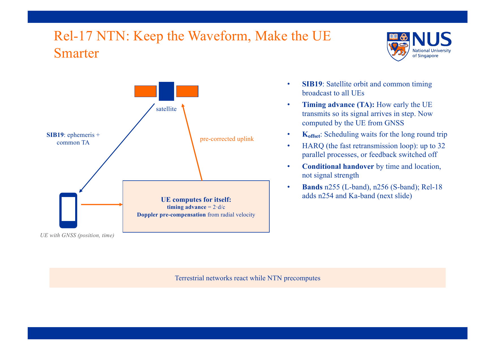
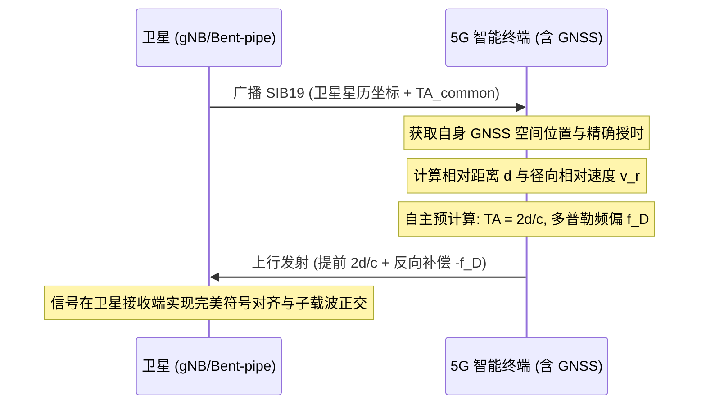
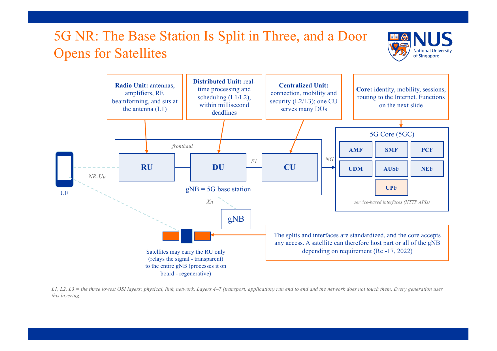
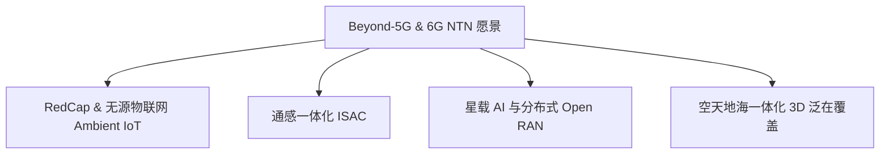

# NTN 标准化与 Beyond-5G 演进

> 本页属于：CEG5104 / Week 04
> 前置知识：[[CEG5104-Week04-NTN轨道几何与链路容量分析]]
> 预计阅读时间：8 分钟

---

## 1. 3GPP Rel-17 NTN 核心改造方案 (Keep the Waveform, Make UE Smarter)

在 3GPP Release 17 之前，卫星通信普遍采用专有的物理层波形与定制协议，导致专用终端昂贵且无法与普通手机兼容。3GPP Rel-17 的核心设计哲学是：**保持现有 5G NR 物理层波形（OFDM）基本不变，通过终端智能补偿与系统信标协助，解决空间物理信道带来的时延与频偏挑战。**

> **Figure Object 5**: 3GPP Rel-17 NTN 终端自主预补偿架构  
> - 📘 **来源 (Source)**: `CEG5104_Intro_to_NTN.pdf`  
> - 📍 **定位 (Locator)**: Slide 30 "Rel-17 NTN: Keep the Waveform, Make the UE Smarter"  
> - 💡 **解读 (Explanation)**: 展示了基于 GNSS（GPS/北斗/Galileo）定位的智能终端如何读取基站广播的 SIB19 星历参数，并在上行发射前自主完成定时提前量 (Timing Advance) 与多普勒频移的预补偿。  
> - 🔍 **看什么 (What to notice)**: 卫星广播系统信息块 **SIB19**，其中包含卫星精确星历（轨道位置、速度矢量）与公共定时提前量 ($TA_{common}$)；UE 测量自身 GNSS 坐标后，计算出相对卫星的瞬时斜距 $d$ 与径向速度 $v_r$，在上行发射时刻提前 $2d/c$ 发射，并反向预加频偏 $-f_D$，使所有不同位置终端的信号到达卫星接收机时在时间和频率上对齐！

---

## 2. 5G NR 基站解耦与星载切分 (RAN Split in Space)

在地面 5G NR 规范中，基站分为 CU (集中单元)、DU (分布式单元) 与 RU (射频单元)。在 NTN 演进中，决定哪一个部分留在地面、哪一个部分随卫星入轨是系统架构的核心分水岭：

> **Figure Object 6**: 5G NR 基站切分架构及其向卫星平台的映射  
> - 📘 **来源 (Source)**: `CEG5104_Intro_to_NTN.pdf`  
> - 📍 **定位 (Locator)**: Slide 10 "5G NR: The Base Station Is Split in Three, and a Door Opens for Satellites"  
> - 💡 **解读 (Explanation)**: 说明了 RU（射频与 L1 物理层前段）、DU（L1/L2 毫秒级实时调度）与 CU（L2/L3 连接与信令移动性管理）的功能划分与前传/中传/回传接口。  
> - 🔍 **看什么 (What to notice)**: 
>   - **Option A (透明转发)**：RU/DU/CU 全部在地面，卫星仅相当于延伸的天线反射面。
>   - **Option B (gNB-DU 上天)**：RU 与 DU 运行在卫星，毫秒级的 HARQ 与调度在星上完成，缓解超长 RTT 对 HARQ 确认机制的致命制约；F1 接口跨越馈电链路。
>   - **Option C (完整 gNB 上天)**：RU/DU/CU 均在星上，星上直接运行 IP 路由，地面仅需标准 5G 核心网 (5GC) 用户面/控制面接口。

---

## 3. 频段划分与标准化规范 (Spectrum Allocation)

根据 3GPP 规范，NTN 主要划分在两大类工作频段：

1. **卫星移动业务频段 (MSS, FR1 sub-6GHz)**:
   - 典型如 **S 频段 (2 GHz)**（如 Band n256: $1980 \sim 2010\text{ MHz}$ UL, $2170 \sim 2200\text{ MHz}$ DL）和 **L 频段 (1.5 / 1.6 GHz)**。
   - 特点：传播损耗相对较小，多普勒频移可控，天然适合普通手持终端和低功耗物联网直接连接。
2. **固定卫星业务宽带频段 (FSS, FR2 及毫米波)**:
   - 典型如 **Ku 频段 ($12 \sim 18\text{ GHz}$)** 和 **Ka 频段 ($26.5 \sim 40\text{ GHz}$)**。
   - 特点：带宽巨大（数 GHz），通常用于信关站馈电链路（Feeder Link）或配备定向跟踪相控阵天线的固定卫星天线终端（VSAT）。

---

## 4. 走向 5G-Advanced 与 6G 的技术演进 (Beyond-5G & 6G IMT-2030)

3GPP Release 18/19（5G-Advanced）及 ITU-R 6G IMT-2030 框架为空间通信引入了四大前沿支柱：

1. **RedCap (Reduced Capability, 轻量级终端)**：裁剪 5G 终端天线数、带宽与基带复杂度，使卫星物联网设备以极低电池功耗常年运行于野外或海上集装箱。
2. **环境物联网 (Ambient IoT)**：基于反向散射（Backscatter）技术的零功耗感知节点，由卫星高功率下行射频照明，实现全域物流与资产追踪。
3. **通感一体化 (ISAC, Integrated Sensing and Communication)**：卫星雷达探测与无线通信共用同一射频信号与硬件前端，既能通信，又能同时完成地球地表遥感、气象监测及低空飞行器轨迹追踪。
4. **星载 AI 与自主网络管理**：在巨型星座中引入分布式星上 AI 推理，自适应调度波束能量并预测地面业务潮汐，自主完成星间激光链路动态选路。

---

## 5. 下一步

- 上一页：[[CEG5104-Week04-NTN轨道几何与链路容量分析]]
- 下一页：[[CEG5104-Week04-NTN产业格局与商业模式]]
- 返回：[[CEG5104-讲义与笔记索引]]

## 来源与更新日志

- 来源：`CEG5104_Intro_to_NTN.pdf` Slide 29–38 (Dr. Varun Kohli, A*STAR)
- 2026-09-18：新建 3GPP Rel-17/18/19 协议改造、SIB19 预补偿时序、基站空间切分及 6G ISAC 演进，补充 Figure 5 与 Figure 6。
