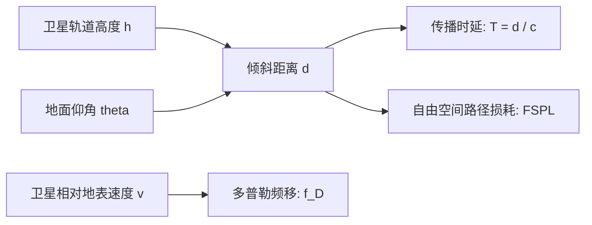
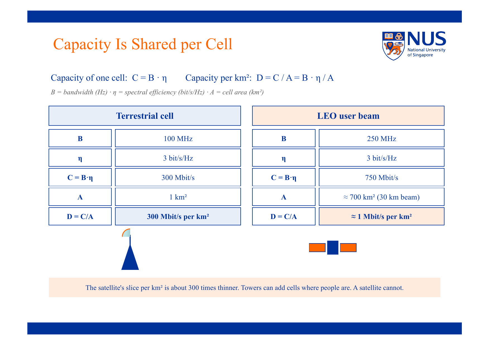

# NTN 轨道几何与链路容量分析

> 本页属于：CEG5104 / Week 04
> 前置知识：[[CEG5104-Week04-非地面网络NTN概述与平台]]、[[CEG5104-Week02-多址接入与容量]]
> 预计阅读时间：9 分钟

---

## 1. 轨道与几何参数 (Orbit and Geometry)

非地面网络中，空间信道的几何关系直接决定了传播时延、多普勒频移和自由空间路径损耗。核心几何变量定义如下：

- $h$：卫星轨道高度（Altitude），LEO 通常为 $500 \sim 1200\text{ km}$，GEO 为 $35786\text{ km}$。
- $\theta$：仰角（Elevation angle），即地面终端与卫星连线和地平面之间的夹角。一般要求 $\theta \ge 10^\circ \sim 30^\circ$ 以避免地形遮挡与严重大气吸收。
- $d$：倾斜距离（Slant range），即地面终端与卫星之间的直线空间距离：
  $$d = \sqrt{R_E^2 \sin^2\theta + 2 R_E h + h^2} - R_E \sin\theta$$
  其中 $R_E \approx 6371\text{ km}$ 为地球平均半径。当卫星处于正头顶（天顶 Zenith, $\theta = 90^\circ$）时，距离最小 $d_{min} = h$。

---

## 2. 空间信道核心物理挑战 (Physical Channel Challenges)

### 2.1 传播时延 (Propagation Delay & RTT)

无线电波在自由空间中以光速 $c \approx 3 \times 10^8\text{ m/s}$ 传播，单向单跳传播时延为：
$$T_p = \frac{d}{c}$$

- **GEO 链路**：$d \approx 36000 \sim 40000\text{ km}$，单程单跳时延 $\approx 120 \sim 140\text{ ms}$。若经透明弯管转发（双跳：终端 $\to$ 卫星 $\to$ 地面站），单向单程即达 $\approx 250\text{ ms}$，往返时间 (RTT) 高达 $480 \sim 540\text{ ms}$。
- **LEO 链路**：$d \approx 500 \sim 1500\text{ km}$，单程单跳时延仅 $\approx 2 \sim 5\text{ ms}$，透明弯管双跳 RTT 约为 $20 \sim 40\text{ ms}$，完全可满足常规语音及网页浏览需求。

### 2.2 极大与动态的多普勒频移 (Doppler Shift)

由于 LEO 卫星以极高的相对速度（$v_{rel} \approx 7.5\text{ km/s}$）飞过用户头顶，接收端载波频率发生显著频移：
$$f_D = f_c \frac{v_{rel}}{c} \cos \theta$$

- 在 $2\text{ GHz}$（S 频段）下，$f_D$ 峰值可达 $\pm 40\text{ kHz}$ 到 $\pm 50\text{ kHz}$（频移比例高达 $\pm 20 \sim 40\text{ ppm}$）。
- 对比地面 4G/5G 系统（车辆以 $120\text{ km/h} \approx 33\text{ m/s}$ 行驶，Doppler 仅几十赫兹，小于 $0.1\text{ ppm}$），NTN 的频移量是地面蜂窝的数百倍。
- 若不对频移做精确补偿，将引发严重的正交频分复用（OFDM）子载波间干扰（ICI）。

### 2.3 自由空间路径损耗 (Free Space Path Loss, FSPL)

$$FSPL\text{ [dB]} = 20 \log_{10}(d) + 20 \log_{10}(f) + 20 \log_{10}\left(\frac{4\pi}{c}\right)$$

- LEO 相比地面基站（距离通常 $< 5\text{ km}$），链路距离扩大了数百倍，FSPL 增加 $40 \sim 60\text{ dB}$。
- 为补偿巨大的路径损耗，卫星天线必须具备极高增益（大孔径天线或大型相控阵波束赋形），或者终端需配合高增益天线。

---

## 3. 小区容量与容量密度计算 (Capacity vs Capacity Density)

地面网络与非地面网络在容量设计上的根本逻辑差异在于**小区面积与频谱复用**：

> **Figure Object 4**: 地面蜂窝与 LEO 卫星波束容量对比  
> - 📘 **来源 (Source)**: `CEG5104_Intro_to_NTN.pdf`  
> - 📍 **定位 (Locator)**: Slide 27 "Capacity Is Shared per Cell"  
> - 💡 **解读 (Explanation)**: 明确对比了地面基站与低轨卫星点波束（User Beam）在带宽 $B$、频谱效率 $\eta$、小区覆盖面积 $A$ 以及单位面积容量密度 $D$ 上的量化数据。  
> - 🔍 **看什么 (What to notice)**: 单个 LEO 波束的总吞吐量（$750\text{ Mbit/s}$）甚至高于单个地面微站（$300\text{ Mbit/s}$），但其覆盖面积高达 $700\text{ km}^2$（直径约 $30\text{ km}$），导致面积容量密度骤降至 $\approx 1\text{ Mbit/s/km}^2$，而地面基站为 $300\text{ Mbit/s/km}^2$。**结论：卫星极其擅长提供广域覆盖（Coverage），但绝不可能替代地面蜂窝提供高密度容量（Capacity Density）**。

### 数值推导与对比公式

单小区吞吐量 $C$ 由香农容量及分配带宽决定：
$$C = B \cdot \eta$$
其中 $B$ 为分配射频带宽 (Hz)，$\eta$ 为系统平均频谱效率 (bit/s/Hz)。

单位面积容量密度 $D$（Capacity per $\text{km}^2$）：
$$D = \frac{C}{A} = \frac{B \cdot \eta}{A}$$
其中 $A$ 为波束在地面的投影面积 ($\text{km}^2$)。

| 指标 | 地面蜂窝微小区 (Urban Macro/Micro) | 低轨卫星用户波束 (LEO Beam) | 数量级差距与工程启示 |
| :--- | :--- | :--- | :--- |
| **信道带宽 $B$** | $100\text{ MHz}$ | $250\text{ MHz}$ | 卫星可用频段更宽（如 Ku/Ka 频段） |
| **平均频谱效率 $\eta$** | $3\text{ bit/s/Hz}$ | $3\text{ bit/s/Hz}$ | 受限于 SNR，物理层调制编码接近 |
| **单小区总容量 $C$** | $300\text{ Mbit/s}$ | $750\text{ Mbit/s}$ | 卫星单波束容量更高 |
| **小区覆盖面积 $A$** | $1\text{ km}^2$ (半径 $\approx 560\text{ m}$) | $700\text{ km}^2$ (直径 $\approx 30\text{ km}$) | 卫星波束面积是地面的 700 倍 |
| **容量密度 $D = C/A$** | **$300\text{ Mbit/s/km}^2$** | **$\approx 1\text{ Mbit/s/km}^2$** | **地面密度是卫星的 300 倍！** |

---

## 4. 用户并发与卫星规模估算 (User Scaling)

假设每个活跃用户在高峰期需要保证平均速率 $R_{user} = 5\text{ Mbit/s}$：
- 一个 $C = 750\text{ Mbit/s}$ 的 LEO 波束最多同时服务：
  $$N_{active} = \frac{C}{R_{user}} = \frac{750}{5} = 150\text{ 个并发全速用户}$$
- 配合忙时集中率（Overbooking Ratio，通常为 10:1 到 20:1），该波束覆盖的 $700\text{ km}^2$ 区域内总共仅能支持约 $1500 \sim 3000$ 个注册宽带用户。
- 这从物理上证明了为什么像 Starlink 这样的低轨巨型星座在城市区域极易拥堵降速，而必须在广阔农村、海洋及航空等稀疏用户场景下才能实现最佳经济效益。

---

## 5. 下一步

- 上一页：[[CEG5104-Week04-非地面网络NTN概述与平台]]
- 下一页：[[CEG5104-Week04-NTN标准化与Beyond-5G演进]]
- 返回：[[CEG5104-讲义与笔记索引]]

## 来源与更新日志

- 来源：`CEG5104_Intro_to_NTN.pdf` Slide 22–28 (Dr. Varun Kohli, A*STAR)
- 2026-09-18：新建 NTN 轨道几何、传播时延、多普勒频移及容量密度对比推导，注入 Figure Object 4。
