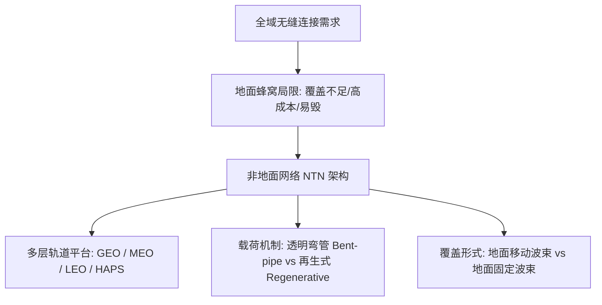
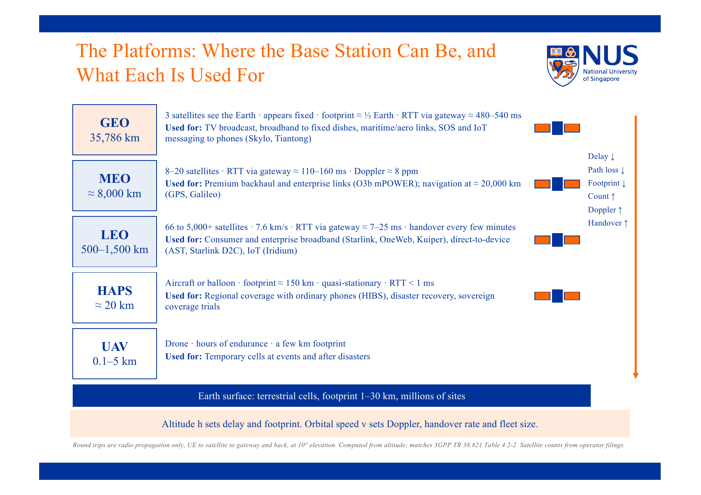
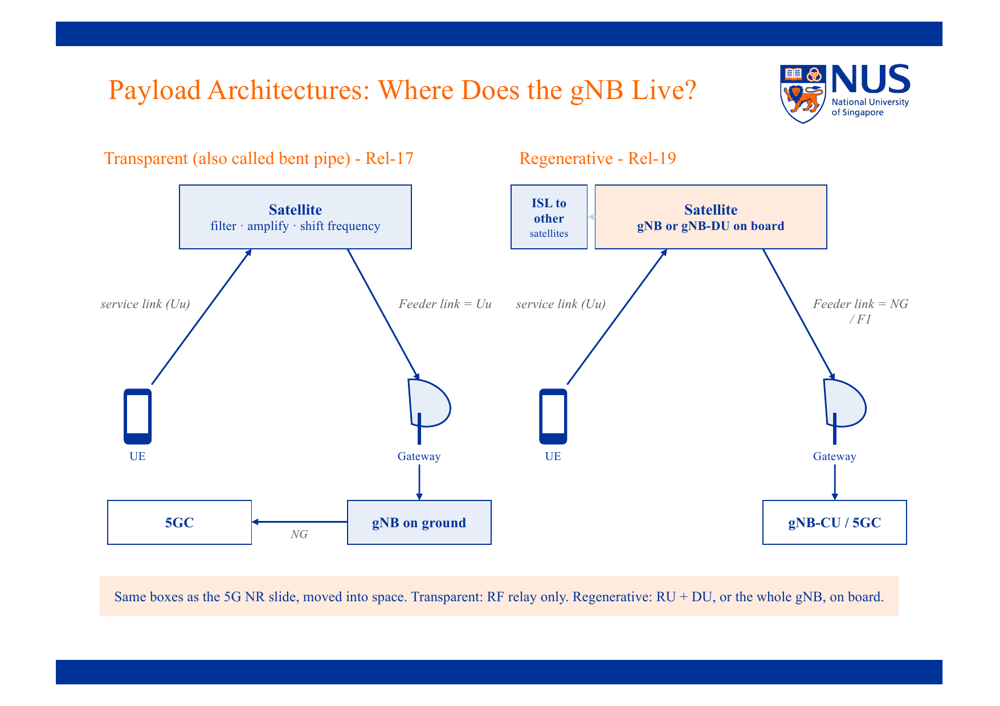
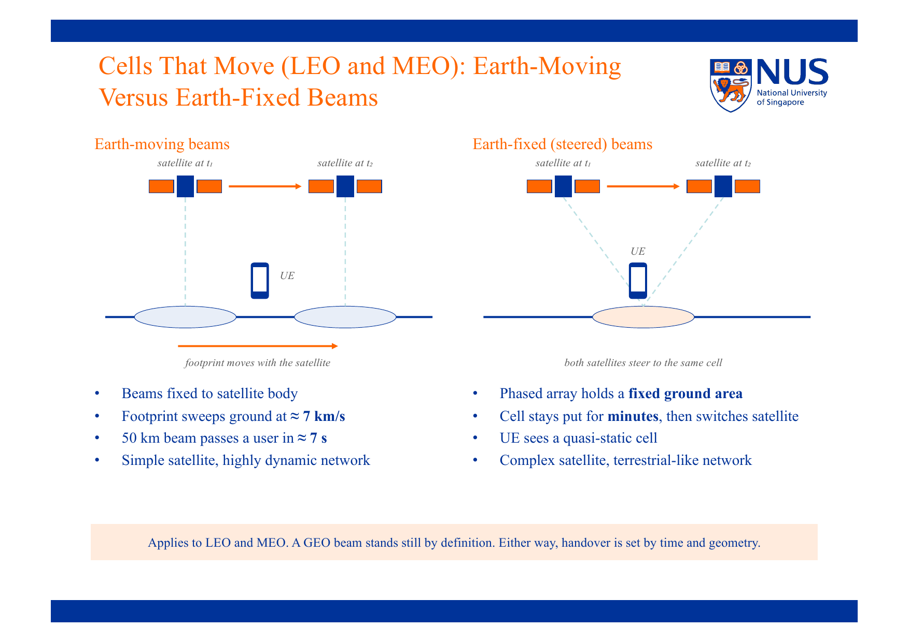

# 非地面网络 (NTN) 概述与空间平台

> 本页属于：CEG5104 / Week 04
> 前置知识：[[CEG5104-Week01-蜂窝网络概述与演进]]
> 预计阅读时间：8 分钟

---

## 1. 为什么需要非地面网络 (Motivation & The Coverage Gap)

蜂窝网络在人口稠密的城市区域取得了巨大成功，但地面蜂窝网络（Terrestrial Networks, TN）存在天然的物理和经济局限性：

1. **地理覆盖盲区**：目前全球地面移动网络仅覆盖了全球陆地表面积的约 15% 到 20%，以及全球总表面积（含海洋）的不到 10%。在海洋（航运）、天空（航空民航）、沙漠、高山及极地等区域，地面基站完全无法部署。
2. **基站建设与运营成本 (Capex / Opex)**：在偏远低人口密度区域，建设传统地面铁塔基站的成本极高（需铺设电力线、光纤回传回线、道路施工），而服务的人口基数极少，单站投资回报率（ROI）严重倒挂。
3. **抗灾韧性不足**：地面基站高度依赖地面电力和有线光纤网，发生地震、台风或战争时，地面基础设施极易遭到物理毁灭。

非地面网络（Non-Terrestrial Networks, NTN）通过将射频发射单元、基站或中继节点部署到空中或太空中，实现从“二维平面覆盖”向“空天地海一体化三维全域覆盖”的质的飞跃。

---

## 2. 空间平台多层架构 (Space Platforms: GEO, MEO, LEO, HAPS)

NTN 空间节点根据运行轨道高度与物理形态分为不同的层级，各层级在时延、多普勒频移、覆盖范围与系统复杂度之间存在根本性的权衡：

> **Figure Object 1**: NTN 空间平台与轨道特性对比  
> - 📘 **来源 (Source)**: `CEG5104_Intro_to_NTN.pdf` (Dr. Varun Kohli, A*STAR)  
> - 📍 **定位 (Locator)**: Slide 24 "The Platforms: Where the Base Station Can Be, and What Each Is Used For"  
> - 💡 **解读 (Explanation)**: 展示了地球静止轨道 (GEO)、中地球轨道 (MEO)、低地球轨道 (LEO) 以及高空平台系统 (HAPS) 的轨道高度、覆盖足迹半径与往返传播时延 (RTT)。  
> - 🔍 **看什么 (What to notice)**: GEO 轨道高达 $35786\text{ km}$，3 颗卫星即可实现全球绝大部分覆盖，但往返单向时延高达 $\approx 250\text{ ms}$（RTT $\approx 500\text{ ms}$）；而 LEO 轨道在 $500 \sim 1200\text{ km}$，RTT 骤降至 $20 \sim 40\text{ ms}$，但单星覆盖面积小且高速移动（速度约 $7.5\text{ km/s}$），需要成百上千颗卫星组成巨型星座（Megaconstellation）。

### 多层平台对比参数表

| 平台类别 | 轨道高度 ($h$) | 单星覆盖半径 | 单向传播时延 | 典型往返时延 (RTT) | 多普勒频移 | 典型应用场景 |
| :--- | :--- | :--- | :--- | :--- | :--- | :--- |
| **GEO (静止轨道)** | $35,786\text{ km}$ | $\approx 7,000\text{ km}$（全球 1/3 视野） | $\approx 120 \sim 140\text{ ms}$ | $\approx 480 \sim 540\text{ ms}$ | 极小（对地静止） | 卫星电视广播、海事宽带、紧急短信（如天通、Skylo） |
| **MEO (中轨道)** | $7,000 \sim 20,000\text{ km}$ | 数千公里 | $\approx 30 \sim 50\text{ ms}$ | $\approx 110 \sim 160\text{ ms}$ | 中等 ($\approx 8\text{ ppm}$) | GPS/北斗导航、中继宽带 (O3b) |
| **LEO (低轨道)** | $500 \sim 1,500\text{ km}$ | $500 \sim 1,500\text{ km}$ | $\approx 2 \sim 5\text{ ms}$ | $\approx 20 \sim 40\text{ ms}$ | 极大 ($\approx 20 \sim 40\text{ ppm}$) | Starlink, OneWeb, 5G NTN 宽带与手机直连 (D2D) |
| **HAPS / UAS (高空平台)**| $20\text{ km}$ (平流层) | $\approx 50 \sim 100\text{ km}$ | $< 1\text{ ms}$ | $< 5\text{ ms}$ | 极小 | 区域应急通信、热点容量补盲、气球/太阳能无人机 |

---

## 3. 卫星载荷架构：透明弯管 vs 再生式 (Payload Architectures)

根据 3GPP 5G NR 规范，卫星星上处理载荷（Payload）存在两种核心架构方案：

> **Figure Object 2**: 透明弯管架构 vs 再生式星上处理架构  
> - 📘 **来源 (Source)**: `CEG5104_Intro_to_NTN.pdf`  
> - 📍 **定位 (Locator)**: Slide 20 "Payload Architectures: Where Does the gNB Live?"  
> - 💡 **解读 (Explanation)**: 对比了 3GPP Rel-17 采纳的透明弯管方案（Transparent / Bent Pipe）与 Rel-19+ 演进的再生式方案（Regenerative）。  
> - 🔍 **看什么 (What to notice)**: 透明弯管中，卫星只做 RF 滤波、放大和变频，完整的 gNB 位于地面信关站；而在再生式中，gNB 或 gNB-DU 直接上天运行在卫星处理器上，并通过星间链路 (ISL, Inter-Satellite Links) 在空间直接组网路由。

### 架构特性深度剖析

1. **透明弯管 (Transparent / Bent Pipe - 3GPP Rel-17)**:
   - **工作原理**：卫星只扮演空间微波反射器/中继器角色。用户端通过服务链路（Service Link, NR-Uu）发射信号，卫星天线接收后进行带通滤波、低噪声放大（LNA）、变频至馈电链路频段并放大发射回地面信关站（Gateway），地面信关站连接真实的地面 gNB 和 5G 核心网（5GC）。
   - **优势**：卫星设计简单、成本低、功耗小、抗辐射要求相对较低，地面设备升级灵活。
   - **缺点**：每次通信必须经过“地面用户 $\to$ 卫星 $\to$ 地面信关站 $\to$ 5GC”的双跳（Double-hop）无线链路，时延加倍；且在没有地面信关站视野的公海或沙漠，卫星无法提供实时服务。

2. **再生式 (Regenerative - 3GPP Rel-19+)**:
   - **工作原理**：卫星内部集成完整的数字信号处理基带单元，将 gNB（或 gNB-DU）直接部署在星上。
   - **星间链路 (ISL, Inter-Satellite Link)**：卫星之间通过空间激光通信链路（Laser ISL）互联，数据包直接在太空中进行分布式路由转发，直到到达靠近目的地的信关站下行。
   - **优势**：时延更低（光在真空中速度比在玻璃光纤中快约 30%），无需地面站中继即可实现真正的全球跨大洋数据穿梭。
   - **缺点**：星载抗辐射空间芯片与基带处理计算功耗巨大，散热与制造成本显著上升。

---

## 4. 地面波束运动模式 (Earth-Moving vs Earth-Fixed Beams)

由于 LEO 卫星以约 $7.5\text{ km/s}$ 的第一宇宙速度掠过地球表面，卫星天线发射的相控阵波束有两种运作模式：

> **Figure Object 3**: 地面移动波束 vs 地面固定波束  
> - 📘 **来源 (Source)**: `CEG5104_Intro_to_NTN.pdf`  
> - 📍 **定位 (Locator)**: Slide 21 "Cells That Move (LEO and MEO): Earth-Moving Versus Earth-Fixed Beams"  
> - 💡 **解读 (Explanation)**: 直观展示了波束随卫星行进而移动，与通过相控阵电扫动态将波束钉在地面固定区域的区别。  
> - 🔍 **看什么 (What to notice)**: 地面移动波束扫过地表速度高达 $7\text{ km/s}$，一个 $50\text{ km}$ 直径的小区经过静止用户仅需约 $7\text{ s}$，导致极频繁的小区切换（Handover）；而地面固定波束利用波束赋形电控跟踪地面区域，显著降低切换频率。

1. **地面移动波束 (Earth-Moving Beams)**:
   - 波束相对于卫星本体固定指向。随着卫星飞行，波束投影在地面上的足迹以数千米每秒的速度移动。
   - **网络挑战**：极高频次的小区切换（Handover 暴增）、信令风暴、频繁的波束重选。
2. **地面固定波束 (Earth-Fixed / Steered Beams)**:
   - 卫星利用大型数字有源相控阵天线，实时调整各辐射单元的相位差，反向补偿卫星运动，使波束“凝视”锁定在地面特定地理网格（Grid/Cell）。
   - 当卫星飞出仰角限制时，相邻即将飞入的卫星接管该地面波束，实现平滑星间切换。

---

## 5. 下一步

- 下一页：[[CEG5104-Week04-NTN轨道几何与链路容量分析]]
- 返回：[[CEG5104-讲义与笔记索引]]

## 来源与更新日志

- 来源：`CEG5104_Intro_to_NTN.pdf` Slide 1–25 (Dr. Varun Kohli, A*STAR)
- 2026-09-18：新建 NTN 导论与平台架构页面，纳入 GEO/MEO/LEO/HAPS 架构参数、透明弯管 vs 再生式、波束模式，完成 Figure Objects 规范化。
