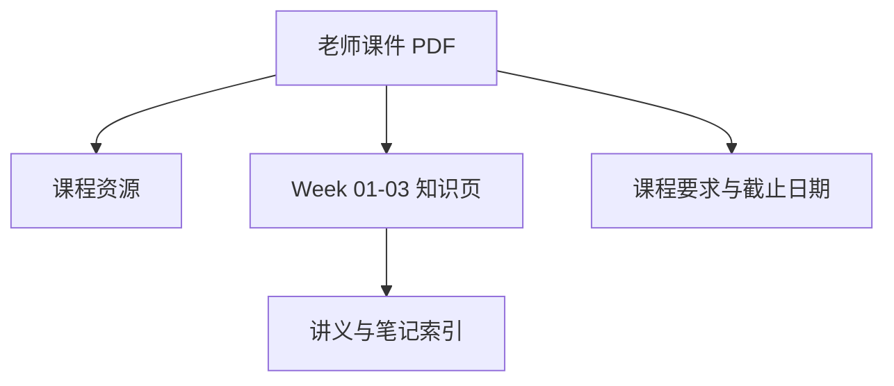

# CEG5104 课程总览

> 本页属于：CEG5104 课程入口
>
> 前置知识：无
>
> 预计阅读时间：5 分钟

## 课程范围

CEG5104 *Cellular Networks*（蜂窝网络）围绕移动蜂窝网络的规划、容量与频率分配展开。当前 Wiki 覆盖 Week 1–3（截至 2026-09-07），知识点按周拆页，来源以老师课件 PDF 为准，个人双语笔记仅作辅助核对。

| 项目 | 当前状态 |
|---|---|
| 课程进度 | Week 3 |
| 讲义覆盖 | Week 01–03，已按主题拆页 |
| 授课安排 | 周五 18:00–21:00（Engineering Auditorium） |
| 当前 assessment | CA1（20%） |
| 材料版本 | AY2026/27 |

## 课程主线

图 1：CEG5104 前三周主线（自制，依据课件整理；2026-09-07）。

## 资料与页面关系

图 2：CEG5104 页面关系（自制；2026-09-07）。

## 快速入口

- [[CEG5104-课程资源总览]]：老师课件、个人笔记入口。
- [[CEG5104-课程要求与截止日期]]：考核构成与开放问题。
- [[CEG5104-讲义与笔记索引]]：以课件为准的 Week 01–03 主题拆分页。
- [[CEG5104-当前进度与待补内容]]：已完成、待补内容与开放问题。

## 来源

- 课件目录：[CEG5104 Assets Release](https://github.com/Kytolly/NUS-coursework-wiki/releases/tag/CEG5104)（Week 1–3 课件 PDF 原件）。
- 个人笔记：[CEG5104 Assets Release](https://github.com/Kytolly/NUS-coursework-wiki/releases/tag/CEG5104)（双语 week-01–03 笔记，仅作参考）。
- 课程要求：[list.md](https://github.com/Kytolly/NUS-coursework-wiki/releases/download/CEG5104/list.md)。
- 核对日期：2026-09-07（按所给课件与笔记整理）。

## 下一步

- 上一页：[[Home]]
- 下一页：[[CEG5104-课程资源总览]]
- 返回：[[Home]]

## 更新日志

- 2026-09-07：建立课程入口，覆盖 Week 1–3 并记录当前状态。
