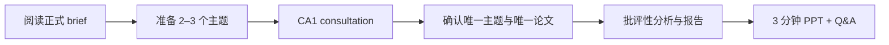

# CEG5201 CA1 Consultation 总览

> 本页属于：CEG5201 / CA1 Consultation
> 前置知识：[[CEG5201-课程要求与截止日期]]
> 预计阅读时间：5 分钟

## 这个子 tab 记录什么？

CA1 Consultation 是连接正式项目要求和个人选题/设计决定的工作区。它记录“老师要求什么”“我需要确认什么”“教师如何答复”，不把未经确认的理解写成事实。

## 子页面

| 页面 | 主要内容 |
|---|---|
| [[CEG5201-CA1-Consultation-项目要求]] | CA1 brief、15 个报告问题和批评性分析边界 |
| [[CEG5201-CA1-Consultation-Topics-Guide]] | 21 个建议主题、论文年份和硬件创新范围 |
| [[CEG5201-CA1-Consultation-提交物与截止日期]] | 报告结构、declaration、3 分钟 PPT 和 in-person evaluation |
| [[CEG5201-CA1-Consultation-问题清单]] | 咨询前的具体问题 |
| [[CEG5201-CA1-Consultation-教师答复与行动项]] | 实际答复、项目影响和行动项 |

## 工作流

图 1：CA1 consultation 工作流（自制，依据 CA1 brief；2026-09-01）。

## 当前状态

- CA1 choices submission 窗口在 brief 中为 2026-08-12–08-31。
- CA1 consultation 日期为 2026-09-01。
- 个人最终主题、论文和教师答复尚未写入本批页面。

## 下一步

- 上一页：[[CEG5201-课程要求与截止日期]]
- 下一页：[[CEG5201-CA1-Consultation-项目要求]]
- 返回：[[Home]]

## 更新日志

- 2026-09-01：建立 CA1 Consultation 子 tab。
