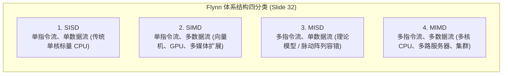

# 现代计算系统与Flynn分类

> 本页对应课件：CG5201_Chap1 (2627).pdf, pp. 28–36
> 本页属于：CEG5201 / Week 01
> 上一页：[[CEG5201-Week01-02-嵌入式系统与计算平台选择]]
> 下一页：[[CEG5201-Week01-04-性能度量与计算吞吐率]]
> 预计阅读时间：11 分钟

---

## 1. 为什么需要体系结构分类？

在了解了不同的物理平台（CPU、GPU、FPGA 等）之后，面对种类繁多的并行计算机体系，学术界与工业界需要一套通用的形式化分类标准，用来准确描述处理器的指令流控制方式、数据流动路径以及软硬件协同接口（[CG5201_Chap1 (2627).pdf](https://github.com/Kytolly/NUS-coursework-wiki/releases/download/CEG5201/CG5201_Chap1%20%282627%29.pdf) 第 28–36 页）。

---

## 2. 现代计算平台的组成要素（Elements of a Compute Platform）

讲义第 29 页指出，一个完整的现代计算平台不仅包含硅片硬件，还高度依赖系统软件的支撑：

1. **计算硬件基础（Computing Hardware）**：
   - 包含主处理器（Host CPU）、协处理器/加速器（Accelerators）、专用物理内存层次结构以及互连总线。
2. **操作系统与运行时（Operating System & Runtime）**：
   - 负责任务调度、虚拟内存映射、设备驱动通信与硬件资源抽象。
3. **并行编译支持工具链（Compiler Support & Tools）**：
   - 硬件的并行能力必须依靠高效的编译器工具暴露给上层软件。

### 2.1 编译器在并行支持中的演化（Slide 30）
讲义第 30 页归纳了并行计算环境下的核心编译技术层级：
- **预处理器（Preprocessor）**：在正式词法分析前展开宏定义、执行条件编译指令。
- **预编译器（Precompiler）**：识别特定并行指导语句（如 OpenMP `#pragma omp`），将其预先翻译为底层线程库调用。
- **自动并行化编译器（Parallelizing Compiler）**：
  讲义指出，先进的现代并行编译器能够自动识别代码中的独立数据模式，并应用以下 4 类关键变换机制：
  1. **向量化变换（Vectorization）**：将简单的标量循环转换为底层 SIMD 向量指令；
  2. **循环分块与重构（Loop Tiling & Interchange）**：改善片上 Cache 命中率并消除跨迭代循环依赖；
  3. **并发线程生成（Thread Generation）**：自动将无依赖的外层循环划分为多线程并发任务；
  4. **通信开销优化（Communication Optimization）**：合并零碎的数据搬运，重叠计算与数据传输过程。

---

## 3. Flynn 计算机体系结构分类法（Flynn's Classification）

Michael J. Flynn 于 1966 年提出了著名的 **Flynn 分类法（Flynn's Taxonomy）**（讲义第 31–34 页）。该分类依据计算机体系在同一时刻所处理的**指令流（Instruction Stream）**与**数据流（Data Stream）**的多寡，将所有计算机划分为四大经典类别：

*图：Flynn 计算机分类体系（来源：CG5201_Chap1 (2627).pdf 第 32 页）*

### 3.1 四大类别的架构机制与特征对比

| 类别代号 | 英文全称 | 控制单元 (CU) 数量 | 处理单元 (PE) 数量 | 核心工作机理与典型实例 |
| :--- | :--- | :--- | :--- | :--- |
| **SISD** | Single Instruction, Single Data | 单一控制单元 | 单一执行单元 | **传统经典冯·诺依曼计算机**。在每个时钟周期内，处理器取出一阶单条指令，对单一物理内存数据单元进行操作。例如早期的单核微处理器。 |
| **SIMD** | Single Instruction, Multiple Data | 单一控制单元 | 大量并行执行单元 | **数据并行机**。唯一的中央控制单元（CU）向所有并行的处理单元（PE）同步广播同一条指令，各个 PE 分别对各自私有局部数据执行该运算。典型代表：向量处理机、现代 CPU 的 AVX-512 指令集、GPU 流处理器。 |
| **MISD** | Multiple Instruction, Single Data | 多个独立控制单元 | 多个执行单元 | **多指令作用于单数据**。理论分类上存在，商业通用机中极少采用。常用于航空航天中多重计算冗余容错校验系统，或特定脉动阵列。 |
| **MIMD** | Multiple Instruction, Multiple Data | 多个独立控制单元 | 多个独立处理器 | **多指令多数据机**。每个处理器拥有自己独立的程序计数器（PC）和指令执行流水线，彼此完全异步自主执行不同的代码。现代通用多核 CPU、分布式集群均属于 MIMD。 |

### 3.2 多处理器 vs 多计算机（Slide 33）
在 MIMD 体系内，讲义进一步区分了两种存储共享形态：
- **多处理器（Multiprocessors）**：所有处理器共享单一物理主存或统一的虚拟物理地址空间，通过读写共享变量实现隐式通信。
- **多计算机（Multi-computers）**：每个计算节点拥有私有的独立物理内存，节点间不存在全局统一物理地址，必须通过网络显式传递消息进行协同（详见后续章节）。

---

## 4. 向量处理机与时间/空间并行性（Vector Processors）

讲义第 35–36 页以向量超级计算机为例，剖析了 SIMD 范式在物理流水线上的实现方式：

*图：经典向量处理器流水线组织架构（来源：CG5201_Chap1 (2627).pdf 第 35 页）*

### 4.1 典型工业界向量超级计算机
- **CRAY-1**：
  - 基于深度流水化的向量寄存器（Vector Registers）架构；
  - 拥有 8 个长度为 64 元的向量寄存器，通过流水线链接（Chaining）技术，将乘法流水线与加法流水线串联，使得每个时钟周期可吐出一个运算结果。
- **CYBER 205**：
  - 采用直接基于内存到内存（Memory-to-Memory）的向量运算流水线；
  - 针对超长向量连续密集数据块提供极高带宽。

### 4.2 时间并行性 vs 空间并行性（Slide 36）
讲义第 36 页明确区分了发掘计算并行的两种基本物理途径：

1. **时间并行性（Temporal Parallelism）**：
   - 依赖**流水线技术（Pipelining）**。
   - 将一个复杂的算术操作细分为若干先后相继的硬件阶段（如取指、译码、执行、访存、写回）；不同指令的不同阶段在时间维度上重叠推进，如同工业装配流水线。
2. **空间并行性（Spatial Parallelism）**：
   - 依赖**物理硬件复制（Hardware Replication）**。
   - 在芯片内部同时放置多个相同的物理算术逻辑单元（ALU/PE）；同一时钟周期内，在空间分布的不同电路上同时并行计算多个数据项。

---

## 学习目标 / Problem-Solving Skills

完成本节学习后，你应能掌握讲义中的以下核心知识与分析技能：

1. **现代计算平台构成**：
   - 掌握计算硬件、操作系统与编译器三要素；
   - 解释编译器支持自动并行的 4 类关键变换机制（向量化、循环重构、线程生成与通信优化）。
2. **Flynn 分类法判定与对比**：
   - 熟练写出 SISD、SIMD、MISD 与 MIMD 的定义与差异；
   - 能够准确指出多核 CPU、GPU 以及向量机在 Flynn 体系中的归属；
   - 明确多处理器（共享地址空间）与多计算机（私有内存显式通信）在 MIMD 中的区别。
3. **向量机与并行物理形态**：
   - 区分时间并行性（流水线分段重叠）与空间并行性（物理单元复制并发）的物理本质。

---

## 下一步

- 上一页：[[CEG5201-Week01-02-嵌入式系统与计算平台选择]]
- 下一页：[[CEG5201-Week01-04-性能度量与计算吞吐率]]
- 模块总览：[[CEG5201-讲义与笔记索引]]
- 返回知识库：[[Home]]

---

## 来源与更新日志

- 来源：[CG5201_Chap1 (2627).pdf](https://github.com/Kytolly/NUS-coursework-wiki/releases/download/CEG5201/CG5201_Chap1%20%282627%29.pdf) pp. 28–36.
- 2026-09-23：按照讲义顺序重构，建立正规编号与讲义映射页眉，聚焦现代计算平台构成、编译器 4 类机制、Flynn 四分法与向量机时间/空间并行性。
