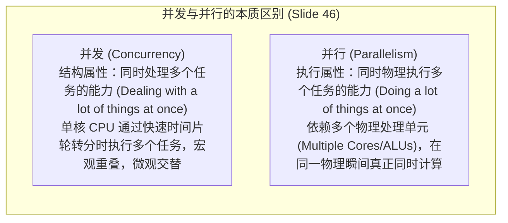

# 并行编程与多处理器系统

> 本页对应课件：CG5201_Chap1 (2627).pdf, pp. 45–51
> 本页属于：CEG5201 / Week 01
> 上一页：[[CEG5201-Week01-04-性能度量与计算吞吐率]]
> 下一页：[[CEG5201-Week01-06-UMA数值分析与二叉树归约例题]]
> 预计阅读时间：11 分钟

---

## 1. 为什么需要并行编程与多处理器？

上一节建立了 CPU 时间与吞吐率的评价模型，公式 $T = I_c \cdot 	ext{CPI} \cdot 	au$ 明确指出：单核处理器的时钟频率 $f$ 遭遇物理功耗极限，而单指令周期的压缩也面临 ILP 墙。因此，要根本性突破计算吞吐率上限，必须从软件和硬件两个层面全面转向**并行处理（Parallel Processing）**（[CG5201_Chap1 (2627).pdf](https://github.com/Kytolly/NUS-coursework-wiki/releases/download/CEG5201/CG5201_Chap1%20%282627%29.pdf) 第 45–51 页）。

---

## 2. 并行编程模型：隐式并行 vs 显式并行（Slide 45）

讲义第 45 页将并行性的挖掘途径划分为两大范式：

1. **隐式并行（Implicit Parallelism）**：
   - 程序员依然使用传统的串行编程语言（如 C/C++、Fortran）编写顺序代码；
   - 依赖底层的**并行编译器（Parallelizing Compiler）**自动分析数据依赖、生成向量化指令或展开循环，或者由**超标量硬件流水线**在运行时动态检测指令无相关性并发射执行；
   - **特点**：对程序员友好，代码向后兼容性极佳；但受限于静态依赖分析的保守性，编译器难以跨越指针别名或复杂控制流，并行度发掘受限。
2. **显式并行（Explicit Parallelism）**：
   - 程序员必须在源代码中**显式声明并发任务、同步点与通信协议**；
   - 通过调用并行库 API（如 Pthreads、OpenMP、MPI、CUDA）或者专用的并行语言构造；
   - **特点**：能够发掘大规模、算法级的粗粒度任务与数据并行；但显著增加了开发复杂度，程序员需自行处理数据竞争、死锁与负载均衡等难题。

---

## 3. 并发 vs 并行（Concurrency vs. Parallelism, Slide 46）

讲义第 46 页对“并发”与“并行”这两个极易混淆的核心概念进行了严格界定：

*图：并发（Concurrency）与并行（Parallelism）概念辨析图（来源：CG5201_Chap1 (2627).pdf 第 46 页）*

- **并发（Concurrency）**：指系统具有**处理多个同时发生事件的能力**。即使在单核处理器上，通过操作系统的抢占式时间片调度（Time Slicing），多个进程交替切入执行，在宏观上呈现为“同时推进”。并发侧重于程序结构的设计与任务解耦。
- **并行（Parallelism）**：指在**物理上同一绝对时钟时刻**，多个计算操作在不同的独立硬件物理单元上真正同时运转。并行需要底层多核心、向量流水线或多处理机硬件的实体支撑。
- **核心论断**：**并发是程序结构的逻辑属性，并行是硬件执行的物理属性。并发不一定意味着物理并行，但物理并行通常建立在并发设计的逻辑基础之上。**

### 3.1 现实中并发出现的四种典型场景（Slide 47）
讲义第 47 页总结了计算机系统中自然发生并发的 4 类情境：
1. **多道程序设计环境（Multiprogramming Environments）**：操作系统同时常驻并管理多个相互独立的用户进程；
2. **多用户交互系统（Multi-user Systems）**：服务器同时响应并处理来自多个终端或网络客户端的并发会话请求；
3. **分布式处理系统（Distributed Processing Systems）**：跨物理机甚至跨数据中心的多个节点协同处理海量数据；
4. **嵌入式控制系统（Embedded Control Systems）**：同时处理来自多个传感器的高频中断输入与外设促动指令。

> **讲义重点警示（Caution, Slide 48）**：
> 在这些并发场景中，多个任务或线程通常会并发竞争底层的有限共享资源（如共享内存、文件描述符、系统总线与硬件外设）。如果缺乏严密的互斥锁、信号量或原子同步机制，将不可避免地导致数据竞争（Race Conditions）、死锁（Deadlock）以及系统崩溃。

---

## 4. 多处理器与多计算机概论（Slide 49）

讲义第 49 页引入了多机系统的核心形态：

1. **共享存储多处理器（Shared Memory Multiprocessor Systems, MPS）**：
   - 所有的处理器共享一个统一的物理地址空间；
   - 细分为三大经典流派：**UMA（统一内存访问）**、**NUMA（非统一内存访问）**与 **COMA（全缓存访问）**。
2. **分布式存储多计算机（Distributed Memory Multi-computers）**：
   - 各节点物理内存相互独立，节点间无共享全局硬件地址空间，必须通过网络显式传递消息通信（如集群系统）。
3. **架构偏好与 Gordon Bell 分类**：
   - 早期专用计算曾青睐 **SIMD** 结构，但其专用性强、缺乏通用可扩展性；
   - 通用高性能计算普遍转向 **MIMD** 架构（参考 Gordon Bell, 1992 年的经典分类体系）。

---

## 5. 集中式共享存储体系：UMA 架构（Slides 50–51）

讲义第 50–51 页详细剖析了第一种共享存储架构——**统一内存访问（Uniform Memory Access, UMA）**：

*图：UMA 对称多处理器硬件架构（来源：CG5201_Chap1 (2627).pdf 第 51 页）*

### 5.1 UMA 的核心特征（Slide 50）
1. **单一物理共享存储（Single Shared Memory）**：
   所有物理处理器核心通过共享总线或交叉开关（Crossbar Switch）访问同一块集中式物理内存，每个处理器对全部内存单元拥有平等的物理访问权限。
2. **均匀访存延迟（Uniform Memory Latency）**：
   任意处理器访问任意内存地址所需的物理访问时间大致相同（Approximately the same），这是其得名“UMA”的原因。
3. **对称多处理（Symmetric Multiprocessing, SMP）**：
   由于所有处理器核心在硬件地位、功能特权以及对内存的访问特性上完全对称，工业界通常将 UMA 架构称为 **SMP 系统**。
4. **编程模型直观简单（Simple Programming Model）**：
   无需进行复杂的跨节点显式通信与数据切分，线程之间可以直接通过全局指针读写共享变量。
5. **必须依赖硬件缓存一致性（Cache Coherence Required）**：
   每个物理核通常配备私有一级/二级 Cache。当多个处理器同时缓存同一物理内存地址时，必须依靠硬件协议（如 MESI）实时嗅探（Snooping）总线，保证数据一致性。
6. **物理可扩展性上限较低（Limited Scalability）**：
   随着处理器核数的增加，所有核心争抢有限的共享总线或集中互连带宽，总线争用（Bus Contention）迅速饱和。因此 UMA 架构通常只适用于中小规模（如 2 至 32 核）的多核系统。

---

## 学习目标 / Problem-Solving Skills

完成本节学习后，你应能掌握讲义中的以下核心知识与分析技能：

1. **并行模式辨析**：
   - 清楚区分隐式并行（编译器/硬件自动发掘）与显式并行（程序员使用线程/MPI 接口声明）的优缺点。
2. **并发与并行严密区分**：
   - 准确阐明并发（结构上同时处理多件事，可由单核时间片分时实现）与并行（物理上同一瞬间在多个硬件单元上同时执行）的定义差异；
   - 阐述 Slide 48 针对并发访问共享资源引发数据竞争与死锁的警示。
3. **UMA 体系结构掌握**：
   - 熟练画出 UMA / SMP 体系结构示意图；
   - 列举 UMA 的核心特征（单一主存、均一延迟、简单编程模型、需缓存一致性、受限于总线带宽扩展性）。

---

## 下一步

- 上一页：[[CEG5201-Week01-04-性能度量与计算吞吐率]]
- 下一页：[[CEG5201-Week01-06-UMA数值分析与二叉树归约例题]]
- 模块总览：[[CEG5201-讲义与笔记索引]]
- 返回知识库：[[Home]]

---

## 来源与更新日志

- 来源：[CG5201_Chap1 (2627).pdf](https://github.com/Kytolly/NUS-coursework-wiki/releases/download/CEG5201/CG5201_Chap1%20%282627%29.pdf) pp. 45–51.
- 2026-09-23：按照讲义顺序重构，建立正规编号与讲义映射页眉，聚焦并行编程范式、并发 vs 并行概念辨析、多机系统引入与 UMA/SMP 硬件架构。
