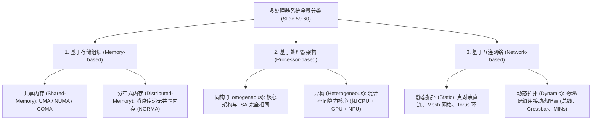

# NUMA架构与多处理器设计流

> 本页对应课件：CG5201_Chap1 (2627).pdf, pp. 56–61
> 本页属于：CEG5201 / Week 01
> 上一页：[[CEG5201-Week01-06-UMA数值分析与二叉树归约例题]]
> 下一页：[[CEG5201-Week01-08-Vector-SIMD与算法复杂度理论]]
> 预计阅读时间：12 分钟

---

## 1. 为什么需要从 UMA 转向 NUMA？

前两节分析表明，UMA 架构中所有处理器通过单一集中式总线或交叉开关访问内存。当处理器核心数从几个增加到几十个甚至上百个时，共享总线争用（Bus Contention）迅速饱和，形成严重的带宽颈瓶。

为了突破 UMA 的可扩展性瓶颈，计算机体系结构引入了**分布式物理内存但全局单一编址**的架构——**NUMA（Non-Uniform Memory Access）**（[CG5201_Chap1 (2627).pdf](https://github.com/Kytolly/NUS-coursework-wiki/releases/download/CEG5201/CG5201_Chap1%20%282627%29.pdf) 第 56–61 页）。

---

## 2. NUMA 架构机制与核心特征（Slides 56–57）

```mermaid
flowchart TD
    subgraph NUMA_Model ["NUMA 硬件拓扑架构 (Slide 56-57)"]
        direction TB
        subgraph Node1 ["节点 1 (Node 1)"]
            CPU1["处理器群 (Processors)"] --- LM1["本地内存 (Local Memory)"]
        end
        subgraph Node2 ["节点 2 (Node 2)"]
            CPU2["处理器群 (Processors)"] --- LM2["本地内存 (Local Memory)"]
        end
        Node1 <== HighSpeedInterconnect["高速互连网络 (MINs / UPI / Infinity Fabric)"] ==> Node2
    end
```

### 2.1 核心特征（Slide 56）
1. **分布式共享内存（Distributed Shared Memory）**：
   - 物理内存被物理拆分并挂载在各个处理器插槽（Socket/Node）旁，形成每个处理器的**本地内存（Local Memory）**；
   - 操作系统与硬件将其呈现为一个统一的平坦全局地址空间（Single shared address space），任意处理器可以通过指针对其他节点的内存进行透明寻址。
2. **非均匀访存延迟（Non-Uniform Memory Latency）**：
   - 访存时间取决于数据所在的物理位置：访问本节点的本地内存速度极快；而跨越互连总线访问其他节点的远端内存（Remote Memory），延迟明显增加，有效带宽相对较低。
3. **出色的可扩展性（Improved Scalability）**：
   - 随着处理器节点数增加，总内存带宽随之线性增长，能够支撑数十至数百个处理核心的大规模服务器。

### 2.2 软硬件协同要求（Slide 57）
- **数据局部性至关重要（Data Locality is Critical）**：
  操作系统与应用程序应尽量将数据分配在最频繁访问它的处理器所在的本地内存中（NUMA-aware memory allocation）。如果局部性差导致频繁发生跨节点远端访存，系统性能将严重下降。
- **高速互连网络支撑（High-Speed Interconnect Required）**：
  跨节点访存依赖高带宽、低延迟的多级互连网络（MINs）或专用高速总线（如 AMD Infinity Fabric、Intel UPI）。
- **主要应用领域**：企业级服务器、云基础设施、高性能计算（HPC）集群、大型数据库服务器与 AI 训练服务器。

---

## 3. 真实工业界系统实例（Real-Life Systems, Slide 58）

讲义第 58 页列举了现代工业界中 UMA 与 NUMA 的代表性真实硬件：

| 架构流派 | 工业界代表系统 | 硬件微架构机理 |
| :--- | :--- | :--- |
| **UMA 实例 1** | **Intel Core Ultra / Core i7/i9 桌面芯片**（单 Socket） | 现代桌面 PC 采用单 CPU 插槽。片上所有 CPU 核心通过统一的片上总线/环形互连访问同一物理主存，访存延迟均等。 |
| **UMA 实例 2** | **Apple M3 / M4**（MacBook, iMac, Mac Mini） | 采用统一内存架构（Unified Memory Architecture）。CPU 与 GPU 在单片 SoC 内共享同一物理存储池，CPU 核心之间体验到均一的访存延迟。 |
| **NUMA 实例 1** | **AMD EPYC 多路服务器**（Multi-Socket Servers） | 广泛应用于云数据中心与 HPC。每个 CPU 插槽直连各自的本地 DDR 通道，跨插槽访问通过 AMD Infinity Fabric 路由，呈现出典型的非均匀延迟。 |
| **NUMA 实例 2** | **Intel Xeon 多路服务器**（Multi-Socket Servers） | 常见于企业数据库与虚拟化服务器。每个 Xeon 插槽拥有独立本地 DRAM 控制器，跨插槽远程访存通过 Intel Ultra Path Interconnect (UPI) 互连。 |

---

## 4. 多处理器系统全景分类体系（Slides 59–60）

讲义第 59–60 页从存储、处理器与网络拓扑三个正交维度建立了多处理器系统的分类框架：




*图：基于存储的多处理器分类体系（来源：CG5201_Chap1 (2627).pdf 第 59 页）*


*图：基于处理器与互连网络的多处理器分类（来源：CG5201_Chap1 (2627).pdf 第 60 页）*

---

## 5. 多处理器系统设计流（Design Flow, Slide 61）

构建多处理器系统需要经历多层次的软硬件协同设计流程：


*图：多处理器系统设计流程图（来源：CG5201_Chap1 (2627).pdf 第 61 页）*

讲义第 61 页强调了该流程的三大关键阶段：
1. **任务映射与重映射（Task Mapping / Remapping）**：
   - 对目标应用的工作负载进行分析，在系统高层次抽象阶段，将任务依赖图中的节点分配到具体的核心上执行；
2. **微架构参数确定（Architecture Details）**：
   - 确定各个处理核心内部的寄存器数量、片上缓存层次、内存总线宽度等关键参数；
3. **全系统组件集成与 RTL 生成（RTL Output）**：
   - 综合所有系统组件的架构细节，最终生成可供综合的多处理器寄存器传输级（Register Transfer Logic, RTL）硬件描述代码。

---

## 学习目标 / Problem-Solving Skills

完成本节学习后，你应能掌握讲义中的以下核心知识与分析技能：

1. **NUMA 架构原理与特点**：
   - 清楚阐明 NUMA 的三大核心机制（分布式共享内存、非均匀访存延迟、高可扩展性）；
   - 结合讲义解释为什么在 NUMA 系统中“数据局部性（Data Locality）”至关重要。
2. **工业真实系统识记**：
   - 准确指出 Intel Core Ultra 与 Apple M3/M4 属于 UMA，而 AMD EPYC 与 Intel Xeon 多路服务器属于 NUMA。
3. **多处理器系统三维分类法**：
   - 掌握基于存储（Shared Memory vs Distributed Memory）、基于处理器（Homogeneous vs Heterogeneous）以及基于网络拓扑（Static vs Dynamic）的分类标准。
4. **系统设计流三阶段**：
   - 熟记多处理器系统设计流程中从任务映射、微架构设计到最终生成 RTL 硬件描述的演进链条。

---

## 下一步

- 上一页：[[CEG5201-Week01-06-UMA数值分析与二叉树归约例题]]
- 下一页：[[CEG5201-Week01-08-Vector-SIMD与算法复杂度理论]]
- 模块总览：[[CEG5201-讲义与笔记索引]]
- 返回知识库：[[Home]]

---

## 来源与更新日志

- 来源：[CG5201_Chap1 (2627).pdf](https://github.com/Kytolly/NUS-coursework-wiki/releases/download/CEG5201/CG5201_Chap1%20%282627%29.pdf) pp. 56–61.
- 2026-09-23：按照讲义顺序重构，建立正规编号与讲义映射页眉，聚焦 NUMA 机制、工业真实系统实例、存储/处理器/网络三维分类法以及 Slide 61 系统设计流程图。
