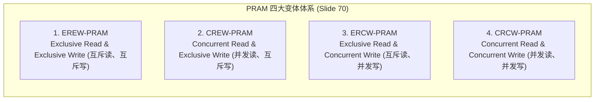

# PRAM理论模型与变体比较

> 本页对应课件：CG5201_Chap1 (2627).pdf, pp. 69–70, 73–74
> 本页属于：CEG5201 / Week 01
> 上一页：[[CEG5201-Week01-08-Vector-SIMD与算法复杂度理论]]
> 下一页：[[CEG5201-Week01-10-并行算法例题-矩阵乘法与Prefix-Sum]]
> 预计阅读时间：12 分钟

---

## 1. 为什么需要 PRAM 理论模型？

上一节阐明了通过理论模型剥离物理实现细节以推导算法极限的必要性。在并行计算理论中，最经典、最具影响力的共享存储抽象计算基准正是 **PRAM（Parallel Random Access Machine，并行随机存取机）**模型（[CG5201_Chap1 (2627).pdf](https://github.com/Kytolly/NUS-coursework-wiki/releases/download/CEG5201/CG5201_Chap1%20%282627%29.pdf) 第 69–70、73–74 页）。

---

## 2. PRAM 理论架构与内存更新模式（Slide 69）

PRAM 模型由 Steven Fortune 与 James Wyllie 于 1978 年提出：


*图：PRAM 理论模型体系结构（来源：CG5201_Chap1 (2627).pdf 第 69 页）*

### 2.1 架构假设
- 系统拥有多个同构的处理单元（PEs）；
- 所有处理器直接连接到一个无延迟、无物理带宽限制的集中式全局共享内存（Shared Memory）；
- 所有处理器在离散时钟步（Clock Steps）内严格同步执行取指、访存与计算。

### 2.2 四类基本内存更新操作（Slide 69）
在共享内存访问中，存在 4 种基本的读写模式：
1. **Exclusive Read (ER，互斥读)**：在同一时刻，任意内存单元至多只能被一个处理器读取。
2. **Exclusive Write (EW，互斥写)**：在同一时刻，任意内存单元至多只能被一个处理器写入。
3. **Concurrent Read (CR，并发读)**：在同一时刻，允许多个处理器同时并发读取同一个内存单元。
4. **Concurrent Write (CW，并发写)**：在同一时刻，允许多个处理器同时试图向同一个内存单元写入数据。

---

## 3. PRAM 的四大变体（Four PRAM Variants, Slide 70）

依据对并发读与并发写冲突的处理规则，PRAM 模型派生出 4 种经典变体：



| 变体名称 | 英文全称 | 允许并发读 (CR)? | 允许并发写 (CW)? | 体系结构定位 |
| :--- | :--- | :---: | :---: | :--- |
| **EREW-PRAM** | Exclusive Read, Exclusive Write | 否 | 否 | **最严格模型**。硬件物理实现门槛最低，是并行算法理论下界的保守基准。 |
| **CREW-PRAM** | Concurrent Read, Exclusive Write | **是** | 否 | **最常用的标准基准**。支持广播与共享数据读取，但禁止写冲突。 |
| **ERCW-PRAM** | Exclusive Read, Concurrent Write | 否 | **是** | 理论完备性模型，物理硬件中极少单独出现。 |
| **CRCW-PRAM** | Concurrent Read, Concurrent Write | **是** | **是** | **能力最强的理论模型**。允许多读多写，需要定义冲突仲裁协议。 |

---

## 4. CRCW 写冲突解决策略（Write Conflict Policies, Slide 70）

在 CRCW-PRAM 中，当多个处理器在同一时刻试图向同一共享内存地址写入不同数值时，必须依靠预定的写冲突策略进行仲裁（讲义第 70 页）：

1. **Common（公共值策略）**：
   - 仅当所有试图写入同一单元的处理器写入**完全相同的值**时，操作才被允许；如果写入值存在任何差异，则系统视为非法。
2. **Arbitrary（任意策略）**：
   - 系统非确定性地在竞争的处理器中任选一个处理器的值写入，其余写入被丢弃。算法必须保证无论选中谁的值，计算逻辑均正确。
3. **Minimum（最小值策略）**：
   - 试图写入的所有数值中，**最小的那个数值**成功写入内存单元。
4. **Priority（优先级策略）**：
   - 所有处理器预先赋予唯一的硬件优先级（通常依据处理器 ID 编号），发生写冲突时，**优先级最高的处理器**成功写入。

---

## 5. 课堂练习题 D：识别 PRAM 模型类型（Slide 73）

讲义第 73 页给出了一个经典的课堂思考与模型辨析题：


*图：课堂练习题 D——判断 PRAM 模型类型（来源：CG5201_Chap1 (2627).pdf 第 73 页）*

### 5.1 题目代码与场景
- **计算目标（Objective）**：检测一个给定的数组中是否包含负数（Detecting whether an array contains a negative number）。
- **输入数组**：$A = [12, -4, 7, 0, 15, -2, 9, 6]$，长度为 8。
- **硬件资源**：配备 8 个处理器 $P_0, P_1, \dots, P_7$，每个处理器对应一个数组元素。
- **共享标志位**：`NegativeFound = 0`。
- **并行算法逻辑**：
  ```text
  NegativeFound = 0
  Do Par: for i = 0 to 7:
      Processor Pi reads A[i]
      If A[i] < 0:
          write 1 into NegativeFound
  ```
- **核心问题**：*Identify the type of PRAM here! Explain. Any assumptions / issues in your choice?*

### 5.2 严密解析与结论
1. **读操作分析（Read Phase）**：
   - 处理器 $P_i$ 仅读取对应的数组单元 $A[i]$。每个处理器访问各自独立的物理内存地址，不存在两个处理器同时读取同一单元的情况。
   - 因此，读操作属于**互斥读（Exclusive Read, ER）**。
2. **写操作分析（Write Phase）**：
   - 检查输入数据，数组中包含负数元素：$A[1] = -4 < 0$ 以及 $A[5] = -2 < 0$。
   - 在并发执行分支中，处理器 $P_1$ 和 $P_5$ 将在同一时钟步同时向唯一的共享变量 `NegativeFound` 发起写入操作。
   - 因此，写操作属于**并发写（Concurrent Write, CW）**。
3. **模型判定结论**：
   - 本算法所需的最精确理论模型为 **ERCW-PRAM**（在支持 CRCW-PRAM 的机器上同样可执行）。
4. **写冲突策略考量（Assumptions / Issues）**：
   - 发生并发写入的所有处理器（此处为 $P_1$ 与 $P_5$）试图写入的数据内容完全相同（均为常数 `1`）。
   - 因此，该算法在最简单的 **Common CRCW**（或 Common ERCW）冲突策略下即可正确运行，无需复杂的优先级仲裁逻辑。

---

## 6. CRCW vs. EREW 算力对比与模拟定理（Slide 74）

讲义第 74 页探讨了不同 PRAM 变体之间的相对算力差距：

### 6.1 算力偏序关系
- CRCW 算法能够以更少的时间步解决特定问题；
- 任何 EREW 算法都可以直接在 CRCW PRAM 上执行；
- 因此，**CRCW 模型在计算能力上严格强于 EREW 模型（CRCW model is strictly more powerful than EREW model）**。

### 6.2 理论加速上界：模拟定理（Simulation Theorem）
CRCW 究竟比 EREW 强大多少？
- 理论上已知，拥有 $p$ 个处理器的 EREW PRAM 可以在 $O(\log p)$ 时间内对 $p$ 个数进行排序。
- 讲义第 74 页给出了著名的**模拟定理（Theorem, Slide 74）**：

> **定理（Slide 74）**：
> 针对同一个计算问题，一个采用 $p$ 个处理器的 CRCW 算法，其运行速度相比该问题在 $p$ 个处理器上的最优 EREW 算法，**快出的倍数至多不超过 $O(\log p)$**。
> 即两者的运行时间满足：
> 
> $$
> T_{EREW} \le O(\log p) \cdot T_{CRCW}
> $$

**工程与理论启示**：允许并发读写虽然极大简化了并行算法的编写，但在渐近意义上，CRCW 相比完全互斥读写的 EREW 所能带来的时间性能优势上限被严格限制在 $O(\log p)$ 倍之内，绝不可能产生多项式级别的飞跃。

---

## 学习目标 / Problem-Solving Skills

完成本节学习后，你应能掌握讲义中的以下核心知识与分析技能：

1. **PRAM 架构与 4 种更新模式**：
   - 掌握 PRAM 的理论假设与 ER、EW、CR、CW 的定义。
2. **四大变体与写冲突策略**：
   - 清楚写出 EREW、CREW、ERCW 与 CRCW 的限制矩阵；
   - 熟记处理写冲突的 4 种仲裁策略（Common, Arbitrary, Minimum, Priority）。
3. **PRAM 模型判定实战（Slide 73 例题）**：
   - 针对给定并行伪代码，能够准确分解读阶段（ER/CR）与写阶段（EW/CW），判定其对应的 PRAM 模型并说明写冲突策略。
4. **CRCW-to-EREW 模拟定理**：
   - 准确写出模拟定理不等式 $T_{EREW} \le O(\log p) \cdot T_{CRCW}$，并解释其理论含义（算力优势上限为 $O(\log p)$）。

---

## 下一步

- 上一页：[[CEG5201-Week01-08-Vector-SIMD与算法复杂度理论]]
- 下一页：[[CEG5201-Week01-10-并行算法例题-矩阵乘法与Prefix-Sum]]
- 模块总览：[[CEG5201-讲义与笔记索引]]
- 返回知识库：[[Home]]

---

## 来源与更新日志

- 来源：[CG5201_Chap1 (2627).pdf](https://github.com/Kytolly/NUS-coursework-wiki/releases/download/CEG5201/CG5201_Chap1%20%282627%29.pdf) pp. 69–70, 73–74.
- 2026-09-23：按照讲义顺序重构，建立正规编号与讲义映射页眉，系统呈现 PRAM 架构图、4 大变体、4 种冲突策略、Slide 73 负数检测实战题及 Slide 74 模拟定理。
