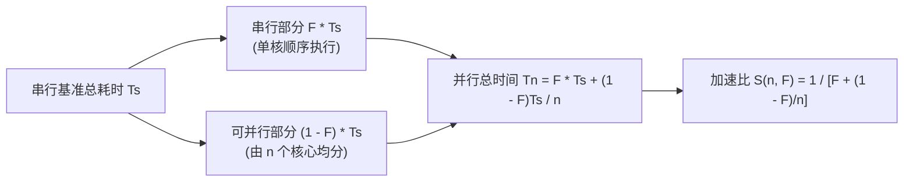

# Amdahl定律与可扩展性

> 本页对应课件：CG5201_Chap1 (2627).pdf, p. 75
> 本页属于：CEG5201 / Week 01
> 上一页：[[CEG5201-Week01-10-并行算法例题-矩阵乘法与Prefix-Sum]]
> 下一页：[[CEG5201-Week01-12-Annex-芯片设计验证与硬件安全]]
> 预计阅读时间：10 分钟

---

## 1. 为什么需要研究 Amdahl 定律？

前几节探讨了具体算法在增加处理器时的加速效果（例如矩阵乘法取得线性加速）。然而在真实的复杂工程应用中，几乎没有任何程序可以被 100% 完全并行化。

计算机体系结构必须回答一个关键理论问题：**如果程序中存在一部分无法并行化的串行代码，随着处理器数量的不断增加，系统的整体加速比极限究竟是多少？**

讲义第 75 页给出了著名的 **Amdahl 定律（Amdahl's Law）**（[CG5201_Chap1 (2627).pdf](https://github.com/Kytolly/NUS-coursework-wiki/releases/download/CEG5201/CG5201_Chap1%20%282627%29.pdf) 第 75 页）。

---

## 2. Amdahl 定律严格数学推导（Slide 75）

讲义第 75 页给出了如下标准符号定义与推导步骤：

### 2.1 符号系统与时间分解
- **加速比（Speed-up）定义**：单处理器执行时间与 $n$ 处理器并行执行时间之比：

$$
	ext{Speed-up} = rac{	ext{Time (single processor)}}{	ext{Time (}n	ext{ processors)}}
$$

- $T_s$：程序以纯串行方式在单处理器上运行的时间（Time to run in serial fashion）。
- $F$：程序中**无法被并行化或无法并发执行**的代码部分所占的时间比例（Fraction of a program that cannot be parallelized or concurrently executed, $0 \le F \le 1$）。
  - 串行部分耗时：$F \cdot T_s$。
- $1 - F$：程序中可以被完全并行化的时间比例。
- $n$：参与协同计算的并行处理器数量。
- $Q$：可并行部分在 $n$ 个处理器上并发执行的时间：

$$
Q = rac{(1 - F) T_s}{n}
$$

### 2.2 理论加速比公式推导
在 $n$ 个处理器上运行的总时间为串行耗时与并行耗时之和：$T_n = F \cdot T_s + Q$。

加速比表达式为：

$$
S(n, F) = rac{T_s}{F \cdot T_s + Q} = rac{T_s}{F \cdot T_s + rac{(1 - F) T_s}{n}}
$$

分子分母同时约去 $T_s$，得到标准的 **Amdahl 定律公式（Amdahl's Law）**：

$$
S(n, F) = rac{1}{F + rac{1 - F}{n}}
$$

---

## 3. 课堂思考题：极限行为与曲线分析（Slide 75）

讲义在第 75 页提出了具体的研讨问题：

> **课堂思考题（Slide 75）**：
> *“Plot $S(n, F)$ with respect to $n$ and $F$ and interpret the behavior. What happens to $S(n, F)$ when $n$ tends to infinity?”*
> （画出 $S(n, F)$ 关于核心数 $n$ 与串行比例 $F$ 的变化关系曲线并解释其行为；当处理器数 $n 	o \infty$ 时，$S(n, F)$ 会发生什么？）

### 3.1 极限推演（$n 	o \infty$）
当投入的处理器数量 $n$ 趋近于无穷大时，分母中的并行分量 $rac{1 - F}{n} 	o 0$：

$$
\lim_{n 	o \infty} S(n, F) = \lim_{n 	o \infty} rac{1}{F + rac{1 - F}{n}} = rac{1}{F}
$$

**物理启示**：
系统的理论最大加速比完全受限于不可并行化的串行比例 $F$ 的倒数：

$$
S_{\max} = rac{1}{F}
$$

只要程序中存在哪怕几个百分点的串行部分，盲目追加处理器核数最终都无法突破 $1/F$ 的硬性上限。

### 3.2 敏感性数值分析表

| 串行比例 $F$ | 可并行比例 $1-F$ | 理论加速比极限 $1/F$ | $n = 8$ 核心 | $n = 64$ 核心 | $n = 256$ 核心 | $n = 1024$ 核心 |
| :--- | :--- | :--- | :--- | :--- | :--- | :--- |
| **$50\%$（$0.5$）** | $50\%$ | **$2$ 倍** | $1.78$ | $1.97$ | $1.99$ | $2.00$ |
| **$20\%$（$0.2$）** | $80\%$ | **$5$ 倍** | $3.33$ | $4.71$ | $4.92$ | $4.98$ |
| **$10\%$（$0.1$）** | $90\%$ | **$10$ 倍** | $4.71$ | $8.77$ | $9.66$ | $9.91$ |
| **$5\%$（$0.05$）** | $95\%$ | **$20$ 倍** | $5.93$ | $15.06$ | $18.42$ | $19.57$ |
| **$1\%$（$0.01$）** | $99\%$ | **$100$ 倍** | $7.48$ | $39.51$ | $72.32$ | $91.19$ |

### 3.3 曲线规律解释（Behavior Interpretation）
1. **$F$ 对加速比上限的决定性控制**：即使程序拥有 90% 的高并行度（$F = 10\%$），系统的极限加速比也绝不可能超过 10 倍。
2. **边际效益递减**：随着 $n$ 的增加，加速比曲线迅速向水平渐近线 $1/F$ 弯曲。在 $F=10\%$ 时，从 1 核增至 64 核获得了约 8.77 倍加速；但从 64 核进一步扩容至 1024 核，耗费了 16 倍的硬件资源，换来的加速比仅从 8.77 微增至 9.91，硬件利用效率极度下降。

---

## 4. 课外拓展阅读指示（Slide 75）

讲义第 75 页末尾明确给出了拓展阅读提示：

> **课外阅读提示（Leisure Reading, Slide 75）**：
> *"Leisure reading! Read an interesting article about another form of Amdahl's law via your Useful Links zone!"*
> 
> > **补充说明（非课件原文）**：
> > 讲义“Useful Links”推荐阅读的内容通常指向 **Gustafson 定律（Gustafson's Law / Scaled Speedup）**。Amdahl 定律假定问题总规模固定（Fixed-size workload）；而在实际超算与大规模模拟中，随着可用算力核心的增加，研究者通常会相应等比例扩大求解的问题规模，从而将串行有效时间占比稀释至极小，实现近乎线性的扩展。

---

## 学习目标 / Problem-Solving Skills

完成本节学习后，你应能掌握讲义中的以下核心知识与分析技能：

1. **Amdahl 定律推导掌握**：
   - 清楚写出加速比定义 $	ext{Speed-up} = rac{T_1}{T_n}$；
   - 掌握符号定义：串行时间 $T_s$、串行比例 $F$ 与并行部分时间 $Q = rac{(1-F)T_s}{n}$；
   - 完整推导出闭式解 $S(n, F) = rac{1}{F + rac{1-F}{n}}$。
2. **渐近极限与曲线行为分析**：
   - 能够求极限证明 $\lim_{n 	o \infty} S(n, F) = rac{1}{F}$；
   - 结合数据表格解释加速比曲线随核心数 $n$ 增加呈现出的边际收益递减趋势，阐明为何串行比例 $F$ 是决定系统上限的关键。
3. **计算与逆向求解能力**：
   - 给定 $F$ 与 $n$，熟练计算实际加速比；
   - 给定目标加速比与处理器数，能够反解程序所允许的最大串行比例 $F$。

---

## 下一步

- 上一页：[[CEG5201-Week01-10-并行算法例题-矩阵乘法与Prefix-Sum]]
- 下一页：[[CEG5201-Week01-12-Annex-芯片设计验证与硬件安全]]
- 模块总览：[[CEG5201-讲义与笔记索引]]
- 返回知识库：[[Home]]

---

## 来源与更新日志

- 来源：[CG5201_Chap1 (2627).pdf](https://github.com/Kytolly/NUS-coursework-wiki/releases/download/CEG5201/CG5201_Chap1%20%282627%29.pdf) p. 75.
- 2026-09-23：按照讲义顺序重构，建立正规编号与讲义映射页眉，严格依照 Slide 75 原版符号体系（$F, T_s, Q$）推导 Amdahl 定律，还原极限分析与 Useful Links 课外拓展提示。
