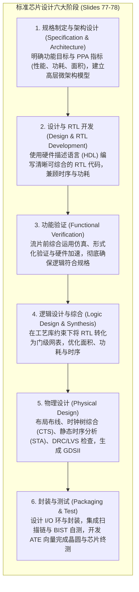

# Annex: 芯片设计验证与硬件安全

> 本页对应课件：CG5201_Chap1 (2627).pdf, pp. 76–84 (Chapter 1 Annex)
> 本页属于：CEG5201 / Week 01 (附录补充专页)
> 上一页：[[CEG5201-Week01-11-Amdahl定律与可扩展性]]
> 下一页：[[CEG5201-Week01-13-Annex-集群计算Cloud与虚拟化]]
> 预计阅读时间：11 分钟

---

## 1. 附录定位说明

本页属于第一章主课件的附录专题（[CG5201_Chap1 (2627).pdf](https://github.com/Kytolly/NUS-coursework-wiki/releases/download/CEG5201/CG5201_Chap1%20%282627%29.pdf) 第 76–84 页）。
讲义在讲授完并行体系结构与理论模型（Amdahl 定律）之后，通过附录向学生展示了现代芯片工程的两大前沿现实课题：
1. **工业级芯片设计流程与大语言模型（LLM）的渗透**；
2. **现代微架构面临的底层物理硬件安全漏洞（如 Rowhammer）**。

---

## 2. 工业级芯片设计流程（Chip Design Flow, Slides 76–78）

讲义第 76 页指出：定制设计一颗芯片是一项极具挑战性的庞大工程。以具有典型复杂度的 ASIC 为例，通常需要投入约 **1000 人月（~1000 engineering months）**的高级工程人力，并面临高昂的人员招聘与团队协作挑战。

讲义第 77–78 页将工业界标准的芯片设计流程系统划分为六个核心阶段：

1. **规格制定与架构设计（Specification & Architecture）**：
   - 确定功能目标与 **PPA 目标**（Performance, Power, Area，性能、功耗、面积）；
   - 建立契合产品需求的顶层微架构。
2. **设计与 RTL 开发（Design & RTL Development）**：
   - 使用硬件描述语言（Verilog/SystemVerilog）将微架构转化为清晰、可综合的寄存器传输级（RTL）代码，充分考虑时钟时序与低功耗需求。
3. **功能验证（Functional Verification）**：
   - 在向晶圆代工厂交付流片之前，综合采用软件仿真（Simulation）、形式化验证（Formal Verification）与硬件仿真加速（Emulation）技术，彻底确保 RTL 行为与规格严格吻合。
4. **逻辑设计与综合（Logic Design & Synthesis）**：
   - 在给定的工艺规则约束下，将 RTL 逻辑映射为晶体管门级网表（Gate-level Netlist），并在面积、功耗和时延之间进行多目标平衡。
5. **物理设计（Physical Design）**：
   - 执行芯片版图布局规划（Floor-planning）、标准单元放置（Placement）、时钟树综合（Clock-Tree Synthesis, CTS）以及金属布线（Routing）；
   - 完成静态时序分析（STA）、设计规则检查（DRC/LVS）与电源完整性分析，最终导出准备流片的 **GDSII** 掩膜文件。
6. **封装与测试（Packaging & Test）**：
   - 设计芯片 I/O 环与封装壳体；
   - 植入扫描链（Scan Chains）与内建自测逻辑（BIST, Built-In Self-Test）；
   - 编写自动测试设备（ATE）测试向量，完成晶圆分选（Wafer Sorting）、芯片封装及最终硅片质量验证。

---

## 3. 功能验证瓶颈与大模型（LLM）的应用（Slides 80–81）

讲义第 80–81 页剖析了现代芯片研发中最严峻的资源瓶颈以及生成式 AI 的突破作用：

### 3.1 为什么功能验证占据了 60%–70% 的研发资源？（Slide 80）
- 随着集成电路晶体管规模迈向数十亿级，验证 RTL 功能的正确性变得极其复杂；
- 在现代芯片开发团队中，**功能验证占据了绝大部分工作量，常耗费总项目资源的 60% 至 70%**；
- 该阶段高度依赖繁琐的人工作业，需要工程师深入理解体系结构规格、严密构造极端边界测试用例（Corner cases），并时刻关注复杂的系统物理约束。

### 3.2 为什么验证高度依赖人工理解？（Slide 81）
- 芯片设计与验证的核心难点在于**对人类自然语言（Natural Language）的理解与推理**；
- 架构需求规范书通常由人类自然语言编写，工程师必须阅读海量规格文档、领会设计意图，并检验底层硬件代码是否如实反映了这些语言定义；
- 传统 EDA 工具缺乏处理自然语言语义的能力，因此这一环节长期无法实现完全自动化。

### 3.3 大语言模型（LLM）的赋能机制（Slide 81）
- LLM 具备出色的自然语言理解与常识推理能力，与芯片设计验证的痛点高度契合；
- **核心赋能领域**：
  1. 自动化理解人类自然语言设计意图（Understanding design intent）；
  2. 智能识别相关测试场景并自动生成测试向量代码；
  3. 协同编排并调度 EDA 工具链；
  4. 辅助硬件逻辑调试（Debugging）；
  5. 自动化检测验证测试用例的覆盖率盲区（Coverage gaps）。

---

## 4. 现代硬件安全挑战：硬件漏洞与 Rowhammer（Slides 82–84）

讲义第 82–84 页强调：随着多处理器共享资源密度的提升，微架构底层的物理安全威胁已不可忽视。

### 4.1 硬件漏洞的定义与攻击途径（Slide 82）
- **硬件漏洞（Hardware Vulnerability）定义**：
  计算机系统中可被攻击者利用的软硬件缺陷与薄弱点。如果存在任何途径能让恶意代码被引入计算机系统，则该硬件即被视为存在漏洞（A hardware is said to be vulnerable, if by any means by which "a code" can be introduced to a computer）。
- **攻击启用途径**：通过对系统硬件的物理接触（Physical access）或远程网络访问（Remote access）。
- **常见利用形式**：
  1. 通过 U 盘、移动介质将恶意文件写入物理内存；
  2. 利用微架构运行时的非预期物理缺陷，使攻击者通过提权（Elevating privileges）或远程注入执行任意代码。

### 4.2 典型物理漏洞案例：Rowhammer（Slide 83）
讲义第 83 页以 **Rowhammer** 为例，剖析了 DRAM 物理微观结构引发的内存击穿攻击：

- **攻击机理**：攻击者通过极高频率持续重复读写（Repeatedly rewriting/accessing）DRAM 中特定行的物理内存地址。
- **物理成因**：由于现代 DRAM 存储单元极度微缩密集，高频翻转某一行电荷会在相邻存储行（Adjacent rows）之间产生寄生电磁耦合与电荷泄漏。
- **比特翻转（Bit Flips）**：研究人员已证实，即使相邻存储行处于受保护状态，频繁访问当前行也会导致相邻未访问行的数据发生非预期的**比特翻转（Bit flips）**！
- **本质机理**：攻击者利用了硬件内存的**“空间访问局部性（Spatial access property）”**物理缺陷，跨越逻辑权限隔离窃取或篡改特权信息。

### 4.3 工业界安全评估与防护视角（Slide 84）
讲义在第 84 页给出了客观务实的安全总结：
> **讲义总结（Slide 84）**：
> 通常情况下，硬件级漏洞极少通过随机的黑客扫描被轻易利用。它们主要针对已知的高价值目标系统与关键基础设施发动定向攻击。
> 对于日常普通用户而言，传统的恶意软件防护策略配合基本的物理安全防范（例如给服务器机房上锁，防止未经授权的物理接触），已能够提供足够充分的安全防护。

---

## 学习目标 / Problem-Solving Skills

完成本节学习后，你应能掌握讲义中的以下核心知识与分析技能：

1. **芯片设计六大标准阶段**：
   - 清楚写出从规格架构、RTL 开发、功能验证、逻辑综合、物理设计到封装测试的完整流程。
2. **验证瓶颈与 LLM 角色**：
   - 解释为什么功能验证消耗芯片开发 60%–70% 的资源；
   - 阐明为什么自然语言理解能力使 LLM 能够协助自动化生成测试用例并填补覆盖率盲区。
3. **硬件漏洞与 Rowhammer 机制**：
   - 准确写出讲义对硬件漏洞的定义；
   - 解释 Rowhammer 的工作机制：如何利用 DRAM 空间访问缺陷高频读写诱发相邻行比特翻转（Bit flip）；
   - 说明为什么普通用户依靠传统杀毒与机房物理门禁即可防范大部分硬件物理威胁。

---

## 下一步

- 上一页：[[CEG5201-Week01-11-Amdahl定律与可扩展性]]
- 下一页：[[CEG5201-Week01-13-Annex-集群计算Cloud与虚拟化]]
- 模块总览：[[CEG5201-讲义与笔记索引]]
- 返回知识库：[[Home]]

---

## 来源与更新日志

- 来源：[CG5201_Chap1 (2627).pdf](https://github.com/Kytolly/NUS-coursework-wiki/releases/download/CEG5201/CG5201_Chap1%20%282627%29.pdf) pp. 76–84 (Chapter 1 Annex).
- 2026-09-23：按照讲义顺序重构，建立正规编号与附录标识页眉，严格依照 Slide 76–84 还原工业级 ASIC 研发规模、六阶段芯片设计流程图、验证瓶颈与 LLM 角色，以及 Rowhammer 物理比特翻转机理。
