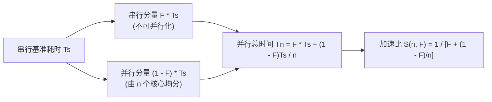

# Amdahl定律与可扩展性分析

> 本页属于：CEG5201 / Week 01
> 前置知识：[[CEG5201-Week01-并行算法例题-Prefix-Sum与归约]]
> 预计阅读时间：10 分钟

---

## 1. 加速比定义与 Amdahl 定律提出

在评估多处理器系统相对于单处理器的性能增益时，**加速比（Speed-up）**是最基本的度量指标（[CG5201_Chap1 (2627).pdf](https://github.com/Kytolly/NUS-coursework-wiki/releases/download/CEG5201/CG5201_Chap1%20%282627%29.pdf) 第 75 页）：

$$
	ext{Speed-up} = rac{	ext{Time (single processor)}}{	ext{Time (}n	ext{ processors)}}
$$

讲义第 75 页指出：若一个程序中存在一部分代码**无法被并行化或并发执行（Cannot be parallelized or concurrently executed）**，则无论投入多少处理器，系统的理论加速比都存在严格的物理上限。该定量关系即为著名的 **Amdahl 定律（Amdahl's Law）**。

---

## 2. Amdahl 定律严格数学推导（Slide 75）

讲义第 75 页给出了如下参数定义与推导：

### 2.1 符号与时间分解
- $T_s$：程序在单处理器上以串行方式运行的时间（Time to run in serial fashion）。
- $F$：程序中**无法被并行化**的代码部分所占的时间比例（Fraction of a program that cannot be parallelized, $0 \le F \le 1$）。
  - 串行部分耗时：$F \cdot T_s$。
- $1 - F$：程序中可以被完全并行化的时间比例。
- $n$：投入协同计算的并行处理器数量。
- $Q$：可并行部分在 $n$ 个处理器上并发执行的时间：

$$
Q = rac{(1 - F) T_s}{n}
$$

### 2.2 加速比公式表达
在 $n$ 个处理器上的总运行时间为串行部分耗时与并行部分耗时之和：$T_n = F \cdot T_s + Q$。

加速比 $S(n, F)$ 表达式为：

$$
S(n, F) = rac{T_s}{F \cdot T_s + Q} = rac{T_s}{F \cdot T_s + rac{(1 - F) T_s}{n}}
$$

分子分母同时约去串行时间 $T_s$，得到标准的 **Amdahl 定律闭式解**：

$$
S(n, F) = rac{1}{F + rac{1 - F}{n}}
$$

---

## 3. 课堂问题研讨：极限行为与曲线分析（Slide 75）

讲义第 75 页提出了具体的课堂研讨问题：

> **课堂思考题（Slide 75）**：
> *“Plot $S(n, F)$ with respect to $n$ and $F$ and interpret the behavior. What happens to $S(n, F)$ when $n$ tends to infinity?”*
> （画出 $S(n, F)$ 关于核心数 $n$ 与串行比例 $F$ 的变化关系曲线并解释其行为；当处理器数 $n 	o \infty$ 时，$S(n, F)$ 会发生什么？）

### 3.1 极限推演（$n 	o \infty$）
当处理器数量 $n$ 趋向于无穷大时，分母中的并行分量 $rac{1 - F}{n} 	o 0$：

$$
\lim_{n 	o \infty} S(n, F) = \lim_{n 	o \infty} rac{1}{F + rac{1 - F}{n}} = rac{1}{F}
$$

**结论与物理意义**：
- 系统的理论极限加速比**完全由不可并行化的串行比例 $F$ 的倒数所决定（$\lim_{n 	o \infty} S = 1/F$）**。
- 只要程序中存在哪怕极小比例的串行瓶颈，盲目堆砌处理器数量都无法突破 $rac{1}{F}$ 的坚硬天花板。

### 3.2 敏感性数值分析

| 串行比例 $F$ | 理论加速比极限 $1/F$ | $n = 8$ 核心 | $n = 64$ 核心 | $n = 256$ 核心 | $n = 1024$ 核心 |
| :--- | :--- | :--- | :--- | :--- | :--- |
| **$50\%$（$0.5$）** | **$2$ 倍** | $1.78$ | $1.97$ | $1.99$ | $2.00$ |
| **$20\%$（$0.2$）** | **$5$ 倍** | $3.33$ | $4.71$ | $4.92$ | $4.98$ |
| **$10\%$（$0.1$）** | **$10$ 倍** | $4.71$ | $8.77$ | $9.66$ | $9.91$ |
| **$5\%$（$0.05$）** | **$20$ 倍** | $5.93$ | $15.06$ | $18.42$ | $19.57$ |
| **$1\%$（$0.01$）** | **$100$ 倍** | $7.48$ | $39.51$ | $72.32$ | $91.19$ |

**曲线规律解释（Behavior Interpretation）**：
1. **$F$ 对加速比上限的决定性制约**：当 $F=10\%$ 时，最大理论加速比仅为 10 倍；即使投入 1024 个核心，实际加速比也仅为 9.91 倍，绝大部分算力被闲置。
2. **边际收益递减**：随着 $n$ 的增加，加速比曲线逐渐趋向平缓并无限逼近水平渐近线 $1/F$。当 $n$ 超过一定阈值后，增加处理器的经济效益迅速下滑。

---

## 4. 课外拓展阅读指示（Slide 75）

讲义第 75 页末尾特别给出了课外休闲阅读提示：

> **课外阅读提示（Leisure Reading, Slide 75）**：
> *"Leisure reading! Read an interesting article about another form of Amdahl's law via your Useful Links zone!"*
> 
> > 补充说明（讲义推荐拓展）：在经典 Amdahl 定律中假定任务总规模固定（Fixed-size workload）。在实际大规模并行科学计算中，研究者通常会随着可用处理核数的增加而相应扩大计算模型规模（如 Gustafson's Law，通过扩大可并行计算量将串行有效占比稀释至极小），这为并行加速比的另一类扩展形态提供了互补视角。

---

## 学习目标 / Problem-Solving Skills

完成本节学习后，你应能掌握讲义中的以下核心知识与分析技能：

1. **加速比与 Amdahl 定律公式推导**：
   - 清楚写出加速比定义 $	ext{Speed-up} = rac{T_1}{T_n}$；
   - 掌握变量定义：串行时间 $T_s$、串行比例 $F$、并行部分时间 $Q = rac{(1-F)T_s}{n}$；
   - 严密推导闭式解 $S(n, F) = rac{1}{F + rac{1-F}{n}}$。
2. **渐近极限与曲线行为分析（Slide 75 核心问题）**：
   - 能够求极限证明 $\lim_{n 	o \infty} S(n, F) = rac{1}{F}$；
   - 结合表格与图像，准确解释加速比曲线随 $n$ 增加出现的边际收益递减规律，阐明为何串行比例 $F$ 是决定性瓶颈。
3. **参数代入与实际计算能力**：
   - 给定 $F$ 与 $n$，熟练计算实际加速比；
   - 给定目标加速比与处理器数，能够反解程序允许的最大串行比例 $F$。

---

## 下一步

- 上一页：[[CEG5201-Week01-并行算法例题-Prefix-Sum与归约]]
- 下一页：[[CEG5201-Week01-集群计算Cloud与虚拟化]]
- 模块总览：[[CEG5201-讲义与笔记索引]]
- 返回知识库：[[Home]]

---

## 来源与更新日志

- 来源：[CG5201_Chap1 (2627).pdf](https://github.com/Kytolly/NUS-coursework-wiki/releases/download/CEG5201/CG5201_Chap1%20%282627%29.pdf) p. 75.
- 2026-09-08：初始简略版归档。
- 2026-09-23：严格依讲义 Slide 75 重构，剔除非讲义的所谓“阿姆达尔诅咒”和强弱扩展深度展开，保留 Slide 75 原版公式定义（$F$, $T_s$, $Q$）、极限证明、曲线研讨与 Useful Links 课外阅读提示，更新为标准学习目标。
