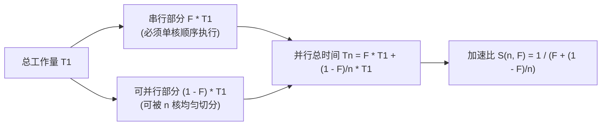
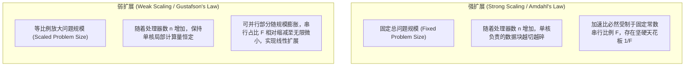

# Amdahl定律与可扩展性分析

> 本页属于：CEG5201 / Week 01
> 前置知识：[[CEG5201-Week01-并行算法例题-Prefix-Sum与归约]]
> 预计阅读时间：11 分钟

---

## 1. Amdahl 定律的提出背景与历史意义

在并行计算与高性能体系结构设计中，**阿姆达尔定律（Amdahl's Law）**是由著名计算机体系结构先驱 Gene Amdahl 于 1967 年提出的一条奠基性理论法则（[CG5201_Chap1 (2627).pdf](https://github.com/Kytolly/NUS-coursework-wiki/releases/download/CEG5201/CG5201_Chap1%20%282627%29.pdf) 第 75 页）。

该定律以极度简洁而冷酷的数学形式，揭示了并行系统性能优化的本质规律：
> **“一个程序在使用并行硬件所能获得的理论最大加速比，根本上受限于该程序中必须串行执行的部分所占的时间比例。”**

---

## 2. Amdahl 定律严格数学推导

讲义第 75 页给出了标准的符号系统与推导链条：

### 2.1 任务时间模型定义
设某个给定基准计算任务在单个处理器上的串行总执行时间为 $T_1$。将该任务的全部工作量在逻辑上划分为互斥的两部分：
1. **纯串行部分（Serial Fraction, $F$）**：
   - 占比为 $F$（$0 \le F \le 1$）。包括程序初始化、文件读取、线程派生（Fork）、临界区互斥锁访问、全局栅障同步（Barrier）以及最终结果汇总。
   - 该部分代码**具有不可解构的数据依赖，无法被多个处理器同时执行**，耗时为：
     $$T_{\text{serial}} = F \cdot T_1$$
2. **完全可并行部分（Parallelizable Fraction, $1 - F$）**：
   - 占比为 $1 - F$。包括完全解耦的独立循环迭代、稠密向量/矩阵运算、分布式网格差分计算。
   - 该部分代码可以被完美、均匀地分发给多个处理器协同处理，耗时为：
     $$T_{\text{parallelizable}} = (1 - F) \cdot T_1$$

### 2.2 $n$ 处理器并行执行时间
当分配 $n$ 个同构的物理处理器协同执行该任务时（假定系统处于理想状态，忽略额外的网络通信拥塞与调度开销）：
- 串行部分仍然只能由单个核心顺序执行，耗时依然为 $F \cdot T_1$；
- 可并行部分被 $n$ 个核心均匀分担，执行时间被压缩至 $\frac{1 - F}{n} \cdot T_1$。

因此，$n$ 个处理器下的总并行执行时间 $T_n$ 为：

$$
T_n = T_{\text{serial}} + \frac{T_{\text{parallelizable}}}{n} = T_1 \cdot \left( F + \frac{1 - F}{n} \right)
$$

### 2.3 理论加速比公式推演
系统的加速比（Speedup, $S(n, F)$）严格定义为单处理器串行耗时与多处理器并行耗时之比：

$$
S(n, F) = \frac{T_1}{T_n} = \frac{T_1}{T_1 \cdot \left( F + \frac{1 - F}{n} \right)} = \frac{1}{F + \frac{1 - F}{n}}
$$

---

## 3. 渐近加速比极限与“阿姆达尔诅咒”（Amdahl's Curse）

讲义第 75 页明确指出：当处理器数量 $n$ 趋向于无穷大（$n \to \infty$）时，公式右侧的并行衰减项 $\frac{1 - F}{n}$ 趋近于 $0$：

$$
S_{\max}(F) = \lim_{n \to \infty} S(n, F) = \lim_{n \to \infty} \frac{1}{F + \frac{1 - F}{n}} = \frac{1}{F}
$$

### 震撼的工程数值对照表

| 串行比例 $F$ | 可并行比例 $1 - F$ | 理论最大加速比极限 $S_{\max} = 1/F$ | 投入 $n=16$ 核加速比 | 投入 $n=256$ 核加速比 | 投入 $n=65,536$ 核加速比 |
| :--- | :--- | :--- | :--- | :--- | :--- |
| **$50\%$** | $50\%$ | **$2$ 倍** | $1.88$ 倍 | $1.99$ 倍 | $2.00$ 倍 |
| **$20\%$** | $80\%$ | **$5$ 倍** | $4.00$ 倍 | $4.93$ 倍 | $5.00$ 倍 |
| **$10\%$** | $90\%$ | **$10$ 倍** | $6.40$ 倍 | $9.66$ 倍 | $9.99$ 倍 |
| **$5\%$** | $95\%$ | **$20$ 倍** | $9.41$ 倍 | $17.58$ 倍 | $19.98$ 倍 |
| **$1\%$** | $99\%$ | **$100$ 倍** | $13.91$ 倍 | $72.32$ 倍 | $99.85$ 倍 |

> **关键警示**：
> - 如果一个程序的代码中有仅仅 **$5\%$** 无法被并行化（$F = 0.05$），那么无论你使用 1000 颗 CPU 还是 10 万颗 GPU，**该系统的最终加速比上限被严格焊死在 20 倍之内！**
> - 这就是著名的“阿姆达尔诅咒”——在固定任务规模下，盲目追加处理机核心数量，最终必定陷入边际收益递减的严重浪费。

---

## 4. 并行效率衰退模型（Parallel Efficiency Degradation）

衡量硬件资源利用充分程度的指标是**并行效率（Efficiency, $E(n, F)$）**：

$$
E(n, F) = \frac{S(n, F)}{n} = \frac{1}{n \cdot \left( F + \frac{1 - F}{n} \right)} = \frac{1}{n \cdot F + (1 - F)}
$$

- 当 $n = 1$ 时，$E(1, F) = 1$（$100\%$ 利用率）。
- 当 $n \to \infty$ 时，分母中的 $n \cdot F$ 趋于无穷大，效率**单调递减并逼近于 $0$**：
  $$\lim_{n \to \infty} E(n, F) = 0$$
- **工程启示**：在芯片设计与集群采购中，存在一个性价比拐点。盲目追求极致缩短微小延迟而扩充核数，会导致成千上万的处理核心长时间处于空转等待状态。

---

## 5. 两种经典扩展范式：强扩展 vs 弱扩展（Scaling Paradigms）

如何破除阿姆达尔定律带来的悲观结论？关键在于区分**强扩展（Strong Scaling）**与**弱扩展（Weak Scaling）**：

### 5.1 强扩展（Strong Scaling）
- **实验设定**：保持输入数据集总大小不变（例如固定模拟 1000 万个天体分子的运动），不断增加处理器核数 $n$。
- **评判目标**：度量系统**缩短单一任务求解时间（Time-to-Solution）**的能力。
- **现实瓶颈**：当 $n$ 极大时，每个处理器分配到的粒子数极少，单核计算时间极快，此时跨核心的网络同步握手延迟（Latency）开始反客为主占据主要比例，强扩展效率迅速崩溃。

### 5.2 弱扩展（Weak Scaling）与格斯塔夫森定律（Gustafson's Law 视野拓展）
- **实验设定**：随着处理器核心数 $n$ 的翻倍，**同步将问题总规模等比例扩大 $n$ 倍**（例如每个核心始终负责模拟 10 万个粒子，100 个核心模拟 1000 万个，1 万个核心模拟 10 亿个）。
- **评判目标**：度量系统在**可接受的恒定时间预算内，求解更大规模、更高精度复杂科学问题**的能力。
- **破解诅咒**：John Gustafson 于 1988 年提出，在实际科研与大模型训练中，没有人会用万卡集群去跑一个手机秒级的微型任务。随着硬件算力的扩充，人们求解的模型规模成百上千倍增长，导致可并行部分的工作量以 $O(n^2)$ 或 $O(n^3)$ 爆炸式增长，而串行部分（如启动初始化）通常只以 $O(1)$ 或 $O(n)$ 增长。串行有效占比 $F$ 被稀释为极其微小的接近零的值，从而实现了近乎理想的线性可扩展性！

---

## 考试时你应该会什么

1. **公式推导与极限定理**：
   - 能够独立完整推导阿姆达尔定律公式 $S(n, F) = \frac{1}{F + \frac{1-F}{n}}$；
   - 能够求极限证明当核心数 $n \to \infty$ 时，$S_{\max} = 1/F$；
   - 根据公式写出并行效率公式 $E(n, F) = \frac{1}{nF + (1-F)}$。
2. **计算题掌握**：
   - 给定程序串行占比 $F$（如 $10\%$）与核心数 $n$（如 $32$ 核），准确计算该系统的实际加速比与硬件效率；
   - 反向求解题：若系统期望在 64 个处理器上获得至少 30 倍的加速比，求程序所允许的最大串行占比 $F$。
3. **概念辨析与宏观思考**：
   - 清楚阐明强扩展（Strong Scaling）与弱扩展（Weak Scaling）的核心区别；
   - 结合现实科研场景（如天气预报精细网格划分、大模型参数规模扩展），解释为何弱扩展能够克服阿姆达尔定律的性能天花板。

---

## 下一步

- 上一页：[[CEG5201-Week01-并行算法例题-Prefix-Sum与归约]]
- 下一页：[[CEG5201-Week01-集群计算Cloud与虚拟化]]
- 模块总览：[[CEG5201-讲义与笔记索引]]
- 返回知识库：[[Home]]

---

## 来源与更新日志

- 来源：[CG5201_Chap1 (2627).pdf](https://github.com/Kytolly/NUS-coursework-wiki/releases/download/CEG5201/CG5201_Chap1%20%282627%29.pdf) p. 75.
- 2026-09-08：初始简略版归档。
- 2026-09-23：全新拆分专页，补充 Amdahl 定律严格数学推导、阿姆达尔诅咒数值敏感性分析表、并行效率衰退机理以及强扩展 vs 弱扩展（Gustafson 定律视角）对比。
