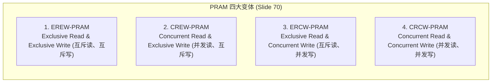

# PRAM理论模型与变体比较

> 本页属于：CEG5201 / Week 01
> 前置知识：[[CEG5201-Week01-算法复杂度与P-NP理论]]
> 预计阅读时间：12 分钟

---

## 1. PRAM 理论模型架构（Parallel Random Access Machines）

在并行计算理论中，**PRAM（Parallel Random Access Machine，并行随机存取机）**模型由 Steven Fortune 与 James Wyllie 于 1978 年提出（[CG5201_Chap1 (2627).pdf](https://github.com/Kytolly/NUS-coursework-wiki/releases/download/CEG5201/CG5201_Chap1%20%282627%29.pdf) 第 64、69 页）：

- **理论模型的定位（Slide 64）**：
  - 属于理论模型（Theoretical models），用于在**无需担忧具体实现细节（Without worrying about implementation details）**的前提下开发并行算法；
  - 该模型可用于获取并行计算机的特定理论边界（Theoretical bounds），或在芯片流片制造之前评估给定芯片面积下的 VLSI 复杂度及其他性能度量。
- **体系结构（Slide 69）**：
  - 拥有多个共享内存的处理器。
  - 在共享存储下，存在四种可能的内存更新模式：
    - **Exclusive Read (ER，互斥读)**
    - **Exclusive Write (EW，互斥写)**
    - **Concurrent Read (CR，并发读)**
    - **Concurrent Write (CW，并发写)**


*图：PRAM 理论模型架构（来源：CG5201_Chap1 (2627).pdf 第 69 页）*

---

## 2. PRAM 的四大变体（PRAM Variants）

讲义第 70 页指出，依据对内存读/写并发冲突的处理机制，PRAM 模型划分为四大经典变体：



| 变体代号 | 英文全称 | 允许并发读 (CR)? | 允许并发写 (CW)? | 说明与特点 |
| :--- | :--- | :--- | :--- | :--- |
| **EREW-PRAM** | Exclusive Read and Exclusive Write | 严格禁止 | 严格禁止 | 约束最严苛，任意单元在同一时刻仅允许一个处理器读或写。 |
| **CREW-PRAM** | Concurrent Read and Exclusive Write | **允许** | 严格禁止 | 允许多个处理器同时读取同一存储单元，但写入必须互斥。 |
| **ERCW-PRAM** | Exclusive Read and Concurrent Write | 严格禁止 | **允许** | 仅允许互斥读取，但允许多个处理器并发写入同一单元。 |
| **CRCW-PRAM** | Concurrent Read and Concurrent Write | **允许** | **允许** | 读写均允许并发，是四类变体中能力最强的理论模型。 |

---

## 3. CRCW 写冲突解决策略（Write Conflict Policies）

在第 4 种变体（CRCW-PRAM）中，当多个处理器在同一时刻试图写入同一个共享内存单元时，必须依靠预定的写冲突策略（Write Conflict Policies）进行仲裁（讲义第 70 页）：

1. **Common（公共值策略）**：
   - 仅当所有试图写入同一单元的处理器写入**完全相同的值**时，写入才被允许；否则视为冲突非法。
2. **Arbitrary（任意策略）**：
   - 系统非确定性地在竞争的处理器中任选一个处理器的值写入，其余处理器的写入被忽略。算法必须确保无论选中谁的值，计算均正确。
3. **Minimum（最小值策略）**：
   - 试图写入的所有数据中，数值**最小**的那个值成功写入目标单元。
4. **Priority（优先级策略）**：
   - 所有处理器预先分配固定的优先级（通常按处理器 ID 编号确定），发生写冲突时由**优先级最高**的处理器写入。

---

## 4. 课堂实例分析：判断 PRAM 变体类型（Slide 73）

讲义第 73 页给出了一个经典的课堂思考与判断题：


*图：课堂练习题 D（来源：CG5201_Chap1 (2627).pdf 第 73 页）*

### 题目描述
- **目标（Objective）**：检测一个数组中是否存在负数（Detecting whether an array contains a negative number）。
- **输入数据**：数组 $A = [12, -4, 7, 0, 15, -2, 9, 6]$，长度为 8。
- **硬件资源**：使用 8 个处理器 $P_0, P_1, \dots, P_7$，每个处理器对应一个数组元素。
- **共享变量**：`NegativeFound = 0`。
- **算法逻辑**：
  ```text
  NegativeFound = 0
  Do Par: for i = 0 to 7:
      Processor Pi reads A[i]
      If A[i] < 0:
          write 1 into NegativeFound
  ```
- **核心问题**：判断本算法属于何种 PRAM 模型？说明理由并讨论其中的假设与问题。

### 解析与结论
1. **读操作分析（Read Phase）**：
   - 每个处理器 $P_i$ 仅读取对应的数组单元 $A[i]$。每个处理器访问的内存地址完全不同，不存在两个处理器读取同一地址的情况。
   - 因此，读操作为**互斥读（Exclusive Read, ER）**。
2. **写操作分析（Write Phase）**：
   - 数组中存在负数元素：$A[1] = -4 < 0$ 以及 $A[5] = -2 < 0$。
   - 因此，处理器 $P_1$ 和 $P_5$ 将在同一时钟步同时向唯一的共享变量 `NegativeFound` 写入数值 `1`。
   - 这构成了**并发写（Concurrent Write, CW）**。
3. **模型判定**：
   - 本算法所需的最精确模型为 **ERCW-PRAM**（若在 CRCW-PRAM 上同样可运行）。
4. **写冲突策略考量**：
   - 参与并发写入的所有处理器（此处为 $P_1$ 与 $P_5$）写入的值完全相同（均为 `1`）。
   - 因此，该算法在 **Common CRCW**（或 Common ERCW）策略下即可正确执行，无需复杂的优先级或极值仲裁。

---

## 5. 变体能力对比与 CRCW-to-EREW 模拟定理

讲义第 74 页探讨了不同变体之间的算力相对强弱：

### 5.1 算力偏序关系
- CRCW 算法求解问题的速度显然快于 EREW 算法；
- 任何 EREW 算法均可以直接在 CRCW PRAM 上执行；
- 因此，**CRCW 模型在计算能力上严格强于 EREW 模型（CRCW model is strictly more powerful than EREW model）**。

### 5.2 理论加速上界（Simulation Theorem）
讲义第 74 页提出核心问题：CRCW 究竟比 EREW 强大多少？
- 已经证明，拥有 $p$ 个处理器的 EREW PRAM 可以在 $O(\log p)$ 时间内完成 $p$ 个数的排序。
- 据此，能否推导出一个 CRCW PRAM 相对 EREW PRAM 的能力上限？

讲义第 74 页给出了关键定理：

> **定理（Theorem, Slide 74）**：
> 针对同一个问题，一个采用 $p$ 个处理器的 CRCW 算法，其运行速度相比该问题在 $p$ 个处理器上的最优 EREW 算法，**快出的倍数至多不超过 $O(\log p)$**。
> 即两者的运行时间满足：
> 
> $$
> T_{EREW} \le O(\log p) \cdot T_{CRCW}
> $$

**深层启示**：允许硬件并发读写（CRCW）虽然简化了算法设计，但在同等处理器规模 $p$ 下，其相比最严格的互斥读写模型（EREW）所能带来的渐近时间优势上限被严格限制在 $O(\log p)$ 因子内。

---

## 6. 算法成本度量（Cost of an Algorithm）

讲义第 72 页给出了评估并行算法资源消耗的标准指标：

$$
	ext{Cost} = 	ext{Running Time} 	imes 	ext{\# of Processors}
$$

- **算法成本（Cost）**：等于算法的并行运行时间与所使用的处理器数量的乘积。
- 该度量综合反映了并行计算所消耗的算力资源总量。

---

## 学习目标 / Problem-Solving Skills

完成本节学习后，你应能掌握讲义中的以下核心知识与分析技能：

1. **PRAM 模型定义与分类**：
   - 准确阐明 PRAM 的理论意义（Fortune & Wyllie, 1978），以及 Exclusive/Concurrent 读写组合所形成的四大变体（EREW, CREW, ERCW, CRCW）。
2. **写冲突解决策略掌握**：
   - 清楚写出 CRCW 处理写冲突的四种策略（Common, Arbitrary, Minimum, Priority）并说明其工作规则。
3. **算法模型判定实战**：
   - 能够针对具体算法伪代码（如 Slide 73 负数检测例题），逐行分析其读操作（ER/CR）与写操作（EW/CW），准确判断其所需的 PRAM 模型级别及适用的写冲突策略。
4. **理论上下界与模拟定理**：
   - 熟记并准确写出 CRCW 与 EREW 之间的模拟定理：$p$ 处理器 CRCW 算法相比最优 $p$ 处理器 EREW 算法至多快 $O(\log p)$ 倍（$T_{EREW} \le O(\log p) \cdot T_{CRCW}$）；
   - 掌握算法成本定义：$	ext{Cost} = 	ext{Running Time} 	imes 	ext{\# of Processors}$。

---

## 下一步

- 上一页：[[CEG5201-Week01-算法复杂度与P-NP理论]]
- 下一页：[[CEG5201-Week01-并行算法例题-矩阵乘法]]
- 模块总览：[[CEG5201-讲义与笔记索引]]
- 返回知识库：[[Home]]

---

## 来源与更新日志

- 来源：[CG5201_Chap1 (2627).pdf](https://github.com/Kytolly/NUS-coursework-wiki/releases/download/CEG5201/CG5201_Chap1%20%282627%29.pdf) pp. 64, 69–70, 72–74.
- 2026-09-08：初始简略版归档。
- 2026-09-23：严格依讲义重构，补充 Slide 73 负数检测例题完整代码与模型解析，对照 Slide 70 还原四种写冲突策略，补充 Slide 74 CRCW-EREW $O(\log p)$ 模拟定理，采用标准学习目标。
