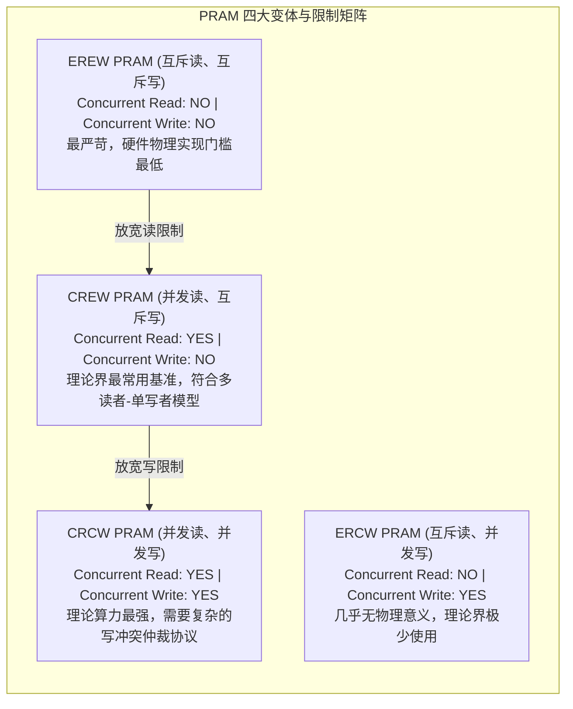

# PRAM理论模型与变体比较

> 本页属于：CEG5201 / Week 01
> 前置知识：[[CEG5201-Week01-算法复杂度与P-NP理论]]
> 预计阅读时间：13 分钟

---

## 1. PRAM 理论模型架构与基本假设

在并行算法与并行计算复杂性理论中，**PRAM（Parallel Random Access Machine，并行随机存取机）**是由 Steven Fortune 与 James Wyllie 于 1978 年提出的一种经典抽象理论计算模型（[CG5201_Chap1 (2627).pdf](https://github.com/Kytolly/NUS-coursework-wiki/releases/download/CEG5201/CG5201_Chap1%20%282627%29.pdf) 第 64、69 页）。

它被誉为并行计算领域的“图灵机”——其核心目的在于**彻底剥离底层物理网络互连拓扑、死锁路由、总线仲裁、缓存一致性等繁杂的工程微架构细节，为纯粹分析算法内在的并行潜力与理论加速极限提供一个标准基准**。

讲义第 69 页给出了 PRAM 的经典抽象组织架构：

### 1.1 核心组成部分
- **处理单元集合（$P_1, P_2, \dots, P_p$）**：系统拥有 $p$ 个同构的处理器，每个处理器具备自己独立的算术逻辑单元（ALU）与一组私有局部寄存器（Local Registers）。
- **无限共享主存储器（Infinite Shared Memory）**：所有处理器均直接连接到一个巨大的全局共享存储器上，存储器被划分为等长单元（Word），地址全局统一编址。

### 1.2 三大理想化假设（Idealized Assumptions）
1. **全局时钟严格同步（Synchronous Lockstep Clock）**：
   所有 $p$ 个处理器由一个统一的全局时钟节拍驱动。在每一个离散时钟步（Step）内，所有活动的处理器严格同时执行：取指 $\to$ 读共享内存 $\to$ 本地 ALU 运算 $\to$ 写共享内存。
2. **零通信延迟与均匀访存（Zero Communication Latency）**：
   任意处理器访问共享内存中任意物理单元的开销均固定为一个单位时钟周期（Unit Cost），完全不存在长距离布线延迟或中继衰减。
3. **无物理带宽瓶颈（Infinite Bandwidth）**：
   只要不违反特定变体的并发冲突规则，任意数量的处理器均可在同一周期内并发访问不同的内存单元，不存在物理信道竞争排队。

---

## 2. PRAM 的四大变体（The 4 PRAM Variants）

在同一物理时钟步内，当**多个处理器试图同时读取或写入共享内存中的同一个物理单元**时，就会引发访问冲突。依据系统对并发读（Concurrent Read）与并发写（Concurrent Write）的受限程度，PRAM 被划分为四种经典变体（讲义第 70 页）：

### 变体全方位特性横向对比

| 变体代号 | 英文全称 | 允许并发读 (CR)? | 允许并发写 (CW)? | 硬件实现难度 | 理论模型定位 |
| :--- | :--- | :--- | :--- | :--- | :--- |
| **EREW** | Exclusive Read, Exclusive Write | 严格禁止 | 严格禁止 | **最低**（最贴近物理真实机器） | 理论下界与最保守基准。 |
| **CREW** | Concurrent Read, Exclusive Write | **允许** | 严格禁止 | **中等**（支持总线广播或只读缓存） | 绝大多数并行算法教材的默认模型。 |
| **ERCW** | Exclusive Read, Concurrent Write | 严格禁止 | **允许** | 畸形 | 仅作理论分类完备性列出，无实用价值。 |
| **CRCW** | Concurrent Read, Concurrent Write | **允许** | **允许** | **极高**（需昂贵的片上多路仲裁逻辑） | 挖掘算法理论极限的终极模型。 |

---

## 3. CRCW 写冲突解决协议（Write Conflict Resolution Protocols）

在 CRCW PRAM 模型中，当 $k$ 个处理器（$k \ge 2$）在同一时钟步试图向同一个内存地址 $M[x]$ 写入不同的数据时，必须由硬件仲裁协议明确规定最终被写入的数值（讲义第 70 页）。常见的四种仲裁协议如下：

### 3.1 Common CRCW（公共值协议）
- **规则**：仅当所有试图写入同一单元的处理器写入**完全相同的值**时，写入操作才被允许；如果试图写入的数据值存在任何差异，则系统判定为非法冲突，操作失败或内存状态未定义（Undefined）。
- **适用场景**：逻辑布尔值归约（例如判断数组中是否存在满足条件的元素，所有找到元素的处理器均向标志位写 `1`）。

### 3.2 Arbitrary CRCW（任意值协议）
- **规则**：硬件非确定性地（Nondeterministically）任选其中一个处理器的写入值成功落盘，其余所有处理器的写入数据被默默丢弃。
- **算法设计要求**：程序员编写的算法必须在数学上证明：**无论硬件随机挑中哪个处理器的值，后续计算的逻辑正确性均保持不变**。

### 3.3 Minimum / Maximum CRCW（极值协议）
- **规则**：在所有发起写入的处理器中，试图写入的值中**最小（或最大）的那个数值**成功写入存储单元。
- **神奇的算法特性**：在 Minimum CRCW 上，寻找一个包含 $n$ 个元素的无序数组的最小值，仅需分配 $n^2$ 个处理器执行两两比较，**在 $O(1)$ 常数时间内即可完成全局最小值的计算！**

### 3.4 Priority CRCW（固定优先级协议）
- **规则**：所有处理器预先被赋予唯一的全局硬件优先级（通常约定处理器编号 ID 最小者拥有最高优先级）。发生写冲突时，**优先级最高的处理器成功写入**，其余处理器的写入被忽略。

---

## 4. 变体间的计算能力层级与模拟定理

讲义第 74 页指出了并行体系结构理论中极具震撼力的定理：不同变体之间的相对算力差距到底有多大？

### 4.1 理论算力包含关系
从解决问题的能力和时间开销来看，四类变体呈现严格的单调包含偏序关系：

$$
\text{EREW} \subset \text{CREW} \subset \text{Common CRCW} \subset \text{Arbitrary CRCW} \subset \text{Priority CRCW}
$$

### 4.2 CRCW vs EREW 模拟定理（Simulation Theorem）
既然 Priority CRCW 算力如此强大甚至能在 $O(1)$ 时间内求出最小值，那它是否能将算法加速数千倍？

讲义第 74 页明确给出了**模拟定理**：
> 任何一个在包含 $p$ 个处理器的 **Priority CRCW PRAM** 上耗时为 $T$ 的并行算法，均可以在一个仅具备 $p$ 个处理器的 **EREW PRAM** 上被完全模拟，且模拟后的运行时间 $T_{\text{EREW}}$ 满足：
> $$T_{\text{EREW}} = O(T_{\text{CRCW}} \cdot \log p)$$

### 模拟原理直观剖析
- 为什么只需要额外付出 $O(\log p)$ 的时间代价？
- 在 EREW 模型下，解决冲突的核心在于：将所有针对同一内存地址的读写请求，通过一个深度为 $\log p$ 的二叉树结构进行地址排序与分发：
  1. 每个处理器将自身的目标地址与写入值构造成三元组 $(Address, ID, Value)$；
  2. 利用 $p$ 个处理器在 EREW 上运行并行的双调排序（Bitonic Sort）或前缀扫描，耗时 $O(\log p)$ 将具有相同 $Address$ 的请求聚合在一起；
  3. 每个地址组内只有排名最高的单节点真正去访问共享内存，然后再经由二叉广播树将结果分发回去。
- **深层结论**：**并发读写能力（CRCW）相较于完全互斥架构（EREW），所能带来的理论速度优势在渐近意义上被严格封顶在 $O(\log p)$ 之内！绝不可能带来多项式级别的速度飞跃**。

---

## 5. 成本度量与工作最优性（Work-Time Framework）

为了科学评估一个并行算法是否真正经济高效，理论界建立了**时间-工作量分析框架（Work-Time Framework）**：

### 5.1 基本度量指标
设求解规模为 $n$ 的问题：
- **并行时间（Parallel Time, $T(n, p)$）**：算法在拥有 $p$ 个处理器的并行机上从开始到全部核心停止的总耗时。
- **总成本 / 总工作量（Cost / Total Work, $C(n, p)$）**：
  $$C(n, p) = p \times T(n, p)$$
  物理含义：算法执行期间所有处理器消耗的“计算资源总量（人·时）”。如果某个处理器在某个时钟步处于空转（Idle）状态，其算力依然被算入总成本中。

### 5.2 工作最优（Work-Optimal / Cost-Optimal）的严格定义
设该问题在单核串行计算机上的**已知最优算法的时间复杂度为 $T_{\text{seq}}(n)$**。

若一个并行算法满足：

$$
C(n, p) = p \times T(n, p) = O(T_{\text{seq}}(n))
$$

则称该并行算法是**工作最优的（Work-Optimal）**或**成本最优的（Cost-Optimal）**。

- **反例剖析**：若一个串行算法耗时 $O(n)$。某个并行算法使用 $p = n$ 个处理器在 $T_p = O(\log n)$ 时间内完成计算。此时其总成本为 $C = n \times O(\log n) = O(n \log n)$。由于 $O(n \log n) > O(n)$，该并行算法**不是工作最优的**（虽然速度极快，但由于存在大量空转等待，总共消耗了更多的计算操作）。

---

## 考试时你应该会什么

1. **基本概念与假设默写**：
   - 准确说出 PRAM 模型的三个基本理想假设（全局同步节拍、零通信延迟、无限存储带宽）；
   - 写出 EREW、CREW、CRCW 的权限矩阵全称与定义。
2. **写冲突协议分析**：
   - 清楚列出 Common、Arbitrary、Minimum/Maximum、Priority 四种 CRCW 写冲突解决协议的工作机理；
   - 能够说明为什么 Minimum CRCW 能在 $O(1)$ 常数时间内求解无序数组最小值。
3. **模拟定理与成本最优性计算**：
   - **必考理论界限**：熟记 Priority CRCW 在 EREW 上模拟的时间膨胀上界公式 $T_{\text{EREW}} = O(T_{\text{CRCW}} \cdot \log p)$，并能指出其最大加速比优势仅为 $O(\log p)$；
   - 给定一个并行算法的运行时间 $T_p(n)$、处理器数 $p$ 及最优串行时间 $T_{\text{seq}}(n)$，熟练代入公式 $C = p \cdot T_p$ 判断该算法是否具备工作最优性（Work-Optimality）。

---

## 下一步

- 上一页：[[CEG5201-Week01-算法复杂度与P-NP理论]]
- 下一页：[[CEG5201-Week01-并行算法例题-矩阵乘法]]
- 模块总览：[[CEG5201-讲义与笔记索引]]
- 返回知识库：[[Home]]

---

## 来源与更新日志

- 来源：[CG5201_Chap1 (2627).pdf](https://github.com/Kytolly/NUS-coursework-wiki/releases/download/CEG5201/CG5201_Chap1%20%282627%29.pdf) pp. 64, 69–74.
- 2026-09-08：初始简略版归档。
- 2026-09-23：全新拆分专页，补充 PRAM 架构图示与三大理想假设、四大变体矩阵对比、四种 CRCW 写冲突协议详解、CRCW-to-EREW 模拟定理数学上界推演以及工作最优性（Cost-Optimality）判据。
