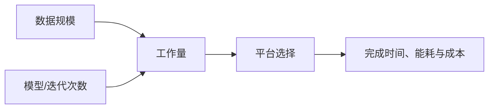

# 为什么需要现代并行平台

> 本页属于：CEG5201 / Week 01
> 前置知识：[[CEG5201-讲义与笔记索引]]
> 预计阅读时间：7 分钟

## 需求：数据和计算量同时增长

讲义用社交媒体、喷气发动机和天气模型说明：现代系统面对的不只是更快的单个指令，而是 TB–PB 级数据、复杂模型和大量迭代。天气模型示例的浮点运算量写成：

`(180×360×12)×5×500×400 = 7.776×10^11`

如果一次浮点操作约需 1 ns，单次模拟约需 777 秒。把独立或部分独立的工作分给多个执行资源，是缩短完成时间的主要路径。

## 一个类比

单核像一个厨师独自完成整桌菜；并行平台像多个厨师同时处理互不冲突的工序，但还要付出交接、等待和协调成本。因此“处理器更多”不自动等于“完成更快”。

## Moore 与 Pollack 的提醒

- Moore’s Law 主要描述晶体管密度的增长，不等于时钟频率按同样速度增长。
- Pollack’s Law 提醒我们，微体系结构复杂度增加带来的性能收益通常低于线性增长。
- 现代平台因此需要利用并行性、专用硬件和更好的数据移动，而不只是堆叠复杂度。

## 讲义中的系统视角

图 1：从应用需求到平台权衡的自制概念图；依据 [CG5201_Chap1 (2627).pdf](https://github.com/Kytolly/NUS-coursework-wiki/releases/download/CEG5201/CG5201_Chap1%20%282627%29.pdf) pp.3–9、28（核对于 2026-09-01）。

## 本页结论

并行化的动机来自数据规模、计算密度和迭代次数。后续页面会讨论嵌入式约束、平台选择、性能公式和可扩展性；不要把本页的数量级例子当作通用 benchmark。

## 下一步

- 上一页：[[CEG5201-讲义与笔记索引]]
- 下一页：[[CEG5201-Week01-嵌入式系统与计算平台选择]]
- 返回：[[Home]]

## 来源与更新日志

- 来源：[CG5201_Chap1 (2627).pdf](https://github.com/Kytolly/NUS-coursework-wiki/releases/download/CEG5201/CG5201_Chap1%20%282627%29.pdf)，pp.3–9、28；个人参考 `notebook/lecture1.md`。
- 2026-09-01：从 Chapter 1 拆出“并行平台需求”短页。