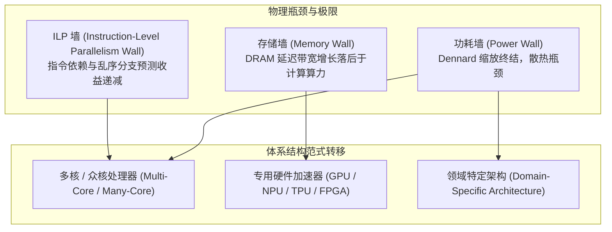

# 为什么需要现代并行平台

> 本页属于：CEG5201 / Week 01
> 前置知识：[[CEG5201-讲义与笔记索引]]
> 预计阅读时间：10 分钟

---

## 1. 现实需求驱动：海量数据爆炸与高计算密度负载

现代计算系统所面临的挑战，早已超越了“更快地执行单条指令”。根据课程讲义（[CG5201_Chap1 (2627).pdf](https://github.com/Kytolly/NUS-coursework-wiki/releases/download/CEG5201/CG5201_Chap1%20%282627%29.pdf) 第 3–5 页），真实工业级与科学应用正同时面临数据容量爆炸（Data Explosion）与计算复杂度急剧攀升的“双重挤压”：

1. **社交媒体与互联网服务**：
   - 全球大型社交平台（如 Facebook、Twitter/X）数据库每天新增超过 **500+ Terabytes (TB)** 数据。
   - 包含图结构分析、个性化推荐模型、实时图文多模态索引，数据呈网状非结构化分布。
2. **工业高频遥测（IoT & Aviation）**：
   - 现代喷气客机单台发动机每运行 30 分钟即可产生 **10–12 TB** 传感器数据。
   - 全球每日数万次商业航班产生的数据汇聚至航空公司与制造商数据中心，总量迅速突破 Petabyte ($10^{15}$) 至 Exabyte ($10^{18}$) 级别，要求流式实时异常检测与结构寿命预测。
3. **气象预报与气候模拟（Weather & Climate Prediction）**：
   - 气象预报通过卫星遥感、地面雷达与浮标网络，保守口径每天收集约 **1.5 TB** 原始观测数据。
   - 更核心的算力瓶颈在于数值天气预报（NWP）求解非线性流体力学偏微分方程组（Navier-Stokes Equations）。
4. **现代大语言模型与生成式 AI（LLMs & Generative AI）**：
   - 现代百亿至万亿参数基础模型（如 GPT-4、Llama 3）展现出严格的“计算扩展法则”（Scaling Laws）：模型性能（损失函数下降）与训练算力（FLOPs）、参数量及标记数呈幂律关系。
   - 单次前沿模型预训练需消耗 $10^{25} \sim 10^{26}$ 次浮点运算，促使产业界建设数十万颗 GPU 规模的密集计算集群（如 NVIDIA Hopper/Blackwell 集群）。

---

## 2. 算力需求定量推导：气象模拟计算量建模

讲义第 4 页给出了一个经典的气象数值模拟计算量估算模型。通过该模型可以清晰看到“三维空间离散化 $	imes$ 变量数 $	imes$ 时间积分步数 $	imes$ 单步方程运算量”带来的计算爆炸：

### 2.1 模拟参数设置
- **全球地理离散网格**：
  - 纬度切分：180 个离散点（每度 1 个网格点）
  - 经度切分：360 个离散点（每度 1 个网格点）
  - 大气垂直剖面：12 个高度层
  - 网格点总数：
    $$N_{	ext{grid}} = 180 	imes 360 	imes 12 = 777,600 	ext{ 点}$$
- **每个空间网格点记录的状态变量数**：5 个物理量（气压 $P$、温度 $T$、风速东西分量 $u$、风速南北分量 $v$、湿度 $q$）。
- **时间步进与方程求解**：
  - 时间积分总步数（Time Steps）：500 次递归推进。
  - 每个网格点在每个时间步内求解离散差分方程所需的操作数：400 次浮点运算（FLOPs）。

### 2.2 总计算量与执行时间估算
单次全天候天气预测所需的总操作数为：

$$
	ext{Total Operations} = (180 	imes 360 	imes 12) 	imes 5 	imes 500 	imes 400 = 7.776 	imes 10^{11} 	ext{ 次浮点操作}
$$

若采用单核通用处理器（假设单次浮点操作的平均延迟为 $1	ext{ ns}$，即单核持续算力为 $1	ext{ GFLOPS}$）：

$$
T_{	ext{seq}} = 7.776 	imes 10^{11} 	imes 10^{-9}	ext{ s} = 777.6	ext{ s} pprox 12.96	ext{ 分钟}
$$

> 补充说明：这仅是 180×360×12 极粗糙网格与 500 步粗时间粒度的玩具模型。若网格空间分辨率从 $1^\circ$ 精细化至 $0.1^\circ$（经纬度各扩大 10 倍，高度层翻倍），且由于 Courant-Friedrichs-Lewy (CFL) 稳定条件，时间步长必须同步缩小 10 倍（步数增加 10 倍），总计算量将暴增 $10 	imes 10 	imes 2 	imes 10 = 2000$ 倍，单次模拟需要数十天，完全失去灾害预报的时效性。唯有通过高度并行的超级计算系统，才能在几分钟内完成求解。

---

## 3. 硬件演进的物理极限与发展规律

历史上处理器性能的提升曾长期依赖两大驱动力：半导体工艺制程微缩和体系结构单核流水线深挖。但自 2005 年前后，这两大红利均撞上不可逾越的物理与工程墙。

### 3.1 摩尔定律（Moore's Law）的真实含义
- **定律陈述**：由 Gordon Moore 于 1965 年提出并在 1975 年修正，集成电路芯片上可容纳的晶体管密度大约每 18–24 个月翻一番（[CG5201_Chap1 (2627).pdf](https://github.com/Kytolly/NUS-coursework-wiki/releases/download/CEG5201/CG5201_Chap1%20%282627%29.pdf) 第 9 页）。
- **常见认知误区**：摩尔定律度量的是**晶体管集成度（Transistor Density）与经济制造成本**，**而不是处理器时钟频率（Clock Frequency）或单核执行速度**。
- 历史数据表明，在 2004 年以前，得益于登纳德缩放（Dennard Scaling），晶体管尺寸缩小带来的不仅是密度提升，还有开关速度的同等提升和单位面积功耗恒定。但当晶体管栅极氧化层薄至几个原子尺度时，量子隧穿漏电流（Leakage Current）剧增，静态功耗失控，导致处理器主频停滞在 $3 \sim 5	ext{ GHz}$ 之间，即**功耗墙（Power Wall）**。

### 3.2 波拉克法则（Pollack's Rule）与单核收益递减
体系结构专家 Fred Pollack（Intel 首席架构师）指出：
> 处理器微体系结构的性能提升幅度，大致与芯片面积（或电路复杂度/晶体管数量）的平方根成正比：
> $$	ext{Speedup} \propto \sqrt{	ext{Complexity}}$$

- **推论**：如果将单核处理器的晶体管预算增加 $2$ 倍（例如设计更宽的超标量发射、更庞大的乱序重命名表、更深的分支预测缓冲），其性能增益仅为 $\sqrt{2} pprox 1.41$ 倍（仅提升约 $41\%$），但功耗和设计验证成本却几乎翻倍。
- **转向多核（Multi-core）的必然性**：若用相同的晶体管预算构建 2 个结构相对简洁的独立处理器核，理论上可以提供 $2$ 倍的峰值吞吐率，能效比远优于单核巨型结构。

### 3.3 存储墙（Memory Wall）与数据搬运瓶颈
- 处理器算力以每年约 $50\%$ 的复合增长率攀升，而外部 DRAM 访问延迟每年仅改善约 $7\%$，两者之间的性能鸿沟被称为**存储墙**。
- 在现代高性能计算（HPC）与 AI 负载中，从主存搬运 1 个字节数据所消耗的电能，往往是从寄存器堆进行一次 64 位浮点加法运算所需电能的数十至数百倍。现代并行平台必须依靠复杂的存储层次（L1/L2/L3 Caches、HBM 高带宽内存、片上共享内存 Scratchpad）来规避存储墙。

---

## 4. 平台体系结构分层与系统要素

要让并行计算硬件发挥真实效能，必须依赖软硬件协同构建的完整生态系统。讲义第 28–30 页归纳了现代并行计算平台的层次结构：

| 层次 | 核心组件 | 职责与功能 |
| :--- | :--- | :--- |
| **应用层 (Application)** | 算法与数据结构 | 针对目标问题设计具备可分性（Decomposability）和数据局部性（Locality）的并行算法。 |
| **系统软件层 (System Software)** | 预处理器 / 并行化编译器 | - **预编译器 (Precompiler)**：执行控制流分析、数据依赖分析与粗粒度并行检测； - **并行化编译器 (Parallelizing Compiler)**：根据程序员提供的编译指令（如 OpenMP `#pragma`、MPI API、CUDA 关键字）或自动向量化算法，将循环展开并映射为并行硬件指令。 |
| **系统支持层 (OS & Runtime)** | 操作系统与运行时调度器 | 负责进程/线程虚拟地址空间映射、亲和性绑定（CPU Affinity）、上下文切换、消息传递通信协议栈（MPI daemon）与硬件故障容错。 |
| **硬件架构层 (Hardware Architecture)** | 计算节点与互连网络 | 多核 CPU、SIMD/向量处理单元、GPU 流多处理器（SM）、FPGA 逻辑阵列、专用 ASIC（TPU），以及片上互连网络（NoC）和片外互连网络（InfiniBand / NVLink）。 |

---

## 5. 指令与数据流的古典分类：Flynn 分类法（1972）

Michael J. Flynn 在 1972 年依据**指令流（Instruction Stream）**与**数据流（Data Stream）**的并发特性，将计算机体系结构划分为四种基本范式（讲义第 31–33 页）：

1. **SISD（Single Instruction, Single Data）**：
   - 传统的冯·诺依曼单处理器架构。
   - 单一控制单元（CU）从程序存储器中逐条取出指令，单一处理单元（PE）在单一数据流上顺序执行。
2. **SIMD（Single Instruction, Multiple Data）**：
   - 单一控制单元广播单条指令，多个处理单元（PE）在不同的数据流上同步（Lockstep）执行相同操作。
   - 典型代表：向量超级计算机（Cray-1）、现代 CPU 的 SIMD 扩展（Intel AVX-512、ARM Neon）、GPU 的 SIMT 核心。非常适合规则密集型矩阵和图像计算。
3. **MISD（Multiple Instruction, Single Data）**：
   - 多个处理单元各自执行不同的指令流，但操作同一个输入数据流。
   - 在商业通用机中极少使用；主要用于高可靠性冗余容错系统（如航天器多机表决系统，不同算法校验同一传感器输入）或特定流水线型收缩阵列（Systolic Arrays）。
4. **MIMD（Multiple Instruction, Multiple Data）**：
   - 多个独立的处理器拥有各自的控制单元，各自执行不同的程序代码，操作不同的私有或共享数据。
   - 现代对称多处理器（SMP）、多核服务器、超级计算集群以及云计算数据中心的核心主流架构。

---

## 6. 核心思维模型：厨师类比与并行开销

- **单核系统**：类似于一名米其林主厨独自完成一道宴席的所有工序（洗菜 $	o$ 切菜 $	o$ 炒菜 $	o$ 摆盘）。速度受限于该主厨个人的动作速率上限。
- **并行平台**：相当于厨房团队协作：
  - 如果菜品工序相互独立（如同时准备 8 道冷盘），8 位厨师可以同时开工，吞吐率接近提升 8 倍。
  - **现实开销**：但厨师之间必须争夺砧板和炉灶（共享资源冲突/内存争用）；后道热炒必须等待前道切配完成（数据依赖与同步等待）；主厨必须分配任务并确认进度（协调调度开销）。
- **结论**：**增加处理单元不等于等比例缩短运行时间**。并行平台的有效加速比取决于算法内在的数据依赖度、通信与同步延迟以及软硬件体系架构的协同能力。

---

## 考试时你应该会什么

1. **定量计算能力**：掌握给定空间网格维度、物理变量数、迭代步数与单步操作数时，计算总操作量（FLOPs）并根据硬件时钟周期/延迟估算理论最短顺序执行时间的方法。
2. **概念辨析**：
   - 清楚区分摩尔定律（晶体管集成度）与处理器主频增长的区别；解释为什么 Dennard 缩放终结后导致了“功耗墙”。
   - 准确阐述波拉克法则（Pollack's Rule）的数学比例关系（$	ext{Performance} \propto \sqrt{	ext{Complexity}}$），并能论证为什么工业界从单核深流水线转向了多核/专用加速器。
3. **分类与架构**：熟记 Flynn 分类的四种架构定义，能够指出日常硬件（单核 CPU、AVX 单元、GPU、多核服务器集群）分别归属于 Flynn 的哪一种类型。

---

## 下一步

- 下一页：[[CEG5201-Week01-嵌入式系统与计算平台选择]]
- 模块总览：[[CEG5201-讲义与笔记索引]]
- 返回知识库：[[Home]]

---

## 来源与更新日志

- 来源：[CG5201_Chap1 (2627).pdf](https://github.com/Kytolly/NUS-coursework-wiki/releases/download/CEG5201/CG5201_Chap1%20%282627%29.pdf) pp. 1–9, 26–33.
- 2026-09-08：初始简略版归档。
- 2026-09-23：全面重构，补全真实工业与科学场景数据规模量化推导、Pollack 法则数学形式、存储墙与功耗墙成因、系统层次表及 Flynn 分类图解。
