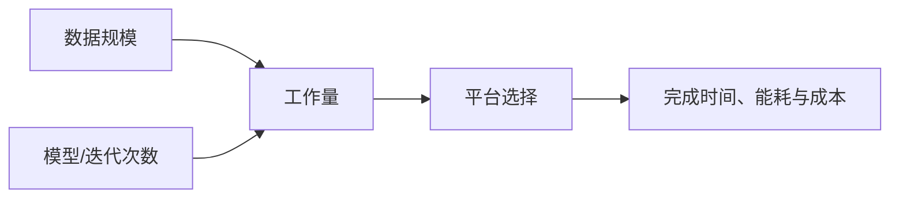

# 为什么需要现代并行平台

> 本页属于：CEG5201 / Week 01
> 前置知识：[[CEG5201-讲义与笔记索引]]
> 预计阅读时间：7 分钟

## 需求：数据和计算量同时增长

讲义先用三个真实应用说明“现代系统面对的不只是更快的单条指令”。社交媒体数据库每天新增超过 500 TB；喷气发动机每 30 分钟每台产生 10–12 TB 数据，总量很容易升到 Peta/Exa 级；气象预测按保守口径每天收集约 1.5 TB 数据（[CG5201_Chap1 (2627).pdf](https://github.com/Kytolly/NUS-coursework-wiki/releases/download/CEG5201/CG5201_Chap1%20%282627%29.pdf) 第 3 页）。这些应用的问题规模由“数据量 × 计算密度 × 迭代次数”共同决定，复杂度呈指数或高次增长，单核顺序执行已难以满足。

天气预测主要靠偏微分方程。讲义给出离散网格估算：180 个纬度 × 360 个经度 × 12 个高度层，每点 5 个变量，递归求解 500 次、每次 400 次操作：

$$
(180 \times 360 \times 12) \times 5 \times 500 \times 400 = 7.776 \times 10^{11}
$$

若一次浮点运算约需 $1\text{ ns}$，单次模拟约 $777\text{ s}$（$\approx 13\text{ 分钟}$）（第 4 页）。现代大语言模型则进一步说明规模法则：训练计算量每提升一个数量级，往往带来一代模型性能的提升，因此各大公司竞相建设大规模训练设施（第 5 页）。

## 技术演进：Moore 与 Pollack 的提醒

- **Moore’s Law**：集成电路晶体管数约每两年翻倍。它更准确地描述晶体管密度，而**不是**处理器时钟频率；处理器速度的增长远慢于晶体管密度（第 6、9 页）。
- **Pollack’s Law**：微体系结构带来的性能增量大致与复杂度平方根成正比。复杂度增长更快，但性能增长更慢（第 22 页）。
- EDA（逻辑综合、Verilog IEEE-1364 标准化、布局布线自动化）等技术使芯片晶体管数从 1971 年的 2,300 个涨到 Nvidia Blackwell GB200 的 1000 亿以上；现代 AI/HPC 成为大芯片的主要需求方（第 8 页）。

因此，仅靠“堆微体系结构复杂度”或“提高单核频率”都不可持续，必须转向并行、专用硬件与更好的数据移动。

## 平台的分层与系统要素

一个完整平台包含：算法与数据结构、硬件、操作系统、系统软件（高级语言 → 编译器 → 汇编器 → 加载器），以及高效编译器（预处理器、预编译器、并行化编译器）（第 29–30 页）。预编译器做程序流分析、依赖检查和有限并行检测；并行化编译器自动分析程序并生成并行目标代码；开发者也可用编译指令引导编译器优化（第 30 页）。

图 1：从应用需求到平台权衡的自制概念图；依据 [CG5201_Chap1 (2627).pdf](https://github.com/Kytolly/NUS-coursework-wiki/releases/download/CEG5201/CG5201_Chap1%20%282627%29.pdf) pp.3–9、28（核对于 2026-09-07）。

## 指令/数据流的分类：Flynn

Flynn 分类按“指令流”与“数据流”划分机器结构（第 31 页）：SISD 是传统单核顺序执行；SIMD 一条指令作用于多个数据，适合向量与规则数据并行（NVIDIA GPU 的 SIMT/SIMD 风格）；MIMD 多个处理器各自运行不同程序、处理不同数据，是一般并行机与多核的主类；MISD 多个指令处理同一数据流，常用于容错或安全关键系统（如 AMD EPYC 多核服务器）。

图 2：Flynn 分类（SISD/SIMD/MISD/MIMD）示意图；来源：[CG5201_Chap1 (2627).pdf](https://github.com/Kytolly/NUS-coursework-wiki/releases/download/CEG5201/CG5201_Chap1%20%282627%29.pdf) 第 31 页；核对 2026-09-07。

## 一个类比

单核像一个厨师独自完成整桌菜；并行平台像多个厨师同时处理互不冲突的工序，但还要付出交接、等待和协调成本。因此“处理器更多”不自动等于“完成更快”，必须同时考虑数据依赖、负载均衡、通信与同步开销。

## 本页结论

并行化的动机来自数据规模、计算密度和迭代次数，而不是单纯提高时钟。后续页面会讨论嵌入式约束、平台选择、性能公式与可扩展性；不要把本页的数量级例子当作通用 benchmark。

## 下一步

- 上一页：[[CEG5201-讲义与笔记索引]]
- 下一页：[[CEG5201-Week01-嵌入式系统与计算平台选择]]
- 返回：[[Home]]

## 来源与更新日志

- 来源：[CG5201_Chap1 (2627).pdf](https://github.com/Kytolly/NUS-coursework-wiki/releases/download/CEG5201/CG5201_Chap1%20%282627%29.pdf)，pp.3–9、28–31；个人参考 `notebook/lecture1.md`。
- 2026-09-01：从 Chapter 1 拆出“并行平台需求”短页。
- 2026-09-07：扩写数据/计算量、Moore/Pollack、平台分层与 Flynn 分类，新增 Flynn 原图（第 31 页）。
