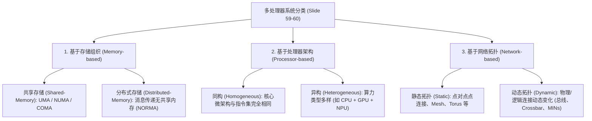

# 多处理器体系结构与系统设计流

> 本页属于：CEG5201 / Week 01
> 前置知识：[[CEG5201-Week01-并发并行与Flynn体系分类]]
> 预计阅读时间：12 分钟

---

## 1. 共享存储多处理器体系：UMA 与 NUMA

在多处理器系统（Multiprocessor Systems, MPS）与多计算机系统（Multi-computers）中，存储器组织方式与互连拓扑直接决定了系统的通信延迟、可扩展性极限以及编程模型（[CG5201_Chap1 (2627).pdf](https://github.com/Kytolly/NUS-coursework-wiki/releases/download/CEG5201/CG5201_Chap1%20%282627%29.pdf) 第 49–58 页）。

讲义第 49 页指出，并行计算机通常分为 SIMD 或 MIMD 配置：
- **SIMD**：专用（Special purpose），不可扩展（not scalable）。
- **通用计算机（General purpose computers）**：偏好采用具有分布式物理内存但拥有全局共享虚拟地址空间的 **MIMD** 配置（参考 Gordon Bell, 1992 年的 MIMD 分类法）。

```mermaid
flowchart TD
    subgraph UMA_Model ["UMA 架构 (Uniform Memory Access)"]
        direction TB
        P1["Processor 1"] --- Bus["共享系统总线 / 互连 (Shared Bus / Interconnect)"]
        P2["Processor 2"] --- Bus
        Pn["Processor M"] --- Bus
        Bus --- M1["集中式物理主存 (Single Shared Memory)"]
    end

    subgraph NUMA_Model ["NUMA 架构 (Non-Uniform Memory Access)"]
        direction TB
        subgraph Node1 ["节点 1 (Socket 1)"]
            CPU1["Processor 1"] --- LM1["本地内存 (Local Memory)"]
        end
        subgraph Node2 ["节点 2 (Socket 2)"]
            CPU2["Processor 2"] --- LM2["本地内存 (Local Memory)"]
        end
        Node1 <== HighSpeedInterconnect["高速互连网络 (MINs / UPI / Infinity Fabric)"] ==> Node2
    end
```

### 1.1 UMA（Uniform Memory Access，统一内存访问）

讲义第 50–51 页总结了 UMA 系统的核心特征与软硬件考量：


*图：UMA 共享存储多处理器硬件结构（来源：CG5201_Chap1 (2627).pdf 第 51 页）*

1. **单一共享物理存储（Single Shared Memory）**：所有处理器共享单一物理主存，每个处理器对整个内存空间拥有平等的访问权限。
2. **均匀访存延迟（Uniform Memory Latency）**：无论哪个处理器发出访存请求，访问任意内存物理单元所需的时间大致相同（Approximately the same）。
3. **编程模型简单（Simple Programming Model）**：由于所有处理器看到的内存视图和访存时间均一，编程、数据共享与同步相对简单直观。
4. **需要缓存一致性协议（Cache Coherence Required）**：在多核 UMA 架构中，每个处理器通常拥有独立的私有 Cache。必须依靠硬件缓存一致性协议（如 MESI、MOESI）来保证所有处理器读到的共享数据是一致的。
5. **扩展性受限（Limited Scalability）**：随着处理器数量增加，共享总线或集中互连的带宽争用（Contention）迅速成为瓶颈。因此，UMA 架构主要适用于中小规模的共享存储系统（Symmetric Multiprocessors, SMP）。
6. **典型应用**：科学计算、数据库服务器、虚拟化平台以及处理器核数适中的通用多处理工作负载。

### 1.2 NUMA（Non-Uniform Memory Access，非统一内存访问）

讲义第 56–57 页给出了 NUMA 系统的关键机制：

1. **分布式共享存储（Distributed Shared Memory）**：物理内存分散挂载在各个处理器节点上，但操作系统将其呈现为单一全局共享地址空间（Single shared address space）。每个处理器拥有自己的本地内存（Local Memory），同时可以通过硬件互连透明访问其他处理器的远程内存。
2. **非均匀访存延迟（Non-Uniform Memory Latency）**：访存时间强烈依赖于数据所处的物理位置。访问本地内存明显快于跨节点访问远程内存（Accessing local memory is significantly faster than remote memory）。
3. **优异的可扩展性（Improved Scalability）**：由于处理器主要访问各自的本地内存，整体内存带宽会随节点数的增加而线性增长，非常适合大规模多路服务器。
4. **数据局部性至关重要（Data Locality is Critical）**：为获得高性能，操作系统和应用程序应采用 NUMA-aware 内存分配策略，将数据分配在最常访问它的处理器附近。局部性差会导致远程访存激增，系统性能严重劣化。
5. **依赖高速互连网络（High-Speed Interconnect / MINs）**：跨节点访存通过高速互连（如 AMD Infinity Fabric、Intel UPI）完成。虽然远端内存完全可达，但延迟更高且有效带宽低于本地内存。
6. **典型应用**：企业级服务器、云基础设施、HPC 集群、超大型数据库、虚拟化集群以及 AI 训练服务器。

### 1.3 现代真实系统实例（Real-Life Examples）

讲义第 58 页列举了现代主流工业界的代表性系统：

| 架构类别 | 工业界代表系统 | 体系结构特征与机理 |
| :--- | :--- | :--- |
| **UMA** | **Intel Core Ultra / Core i7/i9 桌面芯片**（单 Socket） | 现代桌面 PC 采用单 CPU 插槽。所有 CPU 核心通过片上互连访问同一物理主存，访存延迟均等。 |
| **UMA** | **Apple M3 / M4**（MacBook, iMac, Mac Mini） | 采用统一内存架构（Unified Memory Architecture）。CPU 和 GPU 在同一块 SoC 内共享物理主存，CPU 核心之间体验到均一的访存延迟。 |
| **NUMA** | **AMD EPYC 多路服务器**（Multi-Socket Servers） | 广泛应用于云数据中心与高性能计算。每个 CPU 插槽拥有专享的本地 DDR 内存，跨插槽访存通过 AMD Infinity Fabric 完成，呈现出明显的非均匀访存延迟。 |
| **NUMA** | **Intel Xeon 多路服务器**（Multi-Socket Servers） | 广泛用于企业数据库与虚拟化服务器。每个 Xeon 处理器直连本地 DRAM，远端访问通过 Intel Ultra Path Interconnect (UPI) 互联，属于典型的 NUMA 系统。 |

---

## 2. 多处理器系统的全景分类（Multiprocessor Taxonomies）

讲义第 59–60 页从三个正交维度给出了多处理器系统的分类框架：




*图：基于存储的多处理器分类（来源：CG5201_Chap1 (2627).pdf 第 59 页）*


*图：基于处理器与互连网络的多处理器分类（来源：CG5201_Chap1 (2627).pdf 第 60 页）*

---

## 3. 多处理器系统设计流与现代芯片工程（Chip Design Flow）

构建多处理器系统是一项软硬件深度协同的复杂工程（讲义第 61、76–78 页）：


*图：多处理器系统设计流程图（来源：CG5201_Chap1 (2627).pdf 第 61 页）*

- **任务映射（Task Mapping / Remapping）**：在系统级设计阶段进行算法分析，将应用任务图映射到具体的处理核。
- **架构级参数确定**：设计寄存器、内存层次、缓存大小等。
- **RTL 逻辑输出**：最终输出多处理器系统的寄存器传输级（Register Transfer Logic, RTL）代码。

### 3.1 标准芯片设计流程（Standard Chip Design Flow）

讲义第 76 页强调：定制设计一颗芯片工程极其庞大！以典型复杂度的 ASIC 为例，通常需要约 **1000 人月（~1000 engineering months）**，且面临高昂的人力招聘与管理挑战。

讲义第 77–78 页将标准芯片设计划分为六个核心阶段：

1. **规格制定与架构设计（Specification & Architecture）**：
   - 明确功能目标与 **PPA 指标**（Performance, Power, Area，性能、功耗、面积）；
   - 建立匹配产品需求的高层微架构模型。
2. **设计与 RTL 开发（Design & RTL Development）**：
   - 使用硬件描述语言（HDL，如 Verilog/SystemVerilog）将微架构转化为清晰、可综合的 RTL 代码，充分考虑时序与低功耗策略。
3. **功能验证（Functional Verification）**：
   - 在流片制造前，运用**软件仿真（Simulation）**、**形式化验证（Formal Verification）**与**硬件仿真加速（Emulation）**，彻底保证 RTL 逻辑符合设计预期。
4. **逻辑设计与综合（Logic Design & Synthesis）**：
   - 在特定工艺约束下，将 RTL 映射并转化为门级网表（Gate-level Netlist），面向面积、功耗与时序进行优化，确保与晶圆厂的标准单元库兼容。
5. **物理设计（Physical Design）**：
   - 进行芯片布局规划（Floor-planning）、标准单元放置（Placement）、时钟树综合（Clock-Tree Synthesis, CTS）以及布线（Routing）；
   - 开展静态时序分析（STA）、设计规则检查（DRC/LVS）与电源完整性分析，生成交付代工厂流片的 **GDSII** 文件。
6. **封装与测试（Packaging & Test）**：
   - 设计 I/O 环与芯片封装；
   - 集成扫描链（Scan Chains）与内建自测电路（BIST, Built-In Self-Test）以支持量产测试；
   - 开发自动测试设备（ATE）测试向量，完成晶圆分选（Wafer Sorting）、封装装配与芯片终测。

### 3.2 大语言模型（LLM）在现代芯片验证中的应用

讲义第 80–81 页指出了大语言模型（LLM）引入芯片设计领域的深层原因：

- **验证阶段的资源瓶颈**：随着集成电路规模与复杂度激增，验证 RTL 功能变得极具挑战。在现代芯片研发中，**功能验证占据了绝大部分工作量，常耗费总项目资源的 60%–70%**。该阶段高度依赖繁重的人工分析，需要深入理解微架构、严密推导边界极端情况（Edge cases）并严格遵循系统约束。
- **为何验证高度依赖人工？** 设计与验证的核心难题在于**理解和推导人类自然语言（Natural Language）**。工程师必须阅读数千页的自然语言需求规范、理解架构目标并验证硬件实现是否忠实反映了这些目标。过去由于缺乏处理自然语言的自动化工具，该环节一直无法彻底自动化。
- **LLM 的转折点作用**：LLM 具备出色的自然语言理解与推理能力，正好完美契合芯片验证的需求。利用 LLM 可以实现：
  1. 自动化理解设计意图（Design Intent）；
  2. 智能识别相关测试场景并生成测试代码；
  3. 协同编排 EDA 工具链；
  4. 辅助硬件调试并自动检测测试覆盖率盲区（Coverage Gaps）。

---

## 4. 现代硬件安全挑战：硬件漏洞与 Rowhammer

讲义第 82–84 页强调了现代多处理器与内存系统面临的底层物理安全威胁：

### 4.1 硬件漏洞的定义与攻击途径

- **硬件漏洞（Hardware Vulnerability）定义**：计算机系统中可被攻击者利用的软硬件薄弱点。如果存在某种途径能让恶意代码被注入并引入计算机系统，则该硬件即被视为存在漏洞（A hardware is said to be vulnerable, if by any means by which "a code" can be introduced to a computer）。
- **启用途径**：通过对系统硬件进行物理接触（Physical access）或远程网络访问（Remote access）。
- **常见被攻击形式**：
  1. 通过 U 盘、光盘等物理移动介质将恶意文件写入存储器；
  2. 利用系统运行中的意外缺陷（Unexpected flaw），使攻击者通过提权（Elevating privileges）或直接执行任意代码获得系统控制权。部分漏洞无需物理接触，可远程被触发。

### 4.2 典型物理漏洞案例：Rowhammer

讲义第 83 页以 **Rowhammer** 为例剖析了 DRAM 物理微观缺陷引发的安全危机：

- **工作机制**：攻击者通过极高频率持续重复读写（Repeatedly rewriting/accessing）DRAM 中同一物理行地址。
- **物理机理**：由于 DRAM 制造工艺微缩使得电容存储单元间距极小，高频翻转某一行电荷会在相邻存储行（Adjacent rows）之间产生电磁耦合与电荷泄漏。研究人员验证了即使相邻行受到硬件访问保护，反复访问该行也会导致相邻未访问行发生**比特翻转（Bit flips）**！
- **本质机理**：攻击者利用了硬件内存的**“空间访问局部性（Spatial access property）”**物理缺陷，跨越逻辑安全屏障窃取甚至篡改相邻行的数据。

> **讲义总结评估（Slide 84）**：
> 一般而言，硬件级漏洞不会通过随意的黑客攻击被大范围利用，它们通常针对高价值系统与关键组织发动定向攻击。对于普通日常用户而言，传统的恶意软件防护加上物理安全防护（如把机房锁好门）已足够应对绝大部分威胁。

---

## 学习目标 / Problem-Solving Skills

完成本节学习后，你应能掌握讲义中的以下核心知识与分析技能：

1. **UMA 与 NUMA 体系对比**：
   - 清楚阐明 UMA 与 NUMA 在物理存储分布、访存延迟特征及可扩展性上的本质区别；
   - 结合讲义实例，列举现代典型系统（如 Intel Core Ultra / Apple M3/M4 为 UMA，AMD EPYC / Intel Xeon 多路服务器为 NUMA），并解释为什么 NUMA 系统中“数据局部性（Data Locality）”至关重要。
2. **多处理器系统三维分类法**：
   - 准确区分基于存储（Shared Memory vs Distributed Memory）、基于处理器（Homogeneous vs Heterogeneous）以及基于网络拓扑（Static vs Dynamic）的多处理器分类法。
3. **芯片设计流程与 LLM 角色**：
   - 掌握现代芯片设计的六大标准流程（规格架构、RTL 开发、功能验证、逻辑综合、物理设计、封装测试）；
   - 能够解释为什么功能验证占据了芯片开发 60%–70% 的工作量，以及为什么自然语言处理能力使得 LLM 成为验证自动化的突破口。
4. **硬件安全漏洞机制**：
   - 准确掌握讲义中关于硬件漏洞的定义；
   - 解释 Rowhammer 漏洞的物理成因：如何利用 DRAM 高频访问引发电荷泄漏导致相邻行比特翻转（Bit flip）。

---

## 下一步

- 上一页：[[CEG5201-Week01-并发并行与Flynn体系分类]]
- 下一页：[[CEG5201-Week01-算法复杂度与P-NP理论]]
- 模块总览：[[CEG5201-讲义与笔记索引]]
- 返回知识库：[[Home]]

---

## 来源与更新日志

- 来源：[CG5201_Chap1 (2627).pdf](https://github.com/Kytolly/NUS-coursework-wiki/releases/download/CEG5201/CG5201_Chap1%20%282627%29.pdf) pp. 49–51, 56–61, 76–84.
- 2026-09-08：初始简略版归档。
- 2026-09-23：严格依讲义重构，剔除非讲义的 Spectre/Meltdown 推测执行扩展，严格对照 Slide 49–61、76–84 还原 UMA/NUMA 工业实例、六大芯片设计阶段、LLM 在功能验证中的作用机理以及 Rowhammer 物理比特翻转原理；更新学习目标小节。
