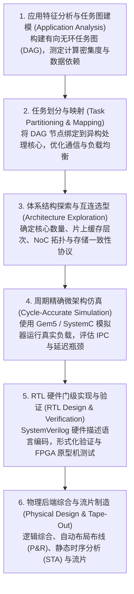

# 多处理器体系结构与系统设计流

> 本页属于：CEG5201 / Week 01
> 前置知识：[[CEG5201-Week01-并发并行与Flynn体系分类]]
> 预计阅读时间：13 分钟

---

## 1. 共享存储体系与内存访问模型

在多处理器系统（Multiprocessor Systems, MPS）中，**存储器组织方式与互连拓扑**直接决定了处理器的通信延迟、可扩展性极限以及编程模型的复杂度（[CG5201_Chap1 (2627).pdf](https://github.com/Kytolly/NUS-coursework-wiki/releases/download/CEG5201/CG5201_Chap1%20%282627%29.pdf) 第 49–58 页）。

根据处理器访问物理内存各区域的延迟对称性，共享存储多处理器可分为两大经典流派：

```mermaid
flowchart TD
    subgraph UMA_Model ["UMA 架构 (对称多处理 SMP)"]
        direction TB
        P1["CPU 1"] --- Bus["共享系统总线 / 交叉开关 (Crossbar)"]
        P2["CPU 2"] --- Bus
        Pn["CPU n"] --- Bus
        Bus --- M1["集中式物理主存 (Shared Memory)"]
        Note1["> 访问延迟完全相同 (Uniform Latency)<br>> 总线仲裁带宽成为扩展瓶颈 (通常 <= 32 核)"]
    end

    subgraph NUMA_Model ["NUMA 架构 (分布式共享内存 DSM)"]
        direction TB
        subgraph Node1 ["节点 1 (Socket 1)"]
            CPU1["CPU 核心群"] --- LM1["本地内存 (Local RAM)"]
        end
        subgraph Node2 ["节点 2 (Socket 2)"]
            CPU2["CPU 核心群"] --- LM2["本地内存 (Local RAM)"]
        end
        Node1 <== HighSpeedInterconnect["高速相干互连总线 (UPI / Infinity Fabric)"] ==> Node2
        Note2["> 全局单虚拟地址空间 (Single Address Space)<br>> 本地访存延迟远远小于远端访存延迟 (Local << Remote)"]
    end
```

### 1.1 UMA（Uniform Memory Access，统一内存访问）
讲义第 50–51 页详细展示了 UMA 硬件组织形式：


- **核心特征**：系统中所有物理处理器通过集中的**共享系统总线（Shared System Bus）**或纵横交叉开关（Crossbar Switch）访问同一块物理内存。
- **对称性**：任意处理器对物理内存中任意单元的读写访问物理延迟（Latency）和有效带宽（Bandwidth）完全相同，故又被称为**对称多处理机（Symmetric Multiprocessing, SMP）**。
- **微架构局限**：由于所有处理器必须竞争唯一的共享总线仲裁权，随着处理器核数 $M$ 的增加，总线争用（Bus Contention）迅速饱和，通常当核数超过 16–32 核时系统扩展性即陷入停滞。

### 1.2 NUMA（Non-Uniform Memory Access，非统一内存访问）
为了突破 UMA 的可扩展性瓶颈，现代中大型服务器广泛采用 NUMA 架构（讲义第 56–58 页）：

- **核心特征**：物理内存被物理拆分为多个模块，紧密物理挂载在各个处理器插槽（Socket/Node）旁形成**本地内存（Local Memory）**。所有节点通过专用的高带宽低延迟互连总线（如 Intel UPI / QPI、AMD Infinity Fabric）网状互连。
- **单一编址与非对称延迟**：整个系统在操作系统层面依然呈现为一个统一的平坦全局物理地址空间（Single Address Space），任意处理器均可通过指针解引用直接访问远端节点的物理内存。
- **数据局部性（Data Locality）的决定性影响**：
  - 访问本节点挂载的本地内存：延迟通常仅为 $50 \sim 80\text{ ns}$。
  - 跨越互连总线访问其他节点的远端内存（Remote Memory）：需经历多级路由报文解包、远端控制器仲裁和目录一致性查询，延迟通常飙升至 $150 \sim 300\text{ ns}$（是非本地延迟的 $2 \sim 4$ 倍）。
  - **工程实践原则**：编写高性能多线程程序时，必须运用 NUMA 绑定技术（`numactl`、CPU 亲和性绑核），确保线程仅计算分配在本地节点内存中的数据，严禁无意识的大规模远程跨节点访问。

---

## 2. 多处理器系统的全景分类（Multiprocessor Taxonomies）

讲义第 59–60 页从多个正交物理维度建立了多处理器系统的分类体系：

### 2.1 基于存储组织的分类（Memory-Based Classification）
讲义第 59 页给出了存储视角的分类全景：


1. **共享存储系统（Shared-Memory Systems）**：
   - 包含 UMA、NUMA 以及 COMA（Cache-Only Memory Architecture，仅缓存架构，内存全部由大容量动态缓存构成）。通过硬件保证各处理器视角下的内存读写一致性。
2. **消息传递分布式存储系统（Message-Passing Distributed-Memory Systems / NORMA）**：
   - 各计算节点物理内存完全独立，无全局统一硬件地址空间。节点间通信必须依赖显式软件网络通信原语（如 MPI 发送 `MPI_Send` 与接收 `MPI_Recv`）。典型代表为计算集群（Clusters）与超级计算机。

### 2.2 基于处理器异构性的分类（Processor-Based Classification）
讲义第 60 页指出根据处理器微架构的一致性可划分为：


1. **同构多处理器（Homogeneous Multiprocessors）**：
   - 芯片上所有处理器核心采用完全相同微架构设计与指令集实现（例如传统的双路 Intel Xeon 服务器）。各核具有相同的时钟频率、流水线结构与能效特性，任务调度均匀对称。
2. **异构多处理器（Heterogeneous Multiprocessors / SoC）**：
   - 芯片上集成不同类型、不同优化取向的算力核心。
   - **典型代表**：现代移动芯片（Apple A/M 系列、高通骁龙）采用“大核（性能核 P-Core）+ 小核（能效核 E-Core）+ 通用 GPU + 深度学习加速器 NPU + 音频 DSP”的片上系统（System-on-Chip, SoC）架构。后台保活任务由小核微功耗运行，前台突发算力由大核全频调度，实现峰值性能与极致续航的兼得。

### 2.3 基于网络拓扑的分类（Interconnection-Based Classification）
处理器与内存之间的通信骨干网络拓扑分为：
- **共享介质网络**：共享物理总线（Shared Bus）。实现简单，但带宽无法随节点数线性扩展。
- **无阻塞交叉连接**：纵横制交叉开关（Crossbar Switch）。为每对输入输出提供专用物理通路，性能极致，但交叉点硬件复杂度随节点数呈平方级增长（$O(N^2)$）。
- **多级互连网络（MIN）**：由多级小规模交换开关（如 $2 \times 2$ 开关单元）级联而成（如 Omega 网络、Baseline 网络、Clos 电话交换网络），以 $O(N \log N)$ 硬件成本实现高带宽连接（详见 [[CEG5201-Week03-MIN结构与路由]] 与 [[CEG5201-Week03-Blocking与CLOS]]）。
- **直接网格拓扑（Direct Networks）**：2D Mesh 网格、3D Torus 环形网格、超立方体（Hypercube），广泛应用于现代大芯片片上网络（NoC）与超算系统。

---

## 3. 多处理器系统设计流（Multiprocessor Design Flow）

构建一个复杂的多处理器或片上多核系统（MPSoC），必须经历严格规范的软硬件协同设计流程（[CG5201_Chap1 (2627).pdf](https://github.com/Kytolly/NUS-coursework-wiki/releases/download/CEG5201/CG5201_Chap1%20%282627%29.pdf) 第 61、76–81 页）：


### 六大设计阶段深度拆解



1. **应用特征分析（Workload Analysis）**：从目标算法中提取任务级数据流图（Task Precedence Graph, DAG），量化各任务的算力需求与边缘通信流量。
2. **任务划分与调度映射（Partitioning & Mapping）**：在 NP-Hard 的调度空间中寻找最优解，决定哪些任务在 CPU 执行、哪些算子卸载到专用加速器，确保没有单个核心成为严重瓶颈。
3. **架构选型与参数调优（Architecture Exploration）**：权衡缓存容量、互连网络带宽、内存控制器通道数。
4. **微架构仿真（Simulation）**：通过高精度仿真器模拟处理器执行，避免在昂贵的硅片上暴露出致命的设计架构缺陷。
5. **RTL 设计与硬件验证（RTL & Verification）**：这是整个芯片开发周期中**消耗人力与工时最多（占比常超 $70\%$）**的阶段。需编写数百万行测试平台（Testbench）进行随机覆盖率测试和硬件仿真加速（Hardware Emulation）。
6. **物理实现（Physical Design）**：经过代工厂（TSMC、Samsung 等）设计规则检查（DRC）后生成 GDSII 掩膜文件，交付制造。

### 讲义补充：大语言模型（LLM）在芯片设计流程中的应用
讲义第 76–81 页特别提到现代生成式 AI 在 EDA 芯片设计领域的渗透：
- **自动化生成 RTL 代码**：根据人类自然语言系统需求草案，辅助生成基础 Verilog 模块。
- **加速验证测试用例生成（Automated Testbench Synthesis）**：LLM 能够根据硬件规格书自动生成极端工况（Corner Cases）边界刺激向量，显著减轻人工编写验证平台的沉重负担。
- **硅后调试与日志归因（Bug Diagnosis）**：协助工程师快速过滤并分析百吉字节（GB）级别的波形转储（VCD）文件，定位时序违例与死锁成因。

---

## 4. 多处理器硬件安全挑战（Hardware Security）

讲义第 82–84 页强调：随着多处理器系统硬件资源共享度的提高，**硬件微架构安全漏洞**已成为现代计算机体系结构不可忽视的关键威胁。

### 4.1 硬件共享带来的微架构侧信道攻击（Side-Channel Attacks）
虽然操作系统在虚拟内存逻辑层面上实现了严格的进程隔离（Process Isolation），但多个处理器核心物理上依然共享着底层的**分支目标预测器（BTB）、L3 共享缓存以及内存总线**：
- **Cache 侧信道攻击（Flush+Reload / Prime+Probe）**：攻击者进程故意清空某块共享库代码的缓存行，随后测量自身重新读取该地址所消耗的时间（命中仅需几个时钟周期，缺失则需数百周期），从而推测出受害进程是否执行了该特定代码分支（例如密码学加密中的私钥指数计算）。

### 4.2 推测执行漏洞（Speculative Execution Attacks）
- 现代处理器为了追求极致性能，普遍采用积极的**分支预测（Branch Prediction）**与**乱序推测执行（Out-of-Order Speculation）**。
- **Spectre / Meltdown 机理**：处理器在分支预测完成前，会先行推测执行尚未授权读取内核物理地址的指令。虽然在架构层面上，安全检查失败后微架构会冲刷掉这批非法指令（指令不被提交，寄存器状态回滚）；但在微架构底层，**非法推测读取的数据已经被加载进片上高速缓存（Cache）中**。攻击者随后通过测量 Cache 访问延迟，即可神不知鬼不觉地复原被保护的内核机密数据。

---

## 考试时你应该会什么

1. **核心架构对比与特性分析**：
   - 画出 UMA 与 NUMA 的体系结构框图，深入对比两者的可扩展性上限与访问延迟特性；
   - 准确解释为什么在 NUMA 系统中强调“数据局部性（Data Locality）”，并说明跨节点访存会引发怎样的性能惩罚。
2. **多处理器分类维度掌握**：
   - 清楚阐明同构多处理器与异构多处理器的定义，列举现代智能手机 SoC 采用异构架构的核心工程原因；
   - 熟记并能按顺序写出多处理器芯片设计的六大标准阶段。
3. **软硬件安全综合问答**：
   - 能够说明为什么微架构侧信道能够击穿操作系统的软件虚拟地址隔离屏障；
   - 简要陈述推测执行（Speculative Execution）留下微架构痕迹引发信息泄露的物理机制。

---

## 下一步

- 上一页：[[CEG5201-Week01-并发并行与Flynn体系分类]]
- 下一页：[[CEG5201-Week01-算法复杂度与P-NP理论]]
- 模块总览：[[CEG5201-讲义与笔记索引]]
- 返回知识库：[[Home]]

---

## 来源与更新日志

- 来源：[CG5201_Chap1 (2627).pdf](https://github.com/Kytolly/NUS-coursework-wiki/releases/download/CEG5201/CG5201_Chap1%20%282627%29.pdf) pp. 49–61, 76–84.
- 2026-09-08：初始简略版归档。
- 2026-09-23：全新拆分专页，补充 UMA 与 NUMA 访存延迟微观机理对比图、存储与处理器分类图解、六阶段芯片设计流全景、LLM 在芯片设计中的角色以及 Spectre/Meltdown 硬件侧信道安全分析。
