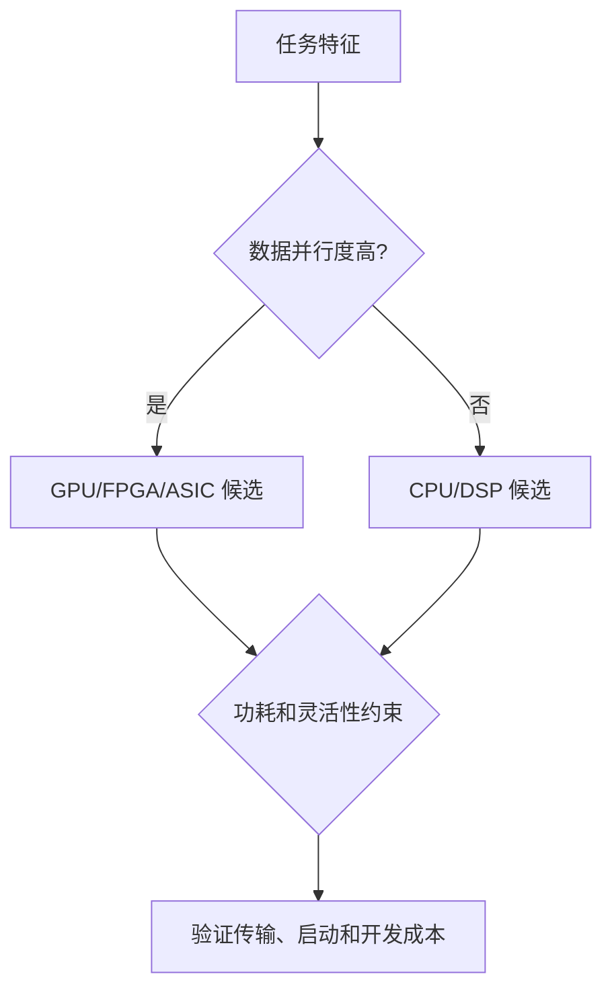

# 嵌入式系统与计算平台选择

> 本页属于：CEG5201 / Week 01
> 前置知识：[[CEG5201-Week01-为什么需要现代并行平台]]
> 预计阅读时间：8 分钟

## 嵌入式系统是什么？

嵌入式系统把物理世界和计算系统接起来：传感器采集信号，经 ADC 转换后由处理器/存储器计算，再通过 DAC 和执行器影响物理系统。它像一个“受时间和电池约束的专用工作站”，性能不是唯一目标。

## 主要权衡

| 平台 | 适合场景 | 主要代价 |
|---|---|---|
| GP-CPU | 通用、变化快的任务 | 峰值性能/能效有限 |
| DSP | 信号处理 | 专用性较强 |
| 多核 CPU | 任务级并行、多任务 | 共享缓存/带宽竞争 |
| GPU/GPGPU | 大规模数据并行 | 控制流分歧、功耗较高 |
| FPGA | 可重配置的专用流水线 | 开发复杂、资源固定 |
| ASIC | 固定功能的最高能效 | 不灵活、设计成本高 |

## 功耗直觉

讲义给出的动态功耗近似为：

`P = 0.5·f·C·Vdd²`

电压以平方项影响功耗；降低电压通常也会降低可达频率。因此 DVS 是“在截止时间内选择电压/频率”的时间—能耗权衡，而不是无条件降压。

## 平台选择流程

图 1：平台选择自制流程；依据 [CG5201_Chap1 (2627).pdf](https://github.com/Kytolly/NUS-coursework-wiki/releases/download/CEG5201/CG5201_Chap1%20%282627%29.pdf) pp.10–25（核对于 2026-09-01）。

## 易错点

硬件加速只有在计算收益超过数据传输、启动和协调开销时才值得。平台排名不是绝对的，必须结合任务粒度、数据布局、带宽、功耗和开发周期。

## 下一步

- 上一页：[[CEG5201-Week01-为什么需要现代并行平台]]
- 下一页：[[CEG5201-Week01-性能度量与可扩展性]]
- 返回：[[Home]]

## 来源与更新日志

- 来源：[CG5201_Chap1 (2627).pdf](https://github.com/Kytolly/NUS-coursework-wiki/releases/download/CEG5201/CG5201_Chap1%20%282627%29.pdf)，pp.10–25；个人参考 `notebook/lecture1.md`。
- 2026-09-01：从 Chapter 1 拆出嵌入式系统、功耗和平台选择短页。