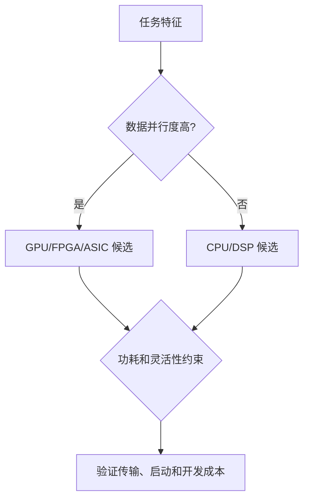

# 嵌入式系统与计算平台选择

> 本页属于：CEG5201 / Week 01
> 前置知识：[[CEG5201-Week01-为什么需要现代并行平台]]
> 预计阅读时间：8 分钟

## 嵌入式系统是什么？

嵌入式系统把物理世界和计算系统接起来：传感器/执行器连接被控对象，信号经 ADC 变成数字量交给计算与存储，处理结果再经 DAC 去驱动执行器，同时带有用户界面与通信接口（[CG5201_Chap1 (2627).pdf](https://github.com/Kytolly/NUS-coursework-wiki/releases/download/CEG5201/CG5201_Chap1%20%282627%29.pdf) 第 10 页）。它像一个“受时间和电池约束的专用工作站”，性能不是唯一目标，还要考虑能量、实时性与成本（第 11 页）。

## 主要权衡

| 平台 | 适合场景 | 主要代价 |
|---|---|---|
| GP-CPU | 通用、变化快的任务 | 峰值性能/能效有限 |
| DSP | 信号处理 | 专用性较强 |
| 多核 CPU | 任务级并行、多任务 | 共享缓存/带宽竞争 |
| GPU/GPGPU | 大规模数据并行 | 控制流分歧、功耗较高 |
| FPGA | 可重配置的专用流水线 | 开发复杂、资源固定 |
| ASIC | 固定功能的最高能效 | 不灵活、设计成本高 |

讲义把“灵活性—性能”画成雷达/坐标图（第 16–21 页）：性能上 ASIC 与 GPGPU 最高，GPGPU 在软件辅助下性能突出但功耗极高；多核在内在并行与目标匹配时接近 GPGPU，但 GPGPU 擅长数据并行、多核更擅长多任务；灵活性上 DSP 优于通用微处理器，FPGA 介于 ASIC 与软件平台之间（可运行时重配置，具有硬件速度与软件式灵活度）。

## 能量问题：硬件与软件两个层面

动态功耗近似为（第 13–14 页）：

`P = 0.5·f·C·Vdd²`

其中 `f` 是频率、`C` 是开关电容、`Vdd` 是电源电压。讲义还给出 `f = k(Vdd−VT)²/Vdd`（`VT` 为阈值电压），因此 `P` 对 `Vdd` 是二次甚至更高阶依赖，`P` 作为 `f` 的函数是凸函数。于是出现 **Dynamic Voltage Scaling (DVS)** 处理器：用一组电压档控制频率，把“截止时间”与“功耗”变成联合优化，即算法要在时间与功耗预算之间折中。

软件层面（第 15 页）也能省能：用更少指令完成同一任务几乎不牺牲性能，代码变换减少对内存层级的访问，节省的内存功耗往往更大。ELM（Efficient Low-Power Microprocessor）则从硬件入手（第 12 页）：用小指令寄存器靠近 ALU、减少从 cache 取指令和数据，从而把每指令能耗压低。

## 硬件加速（HA）与 FPGA/GPU 细节

FPGA 由可编程逻辑块、可编程互连与 I/O 块组成（第 23 页）。经典 FERMI CUDA GPU 有 512 个 CUDA core，组织成 16 个 SM、每 SM 32 核，可让 C/C++/Fortran 直接搬上 GPU 并行执行（第 24 页）。硬件加速（第 25 页）把任务卸载到专用硬件；若 CPU 已足够快且任务计算不密集，HA 收益有限，而图形、交互场景则收益明显。

## 平台选择流程

图 1：平台选择自制流程；依据 [CG5201_Chap1 (2627).pdf](https://github.com/Kytolly/NUS-coursework-wiki/releases/download/CEG5201/CG5201_Chap1%20%282627%29.pdf) pp.10–25（核对于 2026-09-07）。

## 易错点

硬件加速只有在计算收益超过数据传输、启动和协调开销时才值得。平台排名不是绝对的，必须结合任务粒度、数据布局、带宽、功耗和开发周期；ASIC 的高能效也常以丧失灵活性为代价。

## 下一步

- 上一页：[[CEG5201-Week01-为什么需要现代并行平台]]
- 下一页：[[CEG5201-Week01-性能度量与可扩展性]]
- 返回：[[Home]]

## 来源与更新日志

- 来源：[CG5201_Chap1 (2627).pdf](https://github.com/Kytolly/NUS-coursework-wiki/releases/download/CEG5201/CG5201_Chap1%20%282627%29.pdf)，pp.10–25；个人参考 `notebook/lecture1.md`。
- 2026-09-01：从 Chapter 1 拆出嵌入式系统、功耗和平台选择短页。
- 2026-09-07：扩写嵌入式定义、能量两个层面、FPGA/GPU/HA 细节，并更新图注核对日期。
