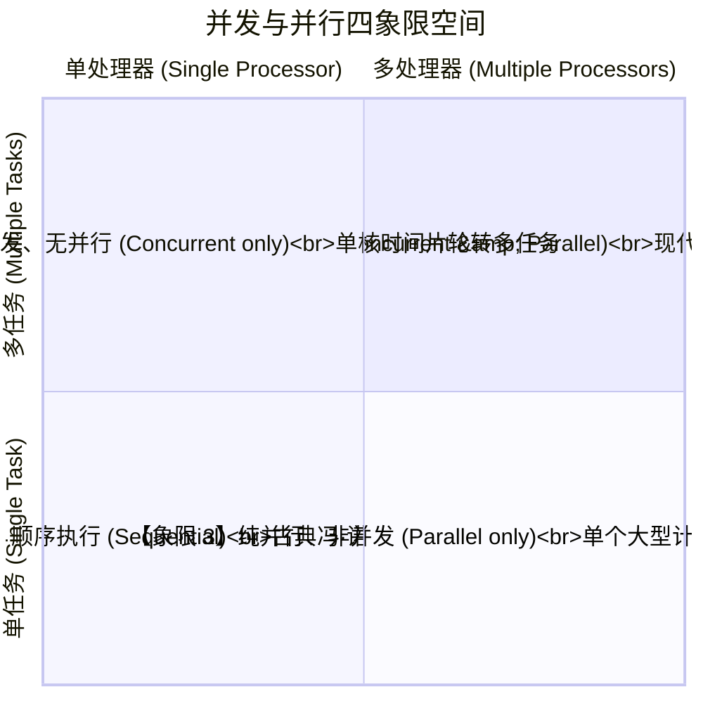
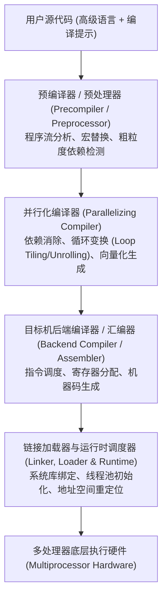
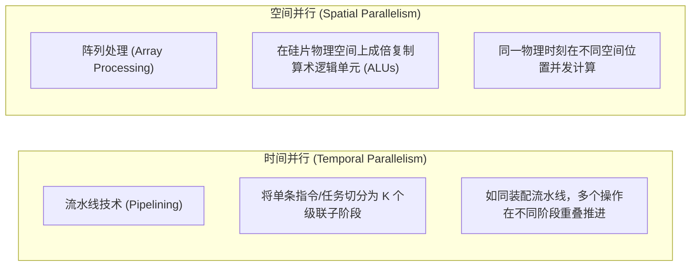

# 并发并行与Flynn体系分类

> 本页属于：CEG5201 / Week 01
> 前置知识：[[CEG5201-Week01-性能度量与计算吞吐率]]
> 预计阅读时间：13 分钟

---

## 1. 并发 vs 并行：概念辨析与四象限模型

在系统与并行体系结构领域，**并发（Concurrency）**与**并行（Parallelism）**是两个经常被混淆但物理内涵截然不同的概念（[CG5201_Chap1 (2627).pdf](https://github.com/Kytolly/NUS-coursework-wiki/releases/download/CEG5201/CG5201_Chap1%20%282627%29.pdf) 第 45–48 页）。

> **Rob Pike（Go 语言之父）的经典定义**：
> - **并发是关于结构的（Concurrency is about structure）**：它是指程序设计上具有同时处理多个任务的能力（Dealing with a lot of things at once）。
> - **并行是关于执行的（Parallelism is about execution）**：它是指物理硬件在同一时间瞬态下真正同时执行多个计算（Doing a lot of things at once）。

讲义第 46 页通过著名的“任务维度 $\times$ 处理器维度”四象限图，给出了二者清晰的对应关系：

### 四象限模型逐一解读

1. **象限 1：单任务 + 单处理器（Single Task, Single Processor）**
   - 古典纯顺序执行。程序从头到尾由单核逐步执行，无多任务切换，无物理并行。
2. **象限 2：多任务 + 单处理器（Multiple Tasks, Single Processor）**
   - **典型场景**：单核 CPU 运行抢占式多任务操作系统（如 Linux）。
   - **执行机理**：通过时间片轮转（Time-Slicing）在多个就绪进程间高频切换上下文。从宏观人类视角看，所有任务“同时处于活跃进展状态”（并发）；但在任何微观物理纳秒瞬间，仅有一个进程在 CPU ALU 上执行，**不具备物理并行性**。
3. **象限 3：单任务 + 多处理器（Single Task, Multiple Processors）**
   - **典型场景**：单个大规模科学计算任务（如 1000 万阶稠密矩阵乘法）被分解为多个数据块，分发到多核或 GPU 上协同加速。
   - **执行机理**：系统服务于单一的全局任务目标，多个硬件核心在同一时刻物理上同时运算，**具有高度的物理并行性，但在应用软件架构上通常不体现复杂的多服务并发解耦**。
4. **象限 4：多任务 + 多处理器（Multiple Tasks, Multiple Processors）**
   - **典型场景**：现代数据中心、多核云计算实例、复杂智能手机 SoC。
   - **执行机理**：系统同时调度多个独立的并发应用程序（多任务并发），并将这些任务的线程在物理上分配至数十个 CPU 核心或异构加速器上同时运行（物理并行），达到吞吐率与响应时间的全局最优化。

---

## 2. 软件与编译体系：隐式并行 vs 显式并行

如何将应用程序表达的计算逻辑转换为底层的并行执行？讲义第 30、45 页将并行编程划分为两大流派：

### 2.1 隐式并行（Implicit Parallelism）
- **定义**：程序员完全使用传统的串行编程语言（如 C、Fortran、Python）书写代码，不引入任何并发或线程原语。并行性的发掘完全交由硬件或编译系统自动完成。
- **实现手段**：
  1. **硬件级隐式并行**：超标量乱序执行（Out-of-Order Execution）、分支预测、动态推测执行、多级指令流水线。
  2. **编译级隐式并行**：**并行化编译器（Parallelizing Compiler）**。编译器在后台自动构建循环迭代空间的数据依赖图（Data Dependence Graph），通过 Bernstein 条件检测无冲突循环，自动展开循环并将其重构为向量指令（如 SSE/AVX 向量化）或多线程代码。

### 2.2 显式并行（Explicit Parallelism）
- **定义**：由程序员在程序源代码中通过显式语言扩展、编译引导指令（Pragmas）或运行时函数库，明确指出哪些代码段应当并发执行、如何划分数据以及何时进行同步通信。
- **工业界标准技术栈**：
  - **共享内存显式多线程**：OpenMP（`#pragma omp parallel for`）、POSIX Threads（Pthreads）。
  - **分布式内存显式消息传递**：MPI（Message Passing Interface，`MPI_Send` / `MPI_Recv`）。
  - **异构协处理器异构编程**：CUDA（NVIDIA GPU）、OpenCL、SYCL、HIP。

### 2.3 平台编译分层支持链（Compilation Toolchain）
讲义第 30 页指出，典型的并行编译链包含四层结构：

---

## 3. Flynn 分类法全面深度解析（Flynn's Taxonomy）

Michael J. Flynn 于 1972 年依据计算机内部**控制单元发射的指令流（Instruction Stream）**与**数据通路操作的数据流（Data Stream）**的重数，建立了沿用至今的体系结构四分法（讲义第 31–33 页）：

### 3.1 SISD（Single Instruction, Single Data）
- **架构定义**：单一控制单元（CU）从存储器中依次取出单条指令并译码，单条指令在每一个时钟周期仅驱动一个算术逻辑单元（ALU）操作单一标量操作数。
- **数据流特征**：无并发指令流，无并发数据流。
- **代表硬件**：早期古典单核微处理器（如 Intel 8086、Intel Pentium III 之前的标量流水线核心）。

### 3.2 SIMD（Single Instruction, Multiple Data）
- **架构定义**：单一中央控制单元（Control Unit）统揽全局，每个周期仅取出并广播一条指令；但该指令会被同步广播分发到 $N$ 个并行排列的**处理单元（Processing Elements, PEs）**，每个 PE 在其私有绑定的局部数据流上同步（Lockstep）执行该操作。
- **控制流特征**：**单程序计数器（Single PC）**，所有活动 PE 步调严格一致。若遇条件分支（如 `if-else`），硬件通过**掩码寄存器（Masking Registers）**将不满足条件的 PE 暂时静默（Disabled），由满足条件的 PE 先执行 `if` 分支，再反转掩码让其余 PE 执行 `else` 分支（即分支分化开销）。
- **代表硬件**：
  - 经典阵列计算机：Illiac IV。
  - CPU 现代向量扩展指令集：Intel MMX / SSE / AVX-512、ARM Neon、RISC-V Vector。
  - GPU 的核心底层执行模型：NVIDIA Warp（32 个线程锁步执行同一条指令）。

### 3.3 MISD（Multiple Instruction, Single Data）
- **架构定义**：多个独立的控制单元各自取出不同的指令流，这些不同的指令在同一物理时刻作用于**同一个输入数据流**上。
- **工业界定位**：在追求通用计算吞吐率的商业计算机中极罕见，主要用于以下两个专属领域：
  1. **空间与航天高容错冗余系统**：航天飞机飞控计算机接收同一传感器输入，三台或四台异构处理器各自运行不同算法进行并行计算，最后经由多数表决器（Voter）裁决输出，防止单粒子翻转（SEU）或单点逻辑故障导致灾难。
  2. **收缩阵列与脉动阵列（Systolic Arrays）**：数据流穿过多个级联的处理单元，每个单元对其执行不同的乘加与变换操作。

### 3.4 MIMD（Multiple Instruction, Multiple Data）
- **架构定义**：系统由多个完全自治的处理器组成，每个处理器拥有其**独立的控制单元（独立 PC）和私有指令流水线**，各自独立执行不同的程序，分别读写各自独立的数据流。
- **控制流特征**：完全异步执行，处理器之间通过共享内存总线或消息传递网络进行协作与同步。
- **代表硬件**：当今绝大部分主流并行系统——多核桌面 CPU（AMD Ryzen, Intel Core Ultra）、多路服务器（Dual-socket Xeon, AMD EPYC）、超级计算机（Summit, Frontier）以及云计算集群。

---

## 4. 空间并行 vs 时间并行（Spatial vs Temporal Parallelism）

并行性在物理硬件实现上有两种截然不同的维度：

- **时间并行（流水线技术）**：通过在流水段之间插入锁存器（Latches），将计算拆分为取指、译码、执行、访存、写回等阶段。单条指令的延迟未变甚至略微增加，但系统每个时钟周期均可输出一个结果，吞吐率提升 $K$ 倍。
- **空间并行（处理机阵列）**：通过直接消耗硅片面积，在芯片上并行集成 64 个或 1024 个 ALU，指令下发后所有 ALU 在同一时刻各自开工。
- **现代处理器的融合**：现代超标量多核 CPU 同时融合了二者——单个核心内部采用 14–19 级深时间流水线（时间并行）+ 4–8 发射乱序超标量与 512 位向量单元（空间并行），片上再集成数十个物理核心（多重空间并行）。

---

## 5. SIMD 计算机的形式化数学描述：5 元组模型

讲义第 63 页给出了 SIMD 体系结构的严密数学抽象模型。一台典型的 SIMD 机器在形式化上可严格定义为一个 **5 元组（5-Tuple）**：

$$
M = \langle N, C, I, M, R \rangle
$$

### 各分量严密数学定义
1. **$N$（Number of Processing Elements, PEs）**：
   - 系统中物理集成的算术逻辑处理单元总数（$PE_0, PE_1, \dots, PE_{N-1}$）。
2. **$C$（Control Unit）**：
   - 唯一的中央控制单元。负责存储控制程序、维护程序计数器（PC）、从指令主存读取并译码指令，并将标量指令在本地执行，将向量并行指令广播至所有 PE。
3. **$I$（Instruction Set）**：
   - 由中央控制单元广播给所有被激活的 PE 并由其执行的指令集合（包含向量加减法、逻辑位运算、移位操作等）。
4. **$M$（Masking Scheme / Enable-Disable Control）**：
   - 空间掩码机制。包含一个长度为 $N$ 的布尔掩码向量：
     $$\mathbf{m} = [m_0, m_1, \dots, m_{N-1}], \quad m_i \in \{0, 1\}$$
   - 当且仅当 $m_i = 1$ 时，第 $i$ 个处理单元 $PE_i$ 处于激活状态并响应该指令；当 $m_i = 0$ 时，该 PE 被屏蔽（Idled/No-Op）。掩码向量由各 PE 的局部状态标志（如条件比较结果）动态生成，从而在单指令流下支持局部条件分支。
5. **$R$（Interconnection Network / Routing Function）**：
   - 互连网络及数据路由通信函数集合。定义了数据在不同 PE 局部寄存器之间直接传递的拓扑映射规则。例如常见的置换函数（Permutations）：
     - 循环移位互连：$R_k(i) = (i + k) \pmod N$
     - 超立方体互连（Hypercube）：$R_b(i) = i \oplus 2^b$（第 $b$ 位反转）
     - 洗牌置换（Shuffle-Exchange）。

---

## 6. 向量处理器体系结构（Vector Processors）

讲义第 34–36 页指出，向量处理器是 SIMD 哲学的另一高度成熟的硬件实现分支：

- **核心设计哲学**：传统标量处理器对寄存器中的单个标量执行循环操作；而向量处理器直接提供**向量寄存器（Vector Registers）**，每个向量寄存器可容纳一组（如 64 个或 128 个）连续的浮点元素。
- **深流水化向量执行单元**：向量处理器内部将浮点加法器与乘法器设计为深度流水线。一旦发射一条向量乘法指令 `VMUL V1, V2, V3`，硬件流水线每个周期吞入一对向量元素并吐出一个乘积，连续流转，彻底消除了标量循环中的循环变量增量、分支跳转及取指译码开销。
- **与当前课程的衔接**：讲义提示，关于向量微架构流水线冲突、链接技术（Vector Chaining）与超流水线处理的深层细节，将在 [[CEG5201-Week04-现代处理器设计空间与流水线基础]] 中全面展开。

---

## 考试时你应该会什么

1. **核心概念阐释与辨析**：
   - 准确区分并发（Concurrency）与并行（Parallelism）的本质区别；能够画出四象限模型，并对每个象限给出对应的软硬件系统实例。
   - 清楚解释隐式并行与显式并行的区别；列举现代并行编译工具链的四个主要层级。
2. **Flynn 分类深度掌握**：
   - 能够准确默写出 Flynn 四类架构的英文全称、控制流与数据流机制；
   - 能够结合现代硬件（单核标量 CPU、Intel AVX 向量单元、NVIDIA GPU Warp、容错多机系统、多核 AMD EPYC 服务器）指出其分别归属于哪一种 Flynn 类别。
3. **SIMD 5 元组形式化表示**：
   - 能够完整写出 SIMD 体系结构的 5 元组数学符号 $M = \langle N, C, I, M, R \rangle$，并准确阐述掩码机制 $M$ 是如何解决 SIMD 架构下分支条件执行的。

---

## 下一步

- 上一页：[[CEG5201-Week01-性能度量与计算吞吐率]]
- 下一页：[[CEG5201-Week01-多处理器体系结构与系统设计流]]
- 模块总览：[[CEG5201-讲义与笔记索引]]
- 返回知识库：[[Home]]

---

## 来源与更新日志

- 来源：[CG5201_Chap1 (2627).pdf](https://github.com/Kytolly/NUS-coursework-wiki/releases/download/CEG5201/CG5201_Chap1%20%282627%29.pdf) pp. 30–36, 45–48, 63.
- 2026-09-08：初始归档。
- 2026-09-23：全面重构，加入并发与并行四象限详细对比、软硬件编译工具链图谱、Flynn 分类图示、时间/空间并行机制剖析及 SIMD 5 元组形式化数学定义。
