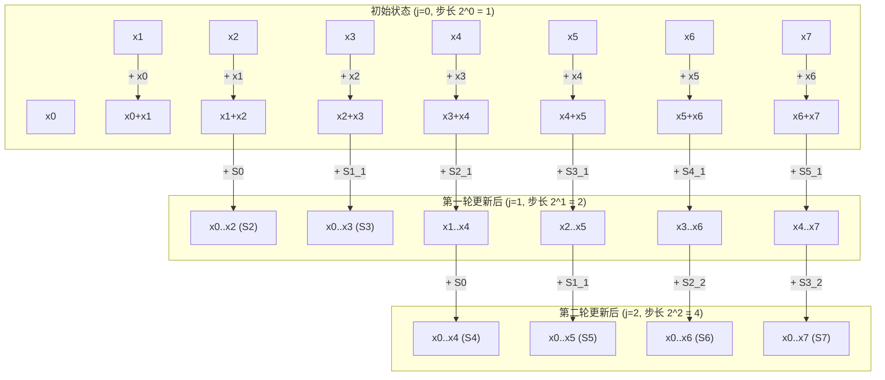

# 并行算法例题：Prefix-Sum与归约

> 本页属于：CEG5201 / Week 01
> 前置知识：[[CEG5201-Week01-并行算法例题-矩阵乘法]]
> 预计阅读时间：14 分钟

---

## 1. 前缀和（Prefix-Sum / Scan）问题定义

**前缀和（Prefix-Sum，又称并行扫描 Parallel Scan）**是并行计算领域最基础、应用最广泛的基本算子之一。不仅在数组累加中至关重要，它还是并行基数排序、流压缩（Stream Compaction）、动态多项式求值以及图遍历的核心底层构件（手写讲义 [Chap1 BigOExamples.pdf](assets/CEG5201/chap1/fig_bigo_page_3.png) 第 3–4 页；[CG5201_Chap1 (2627).pdf](https://github.com/Kytolly/NUS-coursework-wiki/releases/download/CEG5201/CG5201_Chap1%20%282627%29.pdf) 第 72 页）。


### 形式化数学定义
- 设输入元素集合为包含 $n$ 个自然数（或任意半群元素）的有序序列：
  $$X = \{x_0, x_1, x_2, \dots, x_{n-1}\}$$
- $\oplus$ 为定义在集合上的满足**结合律（Associative Law）**的二元算子（如加法、乘法、按位与、求最大值 $\max$）。
- **求解目标**：计算输出序列 $S = \{S_0, S_1, \dots, S_{n-1}\}$，使得每个元素 $S_i$ 均为前 $i+1$ 个输入元素的前缀结合和：
  $$S_i = \bigoplus_{k=0}^i x_k = x_0 \oplus x_1 \oplus \dots \oplus x_i, \quad \forall 0 \le i \le n-1$$

### 单处理器串行基准（RAM Model）
在传统单核 RAM 机器上，前缀和通过线性累加迭代实现：
- $S_0 = x_0$
- 对于 $i = 1, 2, \dots, n-1$：
  $$S_i = S_{i-1} \oplus x_i$$
- **运算量与时间复杂度**：
  共计执行 $n-1$ 次加法运算，算法时间复杂度为严格的：
  $$T_1(n) = O(n)$$

---

## 2. PRAM 上的并行前缀和算法（Hillis-Steele 经典扫描）

手写讲义第 4 页展示了在具备 $n$ 个处理器的 PRAM 模型上，如何将线性链式依赖转换为对数级深度的并行网格（Trellis Diagram）：


### 2.1 硬件与内存环境设定
- 拥有 $n$ 个并行处理器，记作 $P_0, P_1, \dots, P_{n-1}$；
- 设规模 $n$ 为 2 的幂（$n = 2^m$）；
- 共享存储单元 $m_0, m_1, \dots, m_{n-1}$，初始时分别存放原始输入：
  $$m_i \leftarrow x_i, \quad \forall 0 \le i \le n-1$$
- 算法终止时，各单元就地更新为对应的前缀和：
  $$m_i \leftarrow S_i$$

### 2.2 算法伪代码（Hillis-Steele Algorithm）

```text
for j = 0 to log2(n) - 1 do
    for i = 2^j to n - 1 do in parallel
        S_i = S_{i - 2^j} + S_i
    endfor
endfor
```

### 2.3 对数级网格数据流图解（Trellis Diagram）
以 $n = 8$ 个元素（$\log_2 8 = 3$ 轮迭代）为例，数据按步长指数倍增推进：



### 2.4 复杂度与理论界限分析
- **并行时间复杂度（Parallel Time）**：
  外层循环恰好迭代 $\log_2 n$ 轮，每一轮内部的所有加法操作完全并行执行（耗时 $O(1)$）。因此总并行执行时间为：
  $$T_p(n) = O(\log n)$$
- **PRAM 模型要求**：
  在每一轮迭代中，同一个中间前缀值会被右侧跨度的节点并发读取（例如 $S_0$ 会同时被 $S_1, S_2, S_4$ 读取），因此该算法要求底层为 **CREW PRAM**。
- **总工作量与成本（Work / Cost）**：
  在第 $j$ 轮迭代中，参与加法的处理器数量为 $n - 2^j$。总加法操作次数为：
  $$\text{Total Additions} = \sum_{j=0}^{\log_2 n - 1} (n - 2^j) = n \log_2 n - \sum_{j=0}^{\log_2 n - 1} 2^j = n \log_2 n - (n - 1) = O(n \log n)$$
  总成本为 $\text{Cost} = p \times T_p = n \times O(\log n) = O(n \log n)$。
  - **重要结论**：因为 $O(n \log n) > O(n)$，**Hillis-Steele 算法不是工作最优的（Work-Inefficient）**！
  - > 补充说明：Guy Blelloch 后来提出了基于树状结构的两阶段扫描算法（Up-Sweep 树归约 + Down-Sweep 树分发），总共仅需 $2n$ 次加法，从而在 $O(\log n)$ 时间内达成了 $O(n)$ 的严格工作最优性。

---

## 3. UMA 多处理器全局二叉树归约完整数值例题推导

在真实的多处理器体系结构中，如何将前缀累加思想应用于分布式或集中式共享内存硬件？讲义第 52–55 页给出了一个**经典、完整的考题级严密数值例题**。

### 3.1 问题建模与体系结构参数
- **数据规模**：系统需对存储在共享内存中的 **$N$ 个数** 求全局总和。
- **计算资源**：系统集成 **$M$ 个同构处理器**（$M$ 为 2 的幂，且 $N \gg M$）。
- **硬件访存与运算延迟参数**：
  - **配对访存延迟（Memory Access Penalty）**：处理器从 UMA 共享内存中成对读取/写入数据，每次访问需消耗 **$k$ 个时钟周期**。
  - **内部加法周期**：处理器本地寄存器执行一次标量加法操作耗时 **$1$ 个时钟周期**。

讲义第 54 页展示了利用二叉树进行局部与全局汇总的完整执行树：


---

### 3.2 两阶段求解过程严密推导

#### 阶段一：各处理器本地顺序累加（Phase 1: Local Summation）
1. **数据切分**：将 $N$ 个数据均匀切分成 $M$ 个连续的数据块，每个处理器分配到的局部子数组大小为：
   $$L = \frac{N}{M}$$
2. **本地累加耗时**：
   - 累加 $L$ 个数需要执行 $L-1$ 次加法。
   - 讲义第 52 页将单处理器本地顺序求和时“包含指令取指、从主存加载操作数（Load）以及在累加器执行加法（Add）”的综合时钟周期建模为每个元素平均消耗 $2$ 个时钟周期。
   - 因此，每个处理器在本地计算出私有局部和所需的执行时间为：
     $$T_{\text{phase1}} = 2 \cdot L = 2 \cdot \left( \frac{N}{M} \right) \text{ 周期}$$
   - （相应地，若由单个处理器孤立串行完成所有 $N$ 个数的累加，总串行基准时间为 $T_{\text{seq}} = 2N$ 周期）。

#### 阶段二：跨处理器的全局二叉树归约（Phase 2: Global Binary Tree Reduction）
经过阶段一后，每个处理器计算出了一个局部部分和，系统中总共剩下 $M$ 个部分和，存放于各个处理器的预定共享内存单元中。

此时启动**二叉树归约算法（Binary Reduction Tree）**：
- 归约树的总高度为：
  $$\text{Depth} = \log_2 M \text{ 级}$$
- 在归约树的每一个级联层级中：
  - 存活的一半处理器需要通过系统总线从共享内存中读取其配对伙伴处理器的局部和，耗时为 **$k$ 个周期**；
  - 随后在本地执行一次累加，耗时为 **$1$ 个周期**；
  - 单级二叉归约的执行时间为：$k + 1$ 周期。
- 经过 $\log_2 M$ 级归约推进，最终在根节点处理器处得到全局唯一的最终总和。阶段二总耗时为：
  $$T_{\text{phase2}} = (k + 1) \cdot \log_2 M \text{ 周期}$$

---

### 3.3 并行时间与加速比闭式解

综合阶段一与阶段二，并行系统完成全部 $N$ 个数求和的总执行时间为：

$$
T_{\text{par}}(N, M) = T_{\text{phase1}} + T_{\text{phase2}} = 2 \cdot \left( \frac{N}{M} \right) + (k + 1) \cdot \log_2 M
$$

系统相对于单处理器串行执行的加速比（Speedup）定义为：

$$
S(N, M) = \frac{T_{\text{seq}}}{T_{\text{par}}} = \frac{2N}{2 \cdot \left( \frac{N}{M} \right) + (k + 1) \cdot \log_2 M}
$$

系统的并行能效（Efficiency）为：

$$
E(N, M) = \frac{S(N, M)}{M} = \frac{2N}{2N + M \cdot (k + 1) \cdot \log_2 M}
$$

---

### 3.4 讲义真实数值例题代入验算（Slide 55 Worked Example）

讲义第 55 页给出了一个真实的工业级工程计算场景参数：
- 数据总量：$N = 2^{20} = 1,048,576$（约 100 万个数）
- 处理器数量：$M = 256 = 2^8$ 个处理器
- 共享访存惩罚：$k = 4$ 个周期

#### 步骤 1：计算单处理器工作负载
$$L = \frac{N}{M} = \frac{2^{20}}{2^8} = 2^{12} = 4096 \text{ 个数}$$

#### 步骤 2：计算串行基准耗时
$$T_{\text{seq}} = 2 \times N = 2 \times 2^{20} = 2,097,152 \text{ 周期}$$

#### 步骤 3：计算并行阶段一耗时
$$T_{\text{phase1}} = 2 \times L = 2 \times 4096 = 8192 \text{ 周期}$$

#### 步骤 4：计算并行阶段二耗时
$$T_{\text{phase2}} = (k + 1) \times \log_2 M = (4 + 1) \times \log_2(256) = 5 \times 8 = 40 \text{ 周期}$$

#### 步骤 5：汇总总并行时间与加速比
$$T_{\text{par}} = 8192 + 40 = 8232 \text{ 周期}$$

$$
S = \frac{T_{\text{seq}}}{T_{\text{par}}} = \frac{2,097,152}{8232} \approx 254.76
$$

$$
E = \frac{S}{M} = \frac{254.76}{256} \approx 99.52\%
$$

> **极度震撼的工程结论**：
> - 理想状态下 256 个处理器的最大理论加速比为 256 倍。
> - 在本系统中，考虑了阶段二的二叉树跨节点通信和 $k=4$ 的访存延迟后，实际测得加速比依然高达 **254.76 倍**，并行效率高达惊人的 **99.52%**！
> - **为什么效率如此之高？**
>   因为问题规模足够大（$N=10^6$），阶段一纯计算所占的周期（8192）占据了绝对主导地位，阶段二跨网络归约通信开销（40 周期）仅占总耗时的 $\frac{40}{8232} \approx 0.48\%$！通信延迟几乎被完全稀释和掩盖。

---

## 考试时你应该会什么

1. **PRAM 前缀和算法掌握**：
   - 默写 Hillis-Steele 并行前缀和算法的双层循环伪代码；
   - 能够画出 $n=8$ 时的 3 级 Trellis 格状前缀计算依赖图；
   - 指出该算法的并行时间为 $O(\log n)$，总工作量为 $O(n \log n)$，并准确说明为什么它不是工作最优的。
2. **UMA 归约公式推导与计算（高频大题）**：
   - **闭式解默写**：熟记 $T_{\text{par}} = 2\left(\frac{N}{M}\right) + (k+1)\log_2 M$ 与 $S = \frac{2N}{2(N/M) + (k+1)\log_2 M}$；
   - **数值运算**：给定任意 $N$（如 $2^{16}$）、$M$（如 $64$）和 $k$（如 $10$），准确分步计算出 $T_{\text{phase1}}$、$T_{\text{phase2}}$、总时间 $T_{\text{par}}$ 以及加速比 $S$。
   - **定性分析**：分析当数据量 $N$ 固定但核心数 $M$ 无限扩大时，加速比为何会出现边际收益递减（通信项 $(k+1)\log_2 M$ 将逐步超过计算项 $2N/M$）。

---

## 下一步

- 上一页：[[CEG5201-Week01-并行算法例题-矩阵乘法]]
- 下一页：[[CEG5201-Week01-Amdahl定律与可扩展性分析]]
- 模块总览：[[CEG5201-讲义与笔记索引]]
- 返回知识库：[[Home]]

---

## 来源与更新日志

- 来源：[Chap1 BigOExamples.pdf](assets/CEG5201/chap1/fig_bigo_page_3.png) pp. 3–4; [CG5201_Chap1 (2627).pdf](https://github.com/Kytolly/NUS-coursework-wiki/releases/download/CEG5201/CG5201_Chap1%20%282627%29.pdf) pp. 52–55, 72.
- 2026-09-08：初始简略版归档。
- 2026-09-23：全新拆分重构，完整收录手写讲义原件图、Hillis-Steele 伪代码与 Trellis 依赖流图，全面还原 UMA 二叉归约树两阶段时间推导，附带 $N=2^{20}, M=256$ 考题级全套数值验算步骤。
