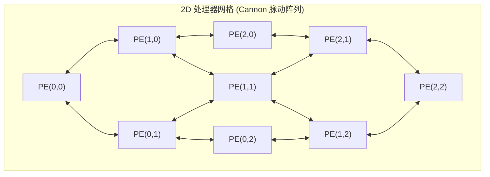

# 并行算法例题：矩阵乘法

> 本页属于：CEG5201 / Week 01
> 前置知识：[[CEG5201-Week01-PRAM理论模型与变体比较]]
> 预计阅读时间：13 分钟

---

## 1. 经典矩阵乘法问题定义

在高性能计算（HPC）、图形学渲染以及当今深度学习（GEMM，通用矩阵乘法）中，密集矩阵乘法（Dense Matrix Multiplication）是最基本、最核心的计算算子（[CG5201_Chap1 (2627).pdf](https://github.com/Kytolly/NUS-coursework-wiki/releases/download/CEG5201/CG5201_Chap1%20%282627%29.pdf) 第 71 页；手写讲义 [Chap1 BigOExamples.pdf](assets/CEG5201/chap1/fig_bigo_page_1.png) 第 1–2 页）。

### 问题数学描述
给定两个维度均为 $n \times n$ 的实数方阵 $A$ 和 $B$：

$$
A = [A_{ik}]_{n \times n}, \quad B = [B_{kj}]_{n \times n}
$$

目标是计算它们的乘积方阵 $C = A \times B$，其中输出矩阵 $C$ 中的每一个元素 $C_{ij}$（$1 \le i, j \le n$）定义为矩阵 $A$ 的第 $i$ 行与矩阵 $B$ 的第 $j$ 列的**向量点积（Inner Product）**：

$$
C_{ij} = \sum_{k=1}^n A_{ik} \cdot B_{kj}
$$

---

## 2. 单处理器串行基准（1 Processor Baseline）

在经典的单核标量处理器上，矩阵乘法通过标准的三重嵌套循环实现（手写讲义第 1 页）：


```c
// 经典串行三重嵌套循环 (Row-Column Triple Loop)
for (int i = 1; i <= n; i++) {         // 遍历输出矩阵的每一行 (n 次)
    for (int j = 1; j <= n; j++) {     // 遍历输出矩阵的每一列 (n 次)
        C[i][j] = 0;
        for (int k = 1; k <= n; k++) { // 执行点积累加 (n 次)
            C[i][j] = C[i][j] + A[i][k] * B[k][j];
        }
    }
}
```

### 复杂度严密分析
- **乘法总次数**：外层循环 $n$ 次 $\times$ 中层循环 $n$ 次 $\times$ 内层循环 $n$ 次 $= n^3$ 次乘法。
- **加法总次数**：每个点积需要 $n-1$ 次加法，共计算 $n^2$ 个元素，总加法次数为 $n^2(n-1) = n^3 - n^2$ 次。
- **串行时间复杂度**：
  $$T_1(n) = O(n^3)$$

---

## 3. 并行分解策略一：$n$ 个处理器的一维行切分（Using $n$ Processors）

讲义第 1 页下半部分与第 2 页上半部分展示了第一种粗粒度一维数据并行分解方式：


### 3.1 任务映射（Task-to-Processor Mapping）
- **处理器资源**：分配 $n$ 个独立的同构处理器，分别记作 $P_1, P_2, \dots, P_n$。
- **分配原则**：将输出矩阵 $C$ 按行切分（Row-wise Partitioning）。**第 $i$ 个处理器 $P_i$ 独占负责计算输出矩阵 $C$ 的整个第 $i$ 行**：
  $$\text{Processor } P_i \implies \text{Compute Row } i = \{C_{i1}, C_{i2}, \dots, C_{in}\}$$

### 3.2 局部计算与并行时间推导
- 对于处理器 $P_i$，其需要读取矩阵 $A$ 的第 $i$ 行（固定行），并依次与矩阵 $B$ 的第 $1, 2, \dots, n$ 列进行点积计算。
- 计算每个元素 $C_{ij}$ 需要 $n$ 次乘加操作；
- 计算整行共 $n$ 个元素，处理器 $P_i$ 本地所需执行的基本操作数为：
  $$\text{Operations per Processor} = n \times n = n^2$$
- 由于所有 $n$ 个处理器在物理上完全并行独立执行各自的行计算，因此总并行执行时间为：
  $$T_n(n) = O(n^2)$$

### 3.3 性能评价指标
- **加速比（Speedup）**：
  $$S_n = \frac{T_1(n)}{T_n(n)} = \frac{O(n^3)}{O(n^2)} = O(n)$$
  （在 $n$ 个处理器上取得了 $n$ 倍的线性加速比！）
- **总成本与工作最优性（Cost & Work-Optimality）**：
  $$\text{Cost} = p \times T_p(n) = n \times O(n^2) = O(n^3)$$
  因为并行算法的总成本与最佳串行算法时间复杂度处于相同渐近阶（$C = O(T_1)$），所以该算法是**严格工作最优的（Work-Optimal）**！
- **PRAM 模型变体要求**：
  在计算过程中，所有 $n$ 个处理器需要同时并发读取矩阵 $B$ 的列数据（例如在计算第一列时，所有处理器都需要读取 $B_{k1}$）。因此，该算法要求底层共享存储器支持**并发读（Concurrent Read）**，即属于 **CREW PRAM** 模型。

---

## 4. 并行分解策略二：$n^2$ 个处理器的二维点对切分（Using $n^2$ Processors）

如果可用硬件核心进一步扩充至 $p = n^2$ 个，讲义第 2 页中间给出了更细粒度的二维网格点对分解（Element-wise Partitioning）：

### 4.1 任务映射
- **处理器资源**：分配 $n^2$ 个处理器，逻辑上排布为一个 $n \times n$ 的二维处理器阵列，记作 $P_{ij}$（$1 \le i, j \le n$）。
- **分配原则**：**每个处理器 $P_{ij}$ 独占且仅负责计算输出矩阵 $C$ 中的单一标量元素 $C_{ij}$**：
  $$\text{Processor } P_{ij} \implies \text{Compute } C_{ij} = \sum_{k=1}^n A_{ik} \cdot B_{kj}$$

### 4.2 计算时间与成本推导
- 处理器 $P_{ij}$ 仅需将 $A$ 的第 $i$ 行与 $B$ 的第 $j$ 列进行逐项相乘并顺序累加，共涉及 $n$ 次乘法与 $n-1$ 次加法。
- 单个处理器的操作数缩减为 $n$ 次。
- 并行执行时间缩短为：
  $$T_{n^2}(n) = O(n)$$
- **指标核算**：
  - 加速比：$S_{n^2} = \frac{O(n^3)}{O(n)} = O(n^2)$（在 $n^2$ 个处理器上达成完美线性加速！）。
  - 总成本：$\text{Cost} = n^2 \times O(n) = O(n^3)$。
  - **结论**：依然保持**工作最优（Work-Optimal）**！

### 4.3 终极理论极限：$n^3$ 个处理器的对数级归约
若在 PRAM 模型下进一步追求极致速度，可为每个乘积项 $A_{ik} B_{kj}$ 分配一个独立的处理器，共动用 $p = n^3$ 个处理器：
1. **第 1 步**：所有 $n^3$ 个处理器在 $1$ 个时钟步内并行完成全部 $n^3$ 次乘法操作；
2. **第 2 步**：对于每个位置 $(i, j)$，利用 $n$ 个处理器对其 $n$ 个乘积项构建高度为 $\lceil \log_2 n \rceil$ 的二叉加法归约树，耗时 $O(\log n)$。
3. **并行时间**：$T_{n^3}(n) = O(\log n)$。
4. **代价**：此时总成本为 $\text{Cost} = n^3 \times O(\log n) = O(n^3 \log n) > O(n^3)$，此时**不再具备工作最优性**，多出的 $O(\log n)$ 因子反映了处理器的空转等待开销。

---

## 5. 真实物理互连映射：2D Mesh 网格脉动阵列

手写讲义第 2 页底部明确抛出了一个深刻的体系结构思考题：
> *"Mesh Architecture: $n \times n$ processors, Claim: $O(n)$. Describe the algorithm. What is the PRAM model?"*

在真实的硅片物理实现中，不存在 PRAM 那种瞬时无损的无限全局共享内存。真实的芯片往往将 $n^2$ 个处理单元排列成 **2D Mesh 网格**，每个 PE 仅与物理相邻的东、西、南、北 4 个邻居相连：



### Cannon 算法与脉动流动（Systolic Data Flow）
在 2D Mesh 网格上，矩阵乘法无须全局访存，而是通过著名的 **Cannon 算法** 实现：
1. **数据初相移（Initial Skewing）**：矩阵 $A$ 的第 $i$ 行向左循环移位 $i$ 步；矩阵 $B$ 的第 $j$ 列向上循环移位 $j$ 步，使得每个 PE 初始获得恰好能匹配的第一对乘数。
2. **循环脉动步进（$n$ 步迭代）**：
   - 在每个步进周期内，所有 PE 同步执行一次局部乘累加：$C_{ij} \leftarrow C_{ij} + A_{ik} \cdot B_{kj}$；
   - 随后，矩阵 $A$ 的子块通过片上布线向左邻居传递 1 格，矩阵 $B$ 的子块向上传递 1 格。
3. **性能与 PRAM 辨析**：
   - 算法共经历 $n$ 次“计算-邻居通信”步进，每次步进耗时为常数 $O(1)$，**总执行时间为严格的 $O(n)$**！
   - **PRAM 模型回答**：Cannon 算法不需要任何并发读写，每个数据单元仅在点对点私有通道流动，其通信语义等价于 **EREW（互斥读写）**，在物理硬件上具有极高的可行性与极低的布线成本（现代 Google TPU 脉动阵列的理论源头！）。

---

## 6. 矩阵乘法并行策略综合对比表

| 策略方案 | 处理器规模 $p$ | 并行时间 $T_p$ | 加速比 $S$ | 总成本 $\text{Cost}$ | 工作最优性 (Work-Optimal)? | 理论存储模型 |
| :--- | :--- | :--- | :--- | :--- | :--- | :--- |
| **单核串行基准** | $1$ | $O(n^3)$ | $1$ | $O(n^3)$ | 是（基准） | RAM |
| **一维行切分** | $n$ | $O(n^2)$ | $O(n)$ | $O(n^3)$ | **是** | CREW PRAM |
| **二维点对切分** | $n^2$ | $O(n)$ | $O(n^2)$ | $O(n^3)$ | **是** | CREW PRAM |
| **三维全展开归约** | $n^3$ | $O(\log n)$ | $O(n^3 / \log n)$ | $O(n^3 \log n)$ | **否** | CREW / CRCW |
| **2D Mesh 脉动阵列** | $n^2$ | $O(n)$ | $O(n^2)$ | $O(n^3)$ | **是** | EREW / 局部通信 |

---

## 考试时你应该会什么

1. **算法时间与复杂度推导**：
   - 熟练写出单核矩阵乘法的运算量推导（$n^3$ 乘法，$n^3-n^2$ 加法）；
   - 在给出处理器数量为 $p = n$ 或 $p = n^2$ 的条件下，能够迅速写出对应的并行任务分配方案，推导并行时间 $T_p$，并计算加速比 $S$ 与成本 $C$。
2. **理论模型与工作最优性判据**：
   - 解释为什么一维行切分需要 CREW 模型而非 EREW 模型（指出矩阵 $B$ 的列并发读冲突）；
   - 根据定义 $C = p \cdot T_p$，判断各并行方案是否属于工作最优，并能解释为何 $p = n^3$ 时会破坏工作最优性。
3. **体系结构映射分析**：
   - 解释在 2D Mesh 网格上如何通过邻居移位（Cannon 算法）在 $O(n)$ 时间内完成矩阵乘法，说明其相比集中式共享内存的硬件布线优势。

---

## 下一步

- 上一页：[[CEG5201-Week01-PRAM理论模型与变体比较]]
- 下一页：[[CEG5201-Week01-并行算法例题-Prefix-Sum与归约]]
- 模块总览：[[CEG5201-讲义与笔记索引]]
- 返回知识库：[[Home]]

---

## 来源与更新日志

- 来源：[Chap1 BigOExamples.pdf](assets/CEG5201/chap1/fig_bigo_page_1.png) pp. 1–2; [CG5201_Chap1 (2627).pdf](https://github.com/Kytolly/NUS-coursework-wiki/releases/download/CEG5201/CG5201_Chap1%20%282627%29.pdf) p. 71.
- 2026-09-08：初版简要归档。
- 2026-09-23：全面重构，加入手写讲义原件图、一维行切分 $O(n^2)$ 严密推导、二维点切分 $O(n)$ 推导、工作最优性证明、2D Mesh 脉动通信机理及综合对比全景表。
