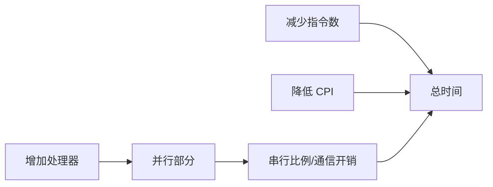

# 性能度量与可扩展性

> 本页属于：CEG5201 / Week 01
> 前置知识：[[CEG5201-Week01-嵌入式系统与计算平台选择]]
> 预计阅读时间：9 分钟

## CPU 时间

讲义把 CPU 时间写为：

`T = Ic × CPI × τ = Ic × CPI / f`

其中 `Ic` 是指令数，`CPI` 是平均每指令周期数，`τ` 是周期时间，`f` 是时钟频率。只提高频率并不一定能改善系统吞吐率，因为指令数、CPI、I/O、OS 和调度开销也会影响完成时间。

## 并发和并行

- **并发（concurrency）**：同时管理多个任务。
- **并行（parallelism）**：把可同时执行的子任务映射到多个执行资源。

类比来说，并发像一个项目经理交替推进多项工作；并行像多个工程师真正同时施工。任务拆分、同步和通信可能抵消理论加速。

## PRAM 与 Amdahl 定律

PRAM 用理想化共享内存模型研究并行算法，常见读写模型包括 EREW、CREW、ERCW 和 CRCW。它便于分析上界，但不表示真实机器没有缓存、带宽和通信成本。

若串行比例为 `F`，使用 `n` 个处理器时：

`S(n,F)=1/[F+(1−F)/n]`

当 `n` 趋于无穷时，speed-up 上限仍为 `1/F`。串行部分像一条只能由一个人办理的柜台，会限制再增加多少并行工作人员。

## 可扩展性检查

图 1：性能优化因素与可扩展性关系（自制，依据 Chapter 1 pp.37–75；核对于 2026-09-01）。

## 开放问题

讲义给出 DVS 的功耗和频率关系，但在给定截止时间与电压档位时的最小能耗调度需要结合后续调度内容确认。

## 下一步

- 上一页：[[CEG5201-Week01-嵌入式系统与计算平台选择]]
- 下一页：[[CEG5201-Week02-任务可分性与数据依赖]]
- 返回：[[Home]]

## 来源与更新日志

- 来源：[CG5201_Chap1 (2627).pdf](https://github.com/Kytolly/NUS-coursework-wiki/releases/download/CEG5201/CG5201_Chap1%20%282627%29.pdf)，pp.37–75；个人参考 `notebook/lecture1.md`。
- 2026-09-01：从 Chapter 1 拆出性能、PRAM 和 Amdahl 短页。