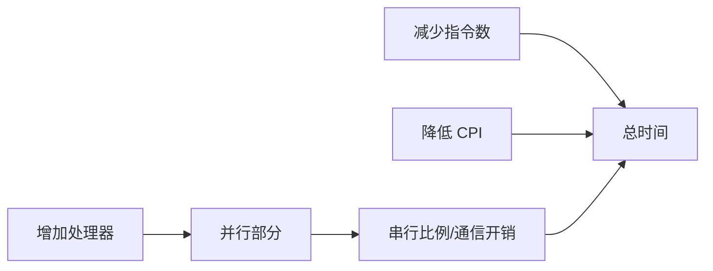

# 性能度量与可扩展性

> 本页属于：CEG5201 / Week 01
> 前置知识：[[CEG5201-Week01-嵌入式系统与计算平台选择]]
> 预计阅读时间：9 分钟

## CPU 时间与 MIPS

讲义把 CPU 时间写为（[CG5201_Chap1 (2627).pdf](https://github.com/Kytolly/NUS-coursework-wiki/releases/download/CEG5201/CG5201_Chap1%20%282627%29.pdf) 第 38–41 页）：

`T = Ic × CPI × τ = Ic × CPI / f`

其中 `Ic` 是指令数，`CPI` 是平均每指令周期数，`τ` 是周期时间，`f` 是时钟频率。用 `C` 表示总周期数，则 `CPI = C/Ic`。MIPS 率为：

`MIPS = Ic / (T·10^6) = f / (CPI·10^6)`

因此 MIPS 与时钟频率成正比、与 CPI 成反比（第 41–42 页）。`T = Ic·10^6/MIPS`。只看提高频率并不一定能改善系统整体吞吐率，因为指令数、CPI、I/O、OS 和调度开销都会影响完成时间。

## 吞吐率与并发/并行

CPU 吞吐率 `Wp = 1/T = f/(Ic·CPI)`，系统吞吐率 `Ws` 还要扣除多程序环境下的 I/O、OS 与调度开销，故 `Ws < Wp`，理想情况下 `Ws = Wp`（第 43 页）。移动平台还常看 MIPS/mW，且多数手机被降频以省电（第 44 页）。

- **并发（concurrency）**：一个应用同时管理多个任务。
- **并行（parallelism）**：把一个任务拆成可同时执行的子任务。

一个应用可以并发而不并行（多任务但任务未拆分），也可以并行而不并发（只做一个任务但拆成子任务），也可以两者皆有（第 47–48 页）。并发与并行混用可能因 CPU 已足够忙而收益很小甚至下降，因此要先分析再采纳。

## PRAM 与 Amdahl 定律

向量机可分 register-to-register（如 CRAY）与 memory-to-memory（如 Cyber 205）两类；SIMD 由控制单元向一组 PE 广播指令，并用 mask 与数据路由函数控制参与单元（第 62–63 页）。

**PRAM** 是 Fortune 与 Wyllie（1978）提出的理想化共享内存模型，忽略实现细节，用于并行算法设计、复杂度上界与 VLSI 估计（第 64、69 页）。共享内存读写组合出四种模型：EREW、CREW、ERCW、CRCW；CRCW 的写冲突可用 common/arbitrary/minimum/priority 策略解决（第 70 页）。CRCW 一般比 EREW 更强，但定理给出：同一问题用 p 个处理器，CRCW 相对最佳 EREW 最多快 `O(log p)`（第 74 页）。

图 1：PRAM 理论模型架构（处理器经共享内存通信）；来源：[CG5201_Chap1 (2627).pdf](https://github.com/Kytolly/NUS-coursework-wiki/releases/download/CEG5201/CG5201_Chap1%20%282627%29.pdf) 第 69 页；核对 2026-09-07。

若串行占比为 `F`，用 `n` 个处理器时（第 75 页）：

`S(n,F) = 1/[F + (1−F)/n]`

当 `n → ∞` 时，加速上限仍为 `1/F`。串行部分像一条只能由一个人办理的柜台，限制再增加多少并行工作人员都无济于事。

## 共享内存可扩展性：UMA 与 NUMA

共享内存多处理器按访问延时可分 **UMA** 与 **NUMA**（第 50–57 页）。UMA 中所有处理器访问同一物理内存、延迟近似相同，编程与同步简单，但共享总线/互连易成为瓶颈，扩展性有限，适合中小规模；NUMA 的内存物理分布在各节点，系统仍呈现单一共享地址空间，本地访问快、远程访问慢，因此**数据局部性**至关重要，规模扩展更好。现代单插槽桌面多核多为 UMA（如 Intel Core i7/i9、Apple M3/M4 统一内存），多插槽服务器多为 NUMA（AMD EPYC、Intel Xeon 经 Infinity Fabric/UPI 访问远程内存）（第 58 页）。

PRAM 中算法成本可定义为 `运行时间 × 处理器数`（第 72 页）。它把“更快”与“用了多少处理器”合并成一个指标，是评估并行算法是否划算的常用记法。

## 可扩展性检查

图 2：性能优化因素与可扩展性关系（自制，依据 [CG5201_Chap1 (2627).pdf](https://github.com/Kytolly/NUS-coursework-wiki/releases/download/CEG5201/CG5201_Chap1%20%282627%29.pdf) pp.37–75；核对于 2026-09-07）。

## 开放问题

讲义给出 DVS 的功耗和频率关系，但在给定截止时间与电压档位时的最小能耗调度需要结合后续调度内容确认。

## 下一步

- 上一页：[[CEG5201-Week01-嵌入式系统与计算平台选择]]
- 下一页：[[CEG5201-Week02-任务可分性与数据依赖]]
- 返回：[[Home]]

## 来源与更新日志

- 来源：[CG5201_Chap1 (2627).pdf](https://github.com/Kytolly/NUS-coursework-wiki/releases/download/CEG5201/CG5201_Chap1%20%282627%29.pdf)，pp.37–75；个人参考 `notebook/lecture1.md`。
- 2026-09-01：从 Chapter 1 拆出性能、PRAM 和 Amdahl 短页。
- 2026-09-07：扩写 MIPS/吞吐率、并发与并行关系、PRAM 读写模型与 CRCW 上界，新增 PRAM 原图（第 69 页）。
