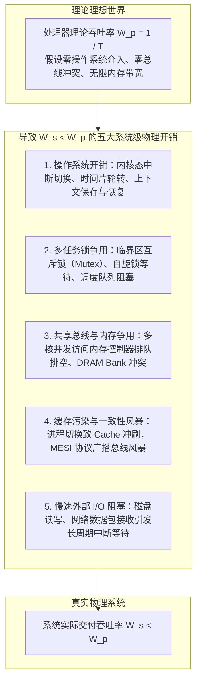

# 性能度量与计算吞吐率

> 本页属于：CEG5201 / Week 01
> 前置知识：[[CEG5201-Week01-嵌入式系统与计算平台选择]]
> 预计阅读时间：11 分钟

---

## 1. 处理器性能铁律（The Iron Law of Processor Performance）

在计算机体系结构中，评估程序执行时间最经典、最权威的基石公式被称为**性能铁律**（[CG5201_Chap1 (2627).pdf](https://github.com/Kytolly/NUS-coursework-wiki/releases/download/CEG5201/CG5201_Chap1%20%282627%29.pdf) 第 38–39 页）。

程序在中央处理器（CPU）上完整执行所需的物理时间（CPU Execution Time）$T$ 建模为三个基本因子的乘积：

$$
T = I_c \times \text{CPI} \times \tau = \frac{I_c \times \text{CPI}}{f}
$$

- $I_c$（Instruction Count）：程序执行过程中动态执行的**机器指令总数**。
- $\text{CPI}$（Cycles Per Instruction）：执行每条机器指令所需的**平均时钟周期数**。
- $\tau$（Clock Cycle Time）：处理器单个硬件**时钟周期时间**（单位为秒 $\text{s}$ 或纳秒 $\text{ns}$）。
- $f$（Clock Frequency）：处理器主频（$f = 1 / \tau$，单位为赫兹 $\text{Hz}$ 或吉赫兹 $\text{GHz}$）。

### 性能因子的软硬件决定边界

| 性能因子 | 受哪些层面直接决定？ | 优化方向与权衡 |
| :--- | :--- | :--- |
| **指令数 $I_c$** | 算法设计、编程语言、编译器优化级别、指令集架构（ISA）。 | 算法时间复杂度、精简冗余代码、使用高效向量指令。 |
| **平均每指令周期数 $\text{CPI}$** | 指令集架构设计、微体系结构（流水线级数、超标量发射宽度、分支预测准确率、分级缓存命中率）。 | 减少流水线气泡（Stall）、提升分支预测率、降低访存缺失率。 |
| **时钟周期时间 $\tau$（主频 $f$）** | 硅片半导体制造工艺（如 3nm/5nm 制程）、关键路径门延迟（Logic Gate Delay）、供电电压 $V_{dd}$。 | 工艺迭代、流水线深度切分（减少每级门逻辑数）、提升供电电压（但受功耗墙制约）。 |

---

## 2. 考虑存储器访问延迟的微观执行时间模型

讲义第 39–40 页进一步指出了传统铁律的局限性：传统铁律将所有指令执行视为在处理器内部完成。但在现代计算机中，**存储器访问延迟（Memory Access Latency）往往占据程序总执行时间的绝大部分**。

为此，讲义引入了更贴合物理实际的细化时间模型：

$$
T = I_c \cdot (p + m \cdot k) \cdot \tau
$$

### 参数详细物理定义
- $p$：每条指令译码与纯内部 ALU 运算所需的**处理器时钟周期数**（Processor cycles for instruction decode and execution）。
- $m$：平均每条指令引发的**主存访问次数**（Number of memory references per instruction）。例如纯寄存器运算指令 $m=0$，单操作数加载指令 $m=1$，带读写操作的复杂指令 $m \ge 2$。
- $k$：存储器访问周期相对于处理器内部时钟周期的比率（Ratio of memory access cycle time to processor cycle time）：
  $$k = \frac{\tau_{\text{mem}}}{\tau_{\text{cpu}}}$$
  其中 $\tau_{\text{mem}}$ 为内存总线一次有效访问延迟，$\tau_{\text{cpu}}$ 为 CPU 核心时钟周期。

### 存储墙的数学体现
在当代高性能处理器中，CPU 核心频率可达 $4\text{ GHz}$（$\tau_{\text{cpu}} = 0.25\text{ ns}$），而访问主存 DRAM 的延迟通常在 $50 \sim 100\text{ ns}$，导致比率 $k = \tau_{\text{mem}} / \tau_{\text{cpu}} \approx 200 \sim 400$！

- 若程序缺乏良好的缓存局部性，即使 $m$ 仅为 $0.1$（即 $10\%$ 的指令发生缓存缺失需要访问主存）：
  $$p + m \cdot k = 1 + 0.1 \times 200 = 1 + 20 = 21 \text{ 周期}$$
- 访存停顿时间占据了总执行周期的 $\frac{20}{21} \approx 95.2\%$！这表明：**在存储受限型任务中，单纯提升 CPU 主频对缩短 $T$ 毫无意义，唯有通过提高缓存命中率或并发预取隐藏访存延迟**。

---

## 3. MIPS 指标及其根本局限

讲义第 41–42 页讨论了历史上被广泛使用、但也极具误导性的度量指标：**MIPS（Million Instructions Per Second，每秒百万条指令数）**。

### 3.1 MIPS 的数学定义
MIPS 度量单位时间内处理器能够执行的百万级指令数量：

$$
\text{MIPS} = \frac{I_c}{T \times 10^6} = \frac{I_c}{\left(\frac{I_c \times \text{CPI}}{f}\right) \times 10^6} = \frac{f}{\text{CPI} \times 10^6}
$$

由上述关系，也可以将执行时间反向表示为：

$$
T = \frac{I_c \times 10^{-6}}{\text{MIPS}}
$$

### 3.2 为什么说 MIPS 具有极大的误导性（Pitfalls of MIPS）？
计算机科学家常戏称 MIPS 为 *"Meaningless Indicator of Processor Speed"*（毫无意义的处理器速度指标）。其根本原因在于：**不同指令集架构（ISA）或不同编译优化级别下，单条指令所能完成的工作量（Workload）截然不同**。

#### 经典对比案例：CISC vs RISC
假设需要执行一个包含 1000 万次向量加法的数学任务：
- **CISC 架构（复杂指令集）**：支持强大的向量/内存寻址指令，仅需 $I_c = 10^7$ 条指令。单条指令功能强大，导致微操作多，平均 $\text{CPI} = 4$，主频 $f = 2\text{ GHz}$。
  $$\text{MIPS}_{\text{CISC}} = \frac{2 \times 10^9}{4 \times 10^6} = 500 \text{ MIPS}$$
  $$T_{\text{CISC}} = \frac{10^7 \times 4}{2 \times 10^9} = 0.02 \text{ 秒}$$
- **RISC 架构（精简指令集）**：所有指令高度规整单周期完成，平均 $\text{CPI} = 1.2$，主频同样为 $f = 2\text{ GHz}$。但由于缺乏复杂寻址指令，完成相同算法需要展开为更多基础指令，$I_c = 2.5 \times 10^7$ 条。
  $$\text{MIPS}_{\text{RISC}} = \frac{2 \times 10^9}{1.2 \times 10^6} \approx 1667 \text{ MIPS}$$
  $$T_{\text{RISC}} = \frac{2.5 \times 10^7 \times 1.2}{2 \times 10^9} = 0.015 \text{ 秒}$$
- **结论剖析**：RISC 处理器的 MIPS 高达 1667，是 CISC 处理器（500 MIPS）的 3.3 倍；但其真实执行时间仅比 CISC 略快（$0.015\text{ s}$ 对 $0.02\text{ s}$）。如果仅凭 MIPS 就断定 RISC 快 3.3 倍，将犯下严重的体系结构常识错误。**程序真正的唯一黄金评价标准只有墙上时钟执行时间（Wall-Clock Execution Time $T$）**。

---

## 4. 系统吞吐率 vs 处理器理论吞吐率

讲义第 43 页严格区分了**单个处理器的理论吞吐率**与**完整多任务计算机系统的实际吞吐率**：

### 4.1 吞吐率的定义
- **处理器理论单任务吞吐率（Processor Throughput, $W_p$）**：
  若已知某个典型基准程序在单个处理器上的端到端执行时间为 $T$，则该处理器单位时间内能够处理的该类程序数为：
  $$W_p = \frac{1}{T}$$
- **系统实际吞吐率（System Throughput, $W_s$）**：
  在由多个处理器、多级内存、操作系统调度器共同组成的完整系统中，单位时间（如每秒或每小时）内系统实际向外界交付并完成的作业（Jobs/Programs）总数。

### 4.2 为什么必然存在 $W_s < W_p$？
在理论无损理想情况下，若单核处理时间为 $T$，单核理论吞吐率为 $W_p$。但讲义明确指出：在真实运行环境（特别是包含操作系统多任务调度与并发共享资源的多核系统中），**系统实际吞吐率必然严格小于处理器单核孤立吞吐率**，即：

$$
W_s < W_p
$$

### 五大系统级性能折损成因深度分析
1. **操作系统上下文切换开销（Context Switching Overhead）**：
   多任务轮转时，CPU 必须保存当前进程的通用寄存器、程序计数器（PC）、栈指针以及页表基址（CR3），并加载新进程上下文，消耗数百至数千个时钟周期。
2. **多核存储总线争用（Shared Bus & Memory Contention）**：
   多个 CPU 核心同时发起读写请求时，仲裁器（Arbiter）必须串行化排队，引入显著的等待周期。
3. **缓存冷启动与缓存污染（Cache Thrashing）**：
   频繁的进程切换导致原有工作集（Working Set）被逐出 L1/L2 Cache，新进程执行初期面临密集的 Cache Miss。
4. **多核缓存一致性开销（Cache Coherence Traffic）**：
   当多核并发写入共享变量时，硬件必须触发 MESI 协议的 Invalidate 广播，导致互连网络拥塞和流水线停顿。
5. **外设 I/O 异步阻塞（I/O Bottleneck）**：
   磁盘存储与网络设备的时钟速度比 CPU 慢 3 到 6 个数量级，I/O 传输期间 CPU 即使让出给其他任务，管理等待队列与中断亦带来常数级损耗。

---

## 5. 移动计算与能效优先指标（Energy-Efficiency Metrics）

在电池供电的移动计算（Mobile Computing）和高密度数据中心中，纯粹的高性能不再是唯一的追求，**能效比（Performance per Watt）**成为了决定性指标（讲义第 44 页）：

- **MIPS / mW（每毫瓦百万条指令数）**：反映在极低功耗物联网微控制器（如 ARM Cortex-M 系列）上的计算效率。
- **GFLOPS / W（每瓦十亿次浮点运算数）**：超算 Green500 榜单的核心排名指标，用于评估超级计算机在能效维度上的卓越程度。
- **TOPS / W（每瓦万亿次操作数）**：现代 AI NPU、自动驾驶芯片（如 Tesla FSD、Apple Neural Engine）衡量定点神经网络推理能效的行业标准。

---

## 考试时你应该会什么

1. **综合计算题**：
   - 熟练运用铁律公式 $T = \frac{I_c \cdot \text{CPI}}{f}$，能够在已知指令数、时钟周期和 CPI 的条件下计算 CPU 时间。
   - 掌握细化访存模型 $T = I_c (p + m \cdot k)\tau$：能够代入具体的每指令访存次数 $m$ 和访存延迟惩罚 $k$，量化计算存储墙对总执行时间的拖累百分比。
2. **概念辨析与简答**：
   - 用公式推导说明为什么高 MIPS 的处理器其真实程序执行时间 $T$ 反而可能慢于低 MIPS 的处理器（指出 $I_c$ 与单条指令工作量的核心差异）。
   - 全面列举并深入解释导致实际系统吞吐率小于单处理器理论吞吐率（$W_s < W_p$）的五种核心系统级损耗。

---

## 下一步

- 上一页：[[CEG5201-Week01-嵌入式系统与计算平台选择]]
- 下一页：[[CEG5201-Week01-并发并行与Flynn体系分类]]
- 模块总览：[[CEG5201-讲义与笔记索引]]
- 返回知识库：[[Home]]

---

## 来源与更新日志

- 来源：[CG5201_Chap1 (2627).pdf](https://github.com/Kytolly/NUS-coursework-wiki/releases/download/CEG5201/CG5201_Chap1%20%282627%29.pdf) pp. 37–44.
- 2026-09-08：初始简略版归档在综合页面中。
- 2026-09-23：独立成专页，详述性能铁律、存储感知时间模型 $T=I_c(p+mk)\tau$、MIPS 陷阱与 CISC/RISC 实例、$W_s < W_p$ 五大成因剖析及能效指标体系。
