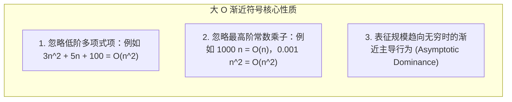
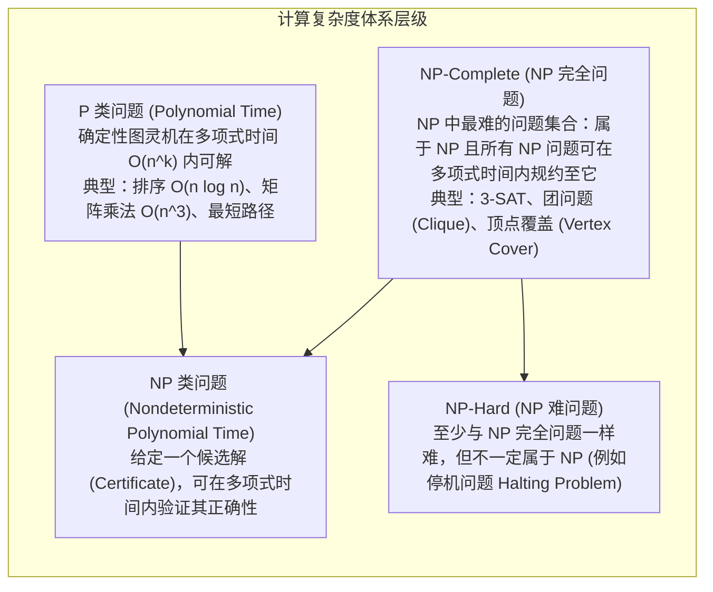
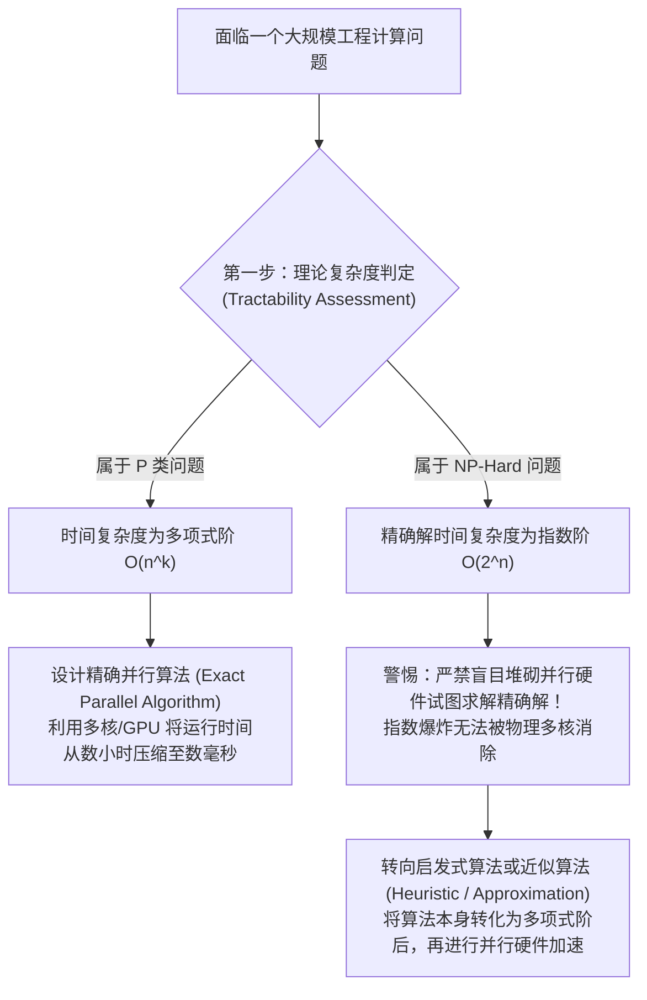

# 算法复杂度与P-NP理论

> 本页属于：CEG5201 / Week 01
> 前置知识：[[CEG5201-Week01-多处理器体系结构与系统设计流]]
> 预计阅读时间：12 分钟

---

## 1. 大 $O$ 渐近复杂度的严格数学定义

在分析单处理器及并行系统的算法性能时，必须剥离底层具体指令集微架构与硬件主频的常数干扰，从渐近增长速率的角度评估算法随**输入问题规模（Problem Size, $s$ 或 $n$）**扩张时的资源开销（[CG5201_Chap1 (2627).pdf](https://github.com/Kytolly/NUS-coursework-wiki/releases/download/CEG5201/CG5201_Chap1%20%282627%29.pdf) 第 65 页）。

### 严格数学定义
设函数 $g(s)$ 为算法在处理输入规模为 $s$ 的问题时所消耗的实际物理时间或基本操作次数。若存在正实数常数 $c > 0$ 以及一个正整数阈值 $s_0 > 0$，使得当问题规模 $s \ge s_0$ 时，恒有：

$$
|g(s)| \le c \cdot |f(s)|
$$

则称算法的时间复杂度渐近上界为 $O(f(s))$，记作：

$$
g(s) = O(f(s))
$$

### 概念拓展：渐近符号族
- **大 $O$ 符号（$O$）**：算法运行时间的**渐近渐进上界（Asymptotic Upper Bound）**。算法的最坏运行时间不会比该函数增长更快。
- **大 $\Omega$ 符号（$\Omega$）**：算法运行时间的**渐近渐进下界（Asymptotic Lower Bound）**。解决该类问题无论采用何种算法，所需时间至少增长如此之快。
- **大 $\Theta$ 符号（$\Theta$）**：算法运行时间的**渐近紧确界（Asymptotically Tight Bound）**。当且仅当 $g(s) = O(f(s))$ 且 $g(s) = \Omega(f(s))$ 时，成立 $g(s) = \Theta(f(s))$。

---

## 2. 时间复杂度 vs 空间复杂度

- **时间复杂度（Time Complexity）**：算法执行直至终止所需要的**基本算术/逻辑操作次数**。
- **空间复杂度（Space Complexity）**：算法在执行过程中为了保存中间数据、调用栈、通信缓冲区所额外占用的**物理内存单元数量**。
- **并行计算中的时空权衡（Time-Space Trade-off）**：
  在单核算法中，为了换取更低的运行时间，往往可以通过预计算建立索引哈希表（以空间换时间）。而在并行计算中，为了使多个处理器能够并发运行，每个处理器往往需要维护一份数据的私有副本或前缀树，**导致并行算法的全局空间复杂度（Memory Footprint）常常高于串行算法**。

---

## 3. 计算复杂度类别：P, NP, NP-Complete, NP-Hard

讲义第 66–68 页将问题按照其“是否可被计算机在合理时间内解决”划分为不同的理论阶层：

### 3.1 P 类问题（Polynomial Time）
- **定义**：存在一台确定性图灵机（Deterministic Turing Machine），可以在以输入规模 $s$ 的多项式为上界的时间（即 $O(s^k)$，其中 $k$ 为常数）内解决该判定问题。
- **哲学意义**：在计算机科学中，**P 类问题被公认为“计算上可处理的”（Computationally Tractable）**。无论规模扩展到多大，只要增加算力或采用合理的并行硬件，总能在人类可接受的时间内计算出精确解。

### 3.2 NP 类问题（Nondeterministic Polynomial Time）
- **定义**：非确定性图灵机可以在多项式时间内求解的判定问题。
- **等价定义（基于验证器）**：若一个问题的答案为“是”，则存在一个长度为多项式大小的证书（Certificate / Proof），使得一台普通的确定性计算机能够在多项式时间内**检验（Verify）**该证书是否真实有效。
- **直观理解**：**“解出难题可能极度漫长，但检验别人给出的现成答案是否正确却极其迅速”**。例如数独游戏（Sudoku）或者大素数分解：从头解出一个 1000 阶数独极其困难，但别人填好一个九宫格后，你只需花费几秒钟就能核对每行每列是否无重复数字。

### 3.3 多项式时间规约（Polynomial Reduction）与 NP 完全性
- **多项式规约（$\le_p$）**：若存在一个多项式时间算法，能将问题 $A$ 的任意输入实例转化为问题 $B$ 的实例，且两者的真伪判定结果严格等价，则记作 $A \le_p B$。这说明：**问题 $B$ 的难度至少不亚于问题 $A$**。
- **NP-Complete（NPC）**：根据 Stephen Cook 和 Leonid Levin 于 1971 年独立发现的 **Cook-Levin 定理**，布尔可满足性问题（Boolean Satisfiability, SAT）是第一个被数学证明的 NP 完全问题。所有其他 NP 难解问题（如旅行商问题 TSP、哈密顿回路）均可通过多项式规约等价到 SAT。

---

## 4. 并行计算对复杂度与可处理性的深刻启示

许多初学者容易产生一个致命的错误直觉：*“如果一个算法具有指数级复杂度 $O(2^n)$，只要我拥有成千上万个处理器的并行计算机，是不是就能把它变成多项式时间内可解的问题？”*

讲义第 68 页做出了掷地有声的定论：**绝无可能！并行计算无法突破指数爆炸的物理高墙！**

### 定量数学证明与推演
设一个求解 NPC 问题的精确算法在单处理器上的时间复杂度为指数级：

$$
T_1(n) = O(2^n)
$$

假设我们构建了一台极其庞大的并行超级计算机，拥有 $p$ 个理想的物理处理器核心。假设算法具有完美的任务可分性，且**完全忽略任何网络通信、内存争用与同步开销**（即理想线性加速的极限状态）。

在 $p$ 个处理器上运行的并行时间 $T_p(n)$ 为：

$$
T_p(n) = \frac{T_1(n)}{p} = \frac{c \cdot 2^n}{p}
$$

1. **若处理器规模 $p$ 是多项式级别的（物理可实现）**：
   现实世界中，芯片上的核心数最多只能随芯片规模呈多项式增长（例如 $p = n^2$ 或 $p = n^3$）。将 $p = n^k$ 代入：
   $$T_p(n) = O\left( \frac{2^n}{n^k} \right) = O(2^n)$$
   **根据高阶无穷大判定定理，指数函数 $2^n$ 的增长速率永远碾压任意多项式 $n^k$！** 当输入规模从 $n=60$ 增长到 $n=100$ 时，$2^{100} / 100^3 \approx 1.26 \times 10^{24}$ 秒，耗时依然超过宇宙现有年龄数十万倍！
2. **要使 $T_p(n)$ 降为多项式阶的极端荒谬条件**：
   要使 $T_p(n) = O(n^k)$，必须强制要求处理器数量满足：
   $$p = O\left( \frac{2^n}{n^k} \right) \approx O(2^n)$$
   即**必须制造出指数级数量的物理处理器！**
   - 若 $n = 300$，所需的处理器芯片数量为 $2^{300} \approx 2 \times 10^{90}$。
   - 而现代物理学可观测宇宙中所有基本粒子（质子、中子、电子）的总数仅约为 $10^{80}$ 个！全宇宙的原子全部拿来制造晶体管也远远不够！

---

## 5. 常见问题复杂度实例速查

| 问题名称 | 典型算法 | 串行时间复杂度 | 复杂度归属 | 并行化特性 |
| :--- | :--- | :--- | :--- | :--- |
| **数组排序 (Sorting)** | 快速排序 / 归并排序 | $O(n \log n)$ | **P 类** | 可通过双调排序网（Bitonic Sort）在 $O(\log^2 n)$ 并行时间内完成。 |
| **矩阵乘法 (Matrix Multiply)** | 经典三层循环 | $O(n^3)$ | **P 类** | 高度数据并行，可在 2D 网格或 PRAM 上加速至 $O(n)$ 或 $O(\log n)$。 |
| **前缀和扫描 (Prefix Sum)** | 顺序累加扫描 | $O(n)$ | **P 类** | 可通过并行归约树在 $O(\log n)$ 并行时间内完成。 |
| **0/1 背包问题 (Knapsack)** | 动态规划（伪多项式） | $O(n \cdot W)$ | **NP-Complete** | 当数值 $W$ 很大时呈指数级，不可简单靠多核求解。 |
| **旅行商问题 (TSP)** | 蛮力全排列搜寻 | $O(n!)$ | **NP-Hard** | 必须采用遗传算法（GA）、模拟退火（SA）等启发式并行求解。 |

---

## 考试时你应该会什么

1. **数学定义默写**：
   - 准确写出大 $O$ 复杂度的数学不等式定义：$\exists c>0, s_0>0, \forall s \ge s_0, |g(s)| \le c|f(s)|$。
2. **理论概念证明与论述**：
   - 准确解释 P 类与 NP 类的定义，阐明多项式规约（Polynomial Reduction）的核心作用；
   - **必考经典论述题**：*“能否利用具有 $p$ 个处理器的并行系统将一个指数时间复杂度 $O(2^n)$ 的 NPC 问题转化为多项式时间求解？”* —— 必须给出严格的数学论证，阐明物理处理器数 $p$ 受限于多项式多核，无法抵消 $2^n$ 的指数爆炸，并由此说明为何面对 NP 难问题时必须优先转向启发式/近似算法。

---

## 下一步

- 上一页：[[CEG5201-Week01-多处理器体系结构与系统设计流]]
- 下一页：[[CEG5201-Week01-PRAM理论模型与变体比较]]
- 模块总览：[[CEG5201-讲义与笔记索引]]
- 返回知识库：[[Home]]

---

## 来源与更新日志

- 来源：[CG5201_Chap1 (2627).pdf](https://github.com/Kytolly/NUS-coursework-wiki/releases/download/CEG5201/CG5201_Chap1%20%282627%29.pdf) pp. 65–68.
- 2026-09-08：初始简略版归档。
- 2026-09-23：全新拆分专页，补充大 O 严格数学不等式定义、渐近符号族体系、P/NP/NPC/NPH 理论架构图，重点补全“并行计算能否突破指数爆炸”的定量物理极限证明。
