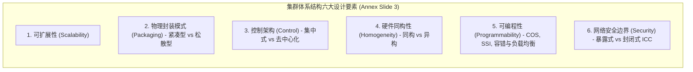

# 集群计算Cloud与虚拟化

> 本页属于：CEG5201 / Week 01
> 前置知识：[[CEG5201-Week01-Amdahl定律与可扩展性分析]]
> 预计阅读时间：12 分钟

---

## 1. 集群计算定义（Compute Clusters）

根据课程附录讲义（[Annex_CG5201_Chap1_OnClusters.pdf](https://github.com/Kytolly/NUS-coursework-wiki/releases/download/CEG5201/Annex_CG5201_Chap1_OnClusters.pdf) 第 1–2 页），**计算机集群（Cluster）**的形式化定义为：

> **集群定义（Annex Slide 2）**：
> 集群是一组通过互连网络协同工作的**独立自治计算机（Stand-alone computers）**集合，对外呈现为一个**单一且集成的计算资源（Single, integrated computing resource）**。换言之，集群本质上是一个**分布式存储系统（Distributed-memory system）**。

---

## 2. 集群设计的六大核心维度（Six Key Design Dimensions）

讲义附录第 3 页给出了设计与评估计算机集群的六大正交物理与逻辑维度：

*图：集群设计的六大核心维度（来源：Annex_CG5201_Chap1_OnClusters.pdf 第 3 页）*

### 2.1 维度 1：可扩展性（Scalability）
集群应能根据计算与存储负载的增长平滑扩充计算节点与互连结构。

### 2.2 维度 2：物理封装模式（Packaging）
物理封装直接影响通信布线长度（Wire length），进而决定所采用的互连网络技术（Annex Slides 4–7）：

*图：数据中心机架服务器（来源：Annex_CG5201_Chap1_OnClusters.pdf 第 6 页）*

- **紧凑型集群（Compact Clusters）**：
  - 节点紧密封装在专用的机房或机柜中（如机架式机箱、刀片服务器）；
  - **互连特征**：通信线缆极短，可采用高带宽、低延迟的专用网络（High-bandwidth, low-latency proprietary networks）；
  - **供电与散热**：由于高密度封装，对机房散热和供电基础设施要求严苛。
- **松散型集群（Slack Clusters）**：
  - 节点分散在不同的房间、不同建筑甚至远程不同地理区域；
  - **互连特征**：节点间布线较长，采用标准的局域网（LAN）或广域网（WAN）互连，延迟相对较高。

### 2.3 维度 3：控制拓扑（Control）
讲义附录第 8 页区分了集群内部的管理权限：
- **集中式控制（Centralized Control）**：所有节点由一个单一的中央操作员或管理机构统一拥有、控制、管理和配置。紧凑型集群通常采用集中式控制。
- **去中心化控制（Decentralized Control）**：集群中的各个节点拥有各自独立的物理所有者（Individual owners）。松散型集群可以支持集中式或去中心化控制。

### 2.4 维度 4：硬件与系统同构性（Homogeneity）
讲义附录第 9 页依据平台一致性划分为：
- **同构集群（Homogeneous Clusters）**：节点属于相同计算平台，即具备相同的处理器体系结构和相同的操作系统，通常由同一硬件供应商提供。
- **异构集群（Heterogeneous Clusters）**：节点由不同计算平台、不同硬件架构及不同操作系统混合构成。
- **思考题（Slide 9）**：*“采用这些系统有什么主要劣势（Major disadvantage）？”*
  - 异构集群的主要挑战在于任务调度极其复杂、缺乏统一的二进制执行环境、各节点算力差异容易诱发负载失衡与同步等待瓶颈。

### 2.5 维度 5：可编程性与集群操作系统（Programmability & COS）
讲义附录第 10–11 页阐述了集群操作系统的核心职责：
- **集群操作系统（Cluster Operating System, COS）**：
  - 像传统 OS 一样，在用户、应用程序与底层集群硬件之间提供用户友好的抽象接口；
  - 提供**单一系统映像（Single-System Image, SSI）**与高系统可用性（System availability）；
  - 确保**故障管理（Failure management）**、**负载均衡（Load balancing）**以及并行计算支持工具；
  - 并行编译器与优化工具是集群编程环境的重要附加优势。
- **典型工业与学术界 COS 实例（Annex Slide 11）**：
  1. **Solaris MC**：用于多计算机（集群）的原型分布式操作系统。
  2. **MOSIX**：用于扩展 Linux 内核的集群计算软件包，使由 Intel 计算机组成的任意规模集群能够像单台 SMP 对称多处理器系统一样协同工作。
  3. **GLUnix (Global Layer Unix for a Network Of Workstations)**：伯克利 NOW（Network of Workstations）项目的全局操作系统，旨在利用商用硬件构建同时支持并行与串行应用的计算平台，具备内置负载均衡能力。

### 2.6 维度 6：集群内部通信安全（Security & ICC）
讲义附录第 12–13 页深入分析了集群内部节点间通信（Intra-Cluster Communication, ICC）的两种物理形态：

| 模式类别 | 架构特征 | 优势 | 局限性与风险 |
| :--- | :--- | :--- | :--- |
| **暴露式集群（Exposed Clusters）** | 节点间的通信路径暴露于外部网络，外部机器可使用标准协议（如 TCP/IP）直接访问通信信道与各个节点。 | 无需设计专用私有互连网络，兼容标准网络协议。 | 需额外开销保证私密性与安全性；外部网络通信可能不可控地干扰内部 ICC（例如繁重的 BBS 网络流量可能中断生产计算作业）；标准协议协议栈开销大。 |
| **封闭式集群（Enclosed Clusters）** | 内部节点间的通信路径（ICC）与外部世界完全屏蔽隔离。 | 彻底规避外部网络对内部通信的干扰，具备高安全性和低网络协议栈开销。 | 目前缺乏高效封闭 ICC 的统一工业标准；大多数商用或学术集群通过专有的独创协议（One-of-a-kind protocols）实现高速通信。 |

---

## 3. 云计算与传统企业数据中心辩论（Cloud vs Data Centers Debate）

讲义附录第 14 页指出现代数据中心（DC）通常被视作私有云或混合云（Private/Hybrid-Cloud），并给出了权威的对比表格：

*图：云计算与数据中心对比辩论（来源：Annex_CG5201_Chap1_OnClusters.pdf 第 14 页）*

| 特性（Feature） | 传统数据中心（Data Center, DC） | 公有云服务（Cloud Computing, CC） |
| :--- | :--- | :--- |
| **可扩展性（Scalability）** | **有限（Limited）**；受限于企业本地机房的物理服务器和存储容量。 | **极易扩展（Easily scalable）**；按需付费（Pay-as-you-go），即用即扩。 |
| **安全性（Security）** | 由企业本地内部安全规范与管理制度决定。 | 云服务商（CSP）承诺的服务质量（QoS）关键要素之一。 |
| **建设成本（Cost）** | **高昂（High）**；前期需购置大量服务器硬件与供电设备。 | **按需付费（Pay-as-you-go）**；计算与存储资源获取成本更为低廉灵活。 |
| **可用性（Availability）** | 完全受控于企业组织自身；取决于自身的运维政策与规范。 | 主要受云服务商签署的服务等级协议（SLA）保障；通常能提供更高、更专业的可用性保证。 |

### 3.1 AWS 云平台实例（Annex Slides 15–17）
- **核心基础服务**：
  - **EC2**：Elastic Compute Cloud（弹性计算云）；
  - **SQS**：Simple Queue Service（消息队列服务）；
  - **EBS**：Elastic Block Store（弹性块存储）；
  - **S3**：Simple Storage Service（简单对象存储）。
- **计算实例类别（Compute Service Categories, Slide 16）**：
  通用型（General Purpose）、计算优化型（Compute Optimized）、内存优化型（Memory Optimized）、加速计算型（Accelerated Computing）、存储优化型（Storage Optimized）与高密存储型（Dense Storage）。
- **存储服务类别（Storage Service Categories, Slide 17）**：
  Amazon S3、Glacier（冷存储档）、EFS（弹性文件系统）、EBS、EC2 实例存储、Storage Gateway、Snowball（大容量离线迁移设备）、CloudFront（内容分发网络 CDN）。

### 3.2 云计算为 IT 企业带来的核心收益（Slide 18）
- 将企业从底层繁琐的硬件搭建（Servers setup）与系统软件维护中解放出来，成本低廉且易于使用；
- 基于具备**“弹性资源（Elastic Resources）”**的虚拟化平台，实现对硬件、软件及数据集的按需动态弹性扩缩容。

---

## 4. 虚拟化技术与虚拟机监视器（Virtualization & Hypervisor）

讲义附录第 19–22 页指出：**虚拟化（Virtualization）是云计算平台的核心关键要素（Key factor in a CC platform）**，正是它支撑了海量工作负载的按需资源调度。

*图：Hypervisor 与虚拟机管理架构（来源：Annex_CG5201_Chap1_OnClusters.pdf 第 21 页）*

*图：虚拟化在云计算中的核心角色（来源：Annex_CG5201_Chap1_OnClusters.pdf 第 22 页）*

### 4.1 虚拟机（Virtual Machine, VM）的本质与沙盒特性
- **定义（Slide 19）**：虚拟机是一个行为与真实物理计算机无异的计算机文件（通常称为镜像 Image）。即在计算机内部创建出一台计算机（Creating a computer within a computer）。
- **运行方式**：VM 运行在由虚拟机管理软件创建的独立窗口中，为最终用户提供与宿主计算机完全相同的操作体验。
- **沙盒隔离（Sandboxed, Slide 20）**：
  - 虚拟机与宿主系统的其余部分被严格沙盒隔离（Sandboxed）；
  - 虚拟机内部运行的软件**无法逃逸或篡改宿主物理计算机自身**（Can't escape or tamper with the host computer itself）。
- **虚拟机核心应用优势（Advantages, Slide 20）**：
  1. 测试其他操作系统（包括 Beta 预览版）；
  2. 安全访问与分析受病毒感染的数据（Accessing virus-infected data）；
  3. 创建操作系统备份镜像；
  4. 运行非原生操作系统支持的应用程序（Running software not originally intended for that OS）。

### 4.2 虚拟机监视器（Hypervisor）与服务器虚拟化
讲义附录第 21 页阐述了 Hypervisor 在服务器上的组织架构：
- **Hypervisor 定义与部署**：
  - 像 **VMware vSphere** 或 **Microsoft Hyper-V** 这样的虚拟机监视器（Hypervisor）直接安装部署在物理硬件（Physical hardware）之上；
  - Hypervisor 负责创建和管理拥有独立虚拟计算资源的虚拟机（VMs）；
  - 多个虚拟机可以在同一台物理计算机上**同时并发运行（Run simultaneously）**。
- **服务器多操作系统协同（Servers）**：
  - 在企业级服务器中，多个不同的操作系统在 Hypervisor 的调度管理下**并排运行（Run side-by-side）**，实现物理服务器算力资源的高密池化与隔离。

---

## 学习目标 / Problem-Solving Skills

完成本节学习后，你应能掌握讲义中的以下核心知识与分析技能：

1. **集群定义与六大设计维度**：
   - 清楚表述集群的定义（分布式内存系统，对外呈现为单一集成计算资源）；
   - 掌握六大设计要素：可扩展性、物理封装模式（紧凑型 vs 松散型）、控制（集中式 vs 去中心化）、同构性（同构 vs 异构）、可编程性（COS, SSI）、网络安全（暴露式 vs 封闭式 ICC）。
2. **集群操作系统（COS）职责与实例**：
   - 阐明 COS 的核心功能（用户/硬件接口、单一系统映像 SSI、系统可用性、容错管理、负载均衡）；
   - 列举讲义介绍的三种代表性系统：Solaris MC、MOSIX 与 GLUnix。
3. **云计算与数据中心对比辩论**：
   - 熟练运用讲义对照表，从可扩展性（有限 vs 弹性按需）、安全性、成本（高昂前期投资 vs 按需低廉付费）以及可用性（自担风险 vs SLA 保证）四个方面进行分析论述；
   - 了解 AWS 云平台的基础服务（EC2, SQS, EBS, S3）及其计算与存储实例分类。
4. **虚拟化机制与 Hypervisor 架构**：
   - 阐明虚拟机的“沙盒（Sandboxed）”特性及其四大典型应用优势；
   - 掌握 Hypervisor（如 VMware vSphere、Microsoft Hyper-V）在服务器硬件上的部署形态，解释多个操作系统如何并排（Side-by-side）并发运行。

---

## 下一步

- 上一页：[[CEG5201-Week01-Amdahl定律与可扩展性分析]]
- 模块总览：[[CEG5201-讲义与笔记索引]]
- 返回知识库：[[Home]]

---

## 来源与更新日志

- 来源：[Annex_CG5201_Chap1_OnClusters.pdf](https://github.com/Kytolly/NUS-coursework-wiki/releases/download/CEG5201/Annex_CG5201_Chap1_OnClusters.pdf) pp. 1–22.
- 2026-09-08：初始未归档 Annex 内容。
- 2026-09-23：严格对照附录讲义 22 页幻灯片重构，剔除非讲义的 Docker/cgroups/容器对比和外部调度器细节，还原 Slide 2 集群分布式存储定义、六大设计维度、Solaris MC / MOSIX / GLUnix 实例、暴露式/封闭式 ICC 优劣势、Slide 14 DC-Cloud 对照矩阵以及 Slide 19–22 虚拟化与 Hypervisor 原版机制；更新为标准学习目标。
