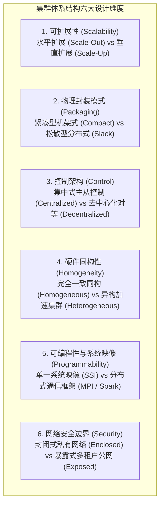
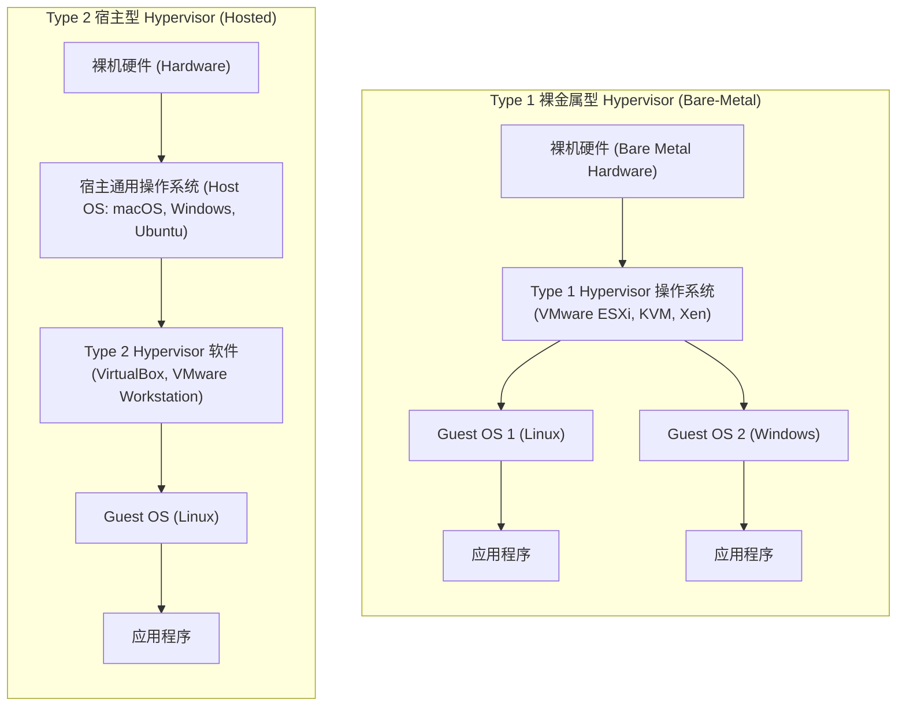

# 集群计算Cloud与虚拟化

> 本页属于：CEG5201 / Week 01
> 前置知识：[[CEG5201-Week01-Amdahl定律与可扩展性分析]]
> 预计阅读时间：13 分钟

---

## 1. 集群计算（Compute Clusters）的定义与核心驱动力

在现代大规模数据处理（Big Data Handling）、深度学习大模型训练以及高可用云服务中，单台多核处理器的物理扩展极限（如主板插槽数量、内存总线带宽、散热 TDP）早已无法满足算力渴求。

根据课程附录讲义（[Annex_CG5201_Chap1_OnClusters.pdf](https://github.com/Kytolly/NUS-coursework-wiki/releases/download/CEG5201/Annex_CG5201_Chap1_OnClusters.pdf) 第 1–2 页），**计算机集群（Compute Cluster）**定义为：
> **“通过商用高速局部网络互连的一组独立的、自治的计算机节点（Stand-alone Computers），在统一的管理控制软件协调下协同运行，向外界用户呈现为单一、高度集成的统一计算资源（Single Integrated Computing Resource）。”**

### 核心设计优势
1. **极致的高性价比（Cost-Effectiveness）**：相比于昂贵且非标的专用大型主机（Mainframe），集群完全基于量产的商用现货（COTS，Commercial Off-The-Shelf）服务器与网络设备构建。
2. **近乎无限的水平可扩展性（Scale-Out）**：算力不足时只需按机架添加新服务器节点。
3. **高可用性与容错自愈（High Availability & Fault Tolerance）**：单个节点的宕机或硬盘损坏不会导致整个集群业务崩溃，任务可被动态迁移与重新调度。

---

## 2. 集群设计的六大正交物理与逻辑维度

讲义第 3 页给出了评估与构建现代计算机集群的 **6 大核心设计空间要素（Six Key Design Dimensions）**：

### 2.1 维度 1：可扩展性（Scalability）
- **垂直扩展（Scale-Up）**：在单台服务器内部升级更强大的 CPU、插满更多内存条、增加 GPU 卡。存在物理母板槽位极限，成本呈超线性指数攀升。
- **水平扩展（Scale-Out）**：保持单节点为标准工业机架服务器，通过交换机向集群横向追加成百上千个节点。现代大数据与云平台的一致选择。

### 2.2 维度 2：物理封装模式（Packaging）
物理部署封装直接决定了**通信布线长度（Wire Length）、信号传播延迟与冷却能耗**（讲义第 5–7 页）：
- **紧凑型集群（Compact Clusters）**：
  - 节点采用高密度刀片服务器（Blade Servers）或高密度机柜集中排布在同一个物理机房。
  - **优势**：各节点之间布线距离极短（通常在几厘米至几米以内），可采用昂贵的高速铜缆或光纤（如 InfiniBand、NVLink），网络通信延迟极低（纳秒级至微秒级），双向互连带宽极高。
  - **挑战**：机柜电力密度极高（单机柜可达 40–100 kW），要求昂贵的精密风冷或浸没式液冷技术。
- **松散型集群（Slack Clusters）**：
  - 节点分散在大学实验室的不同房间、甚至不同建筑物或跨地域园区，节点间通过普通的以太网交换机连接。
  - **特征**：部署成本低、无需特种机房改造；但布线长、网络跳转多、传播延迟高且容易受外部网络干扰，仅适合松耦合且通信频率较低的任务。

### 2.3 维度 3：控制拓扑（Control）
- **集中式控制（Centralized Control）**：
  - 采用经典的主从架构（Master-Worker）。集群中设立专职的 Master 节点负责资源簿记、任务划分、健康心跳探测与调度。
  - **特点**：全局状态清晰一致，调度策略易于优化；但 Master 节点容易成为系统性能吞吐瓶颈与单点故障源（SPOF）。
- **去中心化控制（Decentralized Control）**：
  - 所有节点地位完全对等（P2P / 去中心化共识）。节点间通过 Gossip 协议或 Paxos/Raft 算法同步分布式元数据。
  - **特点**：具备极致的容错与无上限扩展性；但全局一致性达成需要多轮网络通信握手，状态收敛存在延迟。

### 2.4 维度 4：硬件同构性（Homogeneity）
- **同构集群（Homogeneous Clusters）**：所有节点购买自同一批次，拥有完全相同的 CPU 型号、主频、缓存大小、内存容量与网络接口卡。作业调度算法简单，无需考虑节点算力差异造成的负载失衡。
- **异构集群（Heterogeneous Clusters）**：由于数据中心设备分期采购迭代，集群内部混合了不同年代的 CPU，且部分节点挂载了 GPU 或 FPGA 硬件加速卡。调度系统（如 Kubernetes、Slurm）必须具备“硬件亲和性感知调度”能力。

### 2.5 维度 5：可编程性与单一系统映像（Programmability & SSI）
- **集群操作系统（Cluster OS, COS）与单一系统映像（Single System Image, SSI）**（讲义第 10 页）：
  - 理想的分布式操作系统向开发者隐匿底层上千台物理机的异构与网络边界，提供统一的进程空间、统一的虚拟内存（Distributed Shared Memory）、统一的分布式文件系统（如 Ceph、LFS）以及统一的 I/O 接口。
- **分布式显式编程模型**：
  - 科学计算领域标配：**MPI（Message Passing Interface）**。
  - 大数据分析标准：**MapReduce、Apache Spark**。
  - AI 分布式训练标准：**PyTorch DDP、Megatron-LM、Ray**。

### 2.6 维度 6：集群网络安全（Security）
讲义第 12–13 页将节点间通信（Intra-Cluster Communication, ICC）的物理暴露性划分为：
- **封闭式集群（Enclosed Clusters）**：所有内部节点处于隔离的内网私有 VLAN 中，与外部互联网物理隔绝或仅通过受严格监管的双网卡跳板机（Gateway）通信。内部节点间通信可免去繁重的身份鉴权与加密解密，追求极限线速性能。
- **暴露式集群（Exposed Clusters）**：每个计算节点拥有独立的公网 IP 或处于多租户共享公有云网络中。节点间传输的数据包极易遭受网络监听与重放攻击，必须全面启用 TLS/IPsec 传输层加密与零信任动态凭据校验，带来额外的 CPU 封包解包开销。

---

## 3. 云计算 vs 传统数据中心辩论（Cloud vs Data Centers Debate）

讲义第 14–18 页深入探讨了现代 IT 企业基础设施由传统自建数据中心向公有云计算（Cloud Computing）迁移的商业与技术逻辑：

### 核心维度对照矩阵

| 评估维度 | 传统自建企业数据中心（On-Premises DC） | 现代公有云服务（Cloud Computing / AWS） |
| :--- | :--- | :--- |
| **资本财务模型** | **CapEx 模式（前期重资本投入）**：需一次性斥巨资采购服务器、租赁土地、建设变电站与双路市电、部署冷却塔。 | **OpEx 模式（轻运营支出）**：零前期固定资产投资，完全按实际使用的 CPU 核·时、显存与流量按需付费（Pay-as-you-go）。 |
| **弹性与应对突发** | **极差**：硬件扩容需经历立项、采购、物流、上架组网等漫长流程（数周至数月）；若为应对突发峰值超量采购，平时资源闲置浪费严重。 | **极致弹性（Elasticity）**：秒级/分钟级在云端申请并启动数千台计算实例；流量低谷期自动缩容释放，避免算力闲置。 |
| **运维与升级成本** | 需雇佣专职电气、制冷、硬件更换驻场工程师；硬件老化故障自担风险。 | 硬件故障由云厂商（如 AWS、Google Cloud）底层物理透明置换，企业专注业务代码。 |
| **服务层级抽象** | 裸金属机架、物理交换机端口配置。 | 丰富的云原生分层：IaaS（基础设施即服务）、PaaS（平台即服务）、SaaS（软件即服务）。 |

---

## 4. 虚拟化技术精要：虚拟机与 Hypervisor

云计算之所以能够实现多租户资源池化与秒级弹性调度，其底层的核心支柱技术是**虚拟化（Virtualization）**（讲义第 19–22 页）。

### 4.1 虚拟机（Virtual Machine, VM）的本质
- **定义**：虚拟机是一个在软件层面上模拟完整物理计算机硬件行为的执行环境。
- **沙盒隔离性（Sandboxed Execution）**：虚拟机内部运行的客体操作系统（Guest OS）完全确信自己独占了一套完整的底层 CPU、物理内存与外设驱动。Guest OS 的崩溃、死锁或内部恶意木马被严格限制在该虚拟机的内存边界之内，**绝对无法穿透沙盒破坏物理宿主机或其他租户的虚拟机**。

### 4.2 Hypervisor（虚拟机监视器 VMM）两大架构流派
讲义第 21–22 页系统对比了管理虚拟机的两类核心软件引擎：

#### Type 1：裸金属型 Hypervisor（Bare-Metal Hypervisor）
- **架构关系**：直接安装并运行在物理服务器的裸机裸硬件之上，其自身即充当高效的轻量级底层内核。
- **代表产品**：VMware ESXi、Linux KVM、Citrix Xen、Microsoft Hyper-V。
- **性能特征**：由于没有中间操作系统的转发消耗，指令仿真绝大部分依托 CPU 硬件虚拟化扩展（Intel VT-x、AMD-V）近乎裸机线速执行，**性能损耗通常低于 $2\% \sim 5\%$**。公有云数据中心（如 AWS EC2 Nitro 系统）的绝对统治标准。

#### Type 2：宿主型 Hypervisor（Hosted Hypervisor）
- **架构关系**：作为一个普通的应用软件进程，运行在传统的通用宿主操作系统（Host OS）之上。
- **代表产品**：Oracle VirtualBox、VMware Workstation、Parallels Desktop。
- **性能特征**：每次针对虚拟 CPU 或虚拟磁盘的特权指令调用，都需要经过 Guest OS $\to$ Hypervisor $\to$ Host OS 内核 $\to$ 物理硬件的多级调度与转换，上下文切换损耗巨大，主要用于个人电脑桌面开发与测试。

---

## 5. 虚拟机 vs 容器化技术横向技术选型

| 对比维度 | 硬件级虚拟机（Virtual Machines, VMs） | 操作系统级容器（Containers / Docker） |
| :--- | :--- | :--- |
| **虚拟化层级** | **硬件抽象层（Hardware-Level）**：虚拟出虚拟 CPU、虚拟内存、虚拟网卡与 BIOS。 | **操作系统内核级（OS-Level）**：共享宿主机操作系统内核，利用 Linux Namespace 与 Cgroups 隔离。 |
| **客体操作系统** | **必须包含完整的 Guest OS 内核**（如每个 VM 都装一套完整 Ubuntu 内核）。 | **无独立内核**，仅打包应用二进制可执行文件与依赖共享库（Rootfs）。 |
| **冷启动时间** | 较慢（通常需要数秒至数十秒，包含 Guest OS 启动引导）。 | **极速**（通常在亚秒级至几百毫秒内完成秒级拉起）。 |
| **内存与磁盘体积** | 镜像体积庞大（数 GB 至数十 GB），运行时基础内存开销数百 MB。 | 镜像轻量化（数十 MB 至数百 MB），运行时几乎零额外内存损耗。 |
| **安全隔离强度** | **强隔离**：硬件级页表与 VT-x 特权级隔离，多租户公有云安全底线。 | **较弱隔离**：若共享的宿主机 Linux 内核存在漏洞，容器可能逃逸影响整机。 |

---

## 考试时你应该会什么

1. **集群体系结构掌握**：
   - 准确写出集群的定义；
   - 默写出集群设计的 **6 大核心要素**（Scalability, Packaging, Control, Homogeneity, Programmability, Security），并能结合紧凑型（Compact）与松散型（Slack）对比分析物理布线长度对通信延迟与机房散热的影响；
   - 对比封闭式集群（Enclosed）与暴露式集群（Exposed）在安全性与网络传输开销上的本质差异。
2. **云计算与数据中心宏观辨析**：
   - 从 CapEx（资本支出）与 OpEx（运营支出）、弹性伸缩能力两个维度，深入论述云计算相比自建企业数据中心的技术与经济优势。
3. **虚拟化深层机制分析**：
   - 准确画出 Type 1（裸金属型）与 Type 2（宿主型）Hypervisor 的软件层次栈图，指出两者的性能差异成因；
   - 全面列举虚拟机（VM）与容器（Container）在虚拟化层次、冷启动时间、镜像体积以及安全隔离强度上的核心区别。

---

## 下一步

- 上一页：[[CEG5201-Week01-Amdahl定律与可扩展性分析]]
- 下一页：[[CEG5201-Week02-任务可分性与数据依赖]]
- 模块总览：[[CEG5201-讲义与笔记索引]]
- 返回知识库：[[Home]]

---

## 来源与更新日志

- 来源：[Annex_CG5201_Chap1_OnClusters.pdf](https://github.com/Kytolly/NUS-coursework-wiki/releases/download/CEG5201/Annex_CG5201_Chap1_OnClusters.pdf) pp. 1–22.
- 2026-09-08：初始未归档 Annex 内容。
- 2026-09-23：全新创建独立专页，完整归纳集群 6 大设计维度图解、物理封装与网络安全策略、Cloud vs DC 经济技术辩论、Type 1 vs Type 2 Hypervisor 架构微观对比以及 VM 与容器全方位技术选型。
