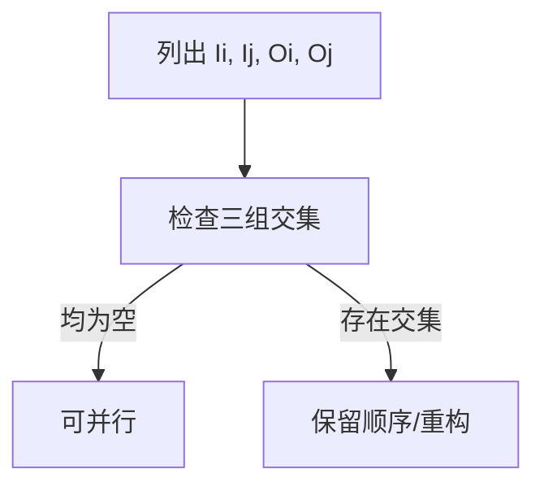

# Bernstein 条件与软件并行性

> 本页属于：CEG5201 / Week 02
> 前置知识：[[CEG5201-Week02-任务可分性与数据依赖]]
> 预计阅读时间：8 分钟

## Bernstein 条件

对两个过程 `Pi` 和 `Pj`，令 `Ii/Ij` 为输入集合、`Oi/Oj` 为输出集合。两者可并行的条件是：

`Ii ∩ Oj = ∅`

`Ij ∩ Oi = ∅`

`Oi ∩ Oj = ∅`

三式分别排除 flow、anti 和 output dependence。它像检查两组施工人员是否会读写同一份图纸或同一块材料。

## 硬件并行性与软件并行性

- 硬件并行性由体系结构提供，例如每周期可发射 `k` 条指令的 k-issue 处理器。
- 软件并行性由算法、程序结构、依赖关系、编译器和并行指令暴露。
- 控制并行包括流水线；数据并行把独立数据映射到 SIMD/MIMD 资源。

## 编译器限制

如果下标、指针或间接寻址使依赖关系无法静态确认，编译器通常选择安全的顺序执行。要恢复并行性，需要课堂后续材料明确的运行时检查或程序转换；本页不自行补充。

## 例题方法

图 1：Bernstein 检查流程（自制，依据 Chapter 2 pp.9–21；核对于 2026-09-01）。

## 下一步

- 上一页：[[CEG5201-Week02-任务可分性与数据依赖]]
- 下一页：[[CEG5201-Week02-粒度通信与网络指标]]
- 返回：[[Home]]

## 来源与更新日志

- 来源：[CG5201_Chap2 (2627).pdf](https://github.com/Kytolly/NUS-coursework-wiki/releases/download/CEG5201/CG5201_Chap2%20%282627%29.pdf)，pp.9–21；个人参考 `notebook/lecture2.md`。
- 2026-09-01：拆出 Bernstein 条件和软件/硬件并行性。