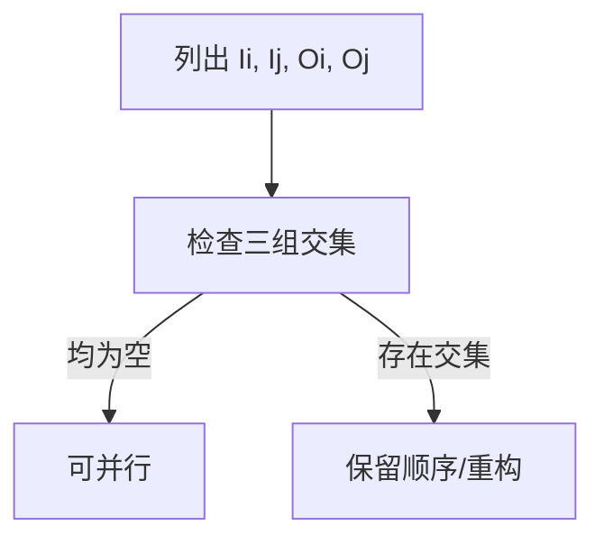

# Bernstein 条件与软件并行性

> 本页属于：CEG5201 / Week 02
> 前置知识：[[CEG5201-Week02-任务可分性与数据依赖]]
> 预计阅读时间：8 分钟

## Bernstein 条件

对两个过程 `Pi` 和 `Pj`，令 `Ii/Ij` 为输入集合、`Oi/Oj` 为输出集合。两者可并行（记为 `Pi || Pj`）当且仅当（[CG5201_Chap2 (2627).pdf](https://github.com/Kytolly/NUS-coursework-wiki/releases/download/CEG5201/CG5201_Chap2%20%282627%29.pdf) 第 14–15 页）：

`Ii ∩ Oj = ∅`

`Ij ∩ Oi = ∅`

`Oi ∩ Oj = ∅`

三式分别排除 **flow（RAW）**、**anti（WAR）** 和 **output（WAW）** 依赖。对 `n` 个过程，需要两两检查 `3n(n−1)/2` 个关系；只要有一对不满足，就禁止这部分并行（第 16 页）。

`||` 关系有以下性质（第 17 页）：通常是**交换**的，**不传递**（例如 `P1||P5` 且 `P5||P2`，但 `P1` 与 `P2` 可能不独立），因此**不是等价关系**；结合律成立；`Ii ∩ Ij ≠ ∅`（只读共享）**并不**阻止并行。

## 硬件并行性与软件并行性

- **硬件并行性（HP）**：由机器体系结构决定，是成本/性能权衡的函数。一种刻画是每周期可发射的指令数——`k-issue` 处理器每周期发射 `k` 条指令；单发射处理器每周期只发 1–2 条（第 18–19 页）。讲义举例：Intel i960CA 是三发射（1980 年代），IBM RISC/System 6000 是四发射（1990）（第 19 页）。由 `n` 个 `k-issue` 处理器组成的系统，理论上至多同时处理 `nk` 条指令流（实际还受依赖、资源和带宽限制）。
- **软件并行性（SP）**：由程序的控制与数据依赖决定，通过依赖流图暴露，是算法、编程风格与编译器优化的函数（第 20 页）。控制并行（如流水线）主要靠硬件；数据并行在 MIMD/SIMD 中随可用数据量线性展开（第 21 页）。

HP 与 SP 不匹配时，需要重构算法、编译器分析或显式并行指令。

## 编译器限制

如果下标、指针或间接寻址使依赖关系无法静态确认，编译器通常选择安全的顺序执行。讲义把“检测并行性”的例题放在扫描页（`Chap 2_0_ScannedSlides.pdf` 第 2 页 / Chapter 2 p.56）。由于该页无文本层，本页不自行补充运行时检查或程序转换内容，标注为 Open。

## 一个最小例子

设 `P1` 读集合 `{a,b}`、写集合 `{c}`；`P2` 读集合 `{c,d}`、写集合 `{e}`。检查三式：`I1∩O2 = ∅`，但 `I2∩O1 = {c} ≠ ∅`，存在 anti/WAR 相关，因此 `P1` 与 `P2` 不能并行。若把 `P2` 改为读 `{d}`、写 `{e}`，三式均为空，则 `P1 || P2` 成立。

对 `n=3` 个过程，需两两检查 `3·3·2/2 = 9` 对集合关系；只要有一对不满足，就禁止相应子集并行（第 16 页）。因此实际判定时，先把每个过程的输入/输出集合列全，再去核对交集，避免凭感觉判断。

`||` 不传递也意味着不能简单做传递闭包：讲义给出 `P1||P5` 且 `P5||P2`，但 `P1` 与 `P2` 可能因共享某个输出变量而不独立（第 17 页）。所以在分析整段程序时，必须成对检查而不仅是相邻对。

## 例题方法

图 1：Bernstein 检查流程（自制，依据 [CG5201_Chap2 (2627).pdf](https://github.com/Kytolly/NUS-coursework-wiki/releases/download/CEG5201/CG5201_Chap2%20%282627%29.pdf) pp.14–21；核对于 2026-09-07）。

## 易错点

`||` 不传递意味着“每个相邻对都满足”并不能推出“整体可并行”；只读共享（输入集合相交）本身不禁止并行。判定时必须同时核对输入/输出集合与资源依赖。

## 下一步

- 上一页：[[CEG5201-Week02-任务可分性与数据依赖]]
- 下一页：[[CEG5201-Week02-粒度通信与网络指标]]
- 返回：[[Home]]

## 来源与更新日志

- 来源：[CG5201_Chap2 (2627).pdf](https://github.com/Kytolly/NUS-coursework-wiki/releases/download/CEG5201/CG5201_Chap2%20%282627%29.pdf)，pp.14–21；`Chap 2_0_ScannedSlides.pdf`（扫描版，无文本层，标 Open）；个人参考 `notebook/lecture2.md`。
- 2026-09-01：拆出 Bernstein 条件和软件/硬件并行性。
- 2026-09-07：扩写 `||` 性质、HP/SP 定义与 k-issue 说明，补扫描版例题 Open 说明并更新图注。
