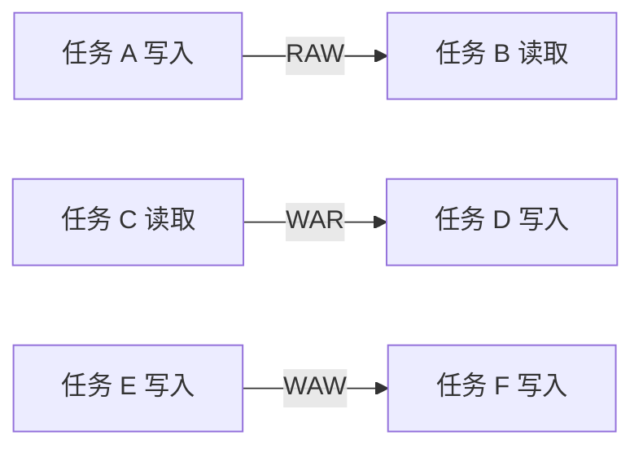

# 任务可分性与数据依赖

> 本页属于：CEG5201 / Week 02
> 前置知识：[[CEG5201-Week01-性能度量与可扩展性]]
> 预计阅读时间：8 分钟

## 三种可分性

| 类型 | 直觉 | 并行限制 |
|---|---|---|
| Indivisible | 一整件货物不能拆开 | 任务必须交给一个处理器 |
| Modularly divisible | 可拆成有限模块 | 模块间依赖仍需保序 |
| Arbitrarily divisible | 独立数据段可自由切分 | 仍要计算通信和异构开销 |

## 依赖类型

- **RAW/Flow**：后者读取前者写入的值，必须保序。
- **WAR/Anti**：后者写入前者读取的位置，可通过重命名或分离存储消除。
- **WAW/Output**：两者写同一输出，需要顺序或重命名。
- **I/O**：同一文件或外设的外部可见顺序不能随意改变。
- **Unknown**：间接寻址或复杂下标无法静态判定时，编译器通常保守地禁止并行。

## 依赖图

图 1：依赖类型自制示意图；依据 [CG5201_Chap2 (2627).pdf](https://github.com/Kytolly/NUS-coursework-wiki/releases/download/CEG5201/CG5201_Chap2%20%282627%29.pdf) pp.9–17（核对于 2026-09-01）。

## 关键提醒

“可以拆分”不等于“可以并行”。必须同时检查数据依赖、控制依赖和共享资源依赖。

## 下一步

- 上一页：[[CEG5201-Week01-性能度量与可扩展性]]
- 下一页：[[CEG5201-Week02-Bernstein条件与软件并行性]]
- 返回：[[Home]]

## 来源与更新日志

- 来源：[CG5201_Chap2 (2627).pdf](https://github.com/Kytolly/NUS-coursework-wiki/releases/download/CEG5201/CG5201_Chap2%20%282627%29.pdf)，pp.4–17；个人参考 `notebook/lecture2.md`。
- 2026-09-01：拆出任务可分性和依赖类型短页。