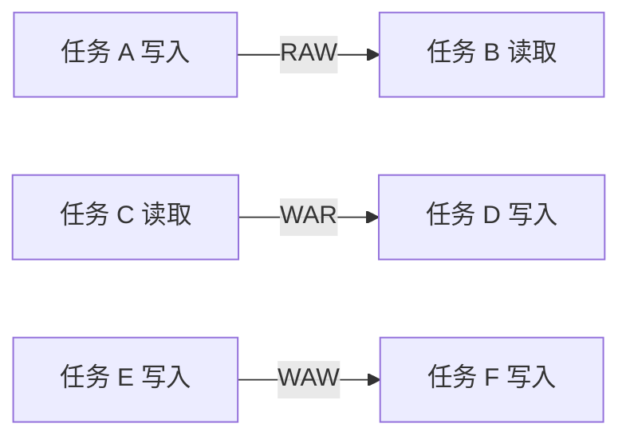

# 任务可分性与数据依赖

> 本页属于：CEG5201 / Week 02
> 前置知识：[[CEG5201-Week01-11-Amdahl定律与可扩展性]]
> 预计阅读时间：8 分钟

## 三种可分性

讲义把“并行化”分为程序并行与数据并行，数据并行又按可分性分为三类（[CG5201_Chap2 (2627).pdf](https://github.com/Kytolly/NUS-coursework-wiki/releases/download/CEG5201/CG5201_Chap2%20%282627%29.pdf) 第 4 页）：

| 类型 | 直觉 | 并行限制 |
|---|---|---|
| Indivisible | 一整件货物不能拆开 | 任务必须整体交给一个处理器（Gantt 图调度） |
| Modularly divisible | 可拆成有限模块 | 模块间依赖仍需保序（带权依赖图） |
| Arbitrarily divisible | 独立数据段可自由切分 | 仍要计算通信和异构开销 |

- **不可分**：任务从微指令到高层任务都可能是不可分的，Gantt 图描述任务到处理器的分配（第 5 页）。
- **模块可分**：能拆成有限子任务，但子任务间有依赖，用图表示——节点是子任务（带/不带权），边是依赖（第 6 页）。
- **任意可分**：数据段相互独立、可均匀分配；并行机无通信延迟（假设），但松散耦合的分布式系统需计入非零通信延迟与异构性（第 7 页）。

**Divisible Load Theory (DLT)** 的目标是在计算/通信延迟、拓扑、可靠性等约束下最小化数据总处理时间（第 8 页）。它给出一个关键思路：真正决定能否并行的是“数据/任务如何切分”，而不仅仅是“有多少个处理器”。

## 依赖类型

依赖图描述先后关系（第 9–11 页）：

- **Flow / RAW**：后语句读取前语句写入的值，必须保序（`S1 → S2`）。
- **Anti / WAR**：后语句写入前语句读取的位置，可用重命名或分离存储消除（`S1 -/-> S2`）。
- **Output / WAW**：两语句写同一输出，需确定写入顺序或重命名（`S1 -o-> S2`）。
- **I/O**：同一文件或外设被两个 I/O 语句引用，外部可见顺序不能随意改变。
- **Unknown**：间接寻址、下标不含循环索引、变量以不同系数反复出现、下标非线性等情况，编译器通常保守地禁止并行。

此外还有**控制依赖**（运行时条件决定顺序，如 `IF (A(I−1)==0)` 的循环）与**资源依赖**（ALU、浮点单元、寄存器、内存等共享资源冲突）（第 12–13 页）。控制依赖常扼杀并行，需要编译器技术绕过。

## 依赖图

图 1：依赖类型自制示意图；依据 [CG5201_Chap2 (2627).pdf](https://github.com/Kytolly/NUS-coursework-wiki/releases/download/CEG5201/CG5201_Chap2%20%282627%29.pdf) pp.9–17（核对于 2026-09-07）。

> [!QUESTION] Q-CEG5201-L2-01（Open）
> **Context:** 讲义在 p.12 提示“参照扫描 slides 文档”验证上述依赖，并在 p.16 提到依赖检测例题位于扫描页第 2 页 / Chapter 2 p.56。
> **Question:** 包含间接寻址或复杂下标的循环，课堂采用何种运行时检查或转换来恢复并行性？
> **Status:** Open — 扫描版讲义无文本层，需按课堂笔记与正式 slides 核对后再补充。

## 控制依赖与资源依赖的例子

讲义给出两类循环（第 12–13 页）：`Do 20 I=1,N` 中 `A(I)=C(I)` 与 `IF(A(I).LT.0) A(I)=1` 是**控制独立**的，每个迭代只依赖自身，可向量化/并行；而 `Do 10 I=1,N` 中 `IF(A(I−1).EQ.0) A(I)=0` 是**控制依赖**的，第 I 次迭代的取值依赖第 I−1 次，难以静态并行。控制依赖常禁止并行，需要编译器技术求解。资源依赖则来自 ALU、浮点单元、寄存器或内存的竞争，即使数据依赖不存在，也可能因共享资源而串行化。

DLT 用调度策略（顺序、均衡、异构分配等）在计算/通信延迟、拓扑与可靠性约束下最小化完成时间（第 8 页）。把依赖图与这些调度策略结合，就能在“模块可分”任务上做负载分配；“任意可分”任务虽然可自由切分，仍要计入通信与异构成本。

## 关键提醒

“可以拆分”不等于“可以并行”。必须同时检查数据依赖、控制依赖和共享资源依赖；DLT 仍需把通信与调度成本纳入模型。

## 下一步

- 上一页：[[CEG5201-Week01-13-Annex-集群计算Cloud与虚拟化]]
- 下一页：[[CEG5201-Week02-Bernstein条件与软件并行性]]
- 返回：[[Home]]

## 来源与更新日志

- 来源：[CG5201_Chap2 (2627).pdf](https://github.com/Kytolly/NUS-coursework-wiki/releases/download/CEG5201/CG5201_Chap2%20%282627%29.pdf)，pp.4–17；`Chap 2_0_ScannedSlides.pdf`（扫描版，无文本层，标 Open）；个人参考 `notebook/lecture2.md`。
- 2026-09-01：拆出任务可分性和依赖类型短页。
- 2026-09-07：扩写三种可分性、DLT、控制/资源依赖，补扫描版例题的 Open 问题并更新图注。
