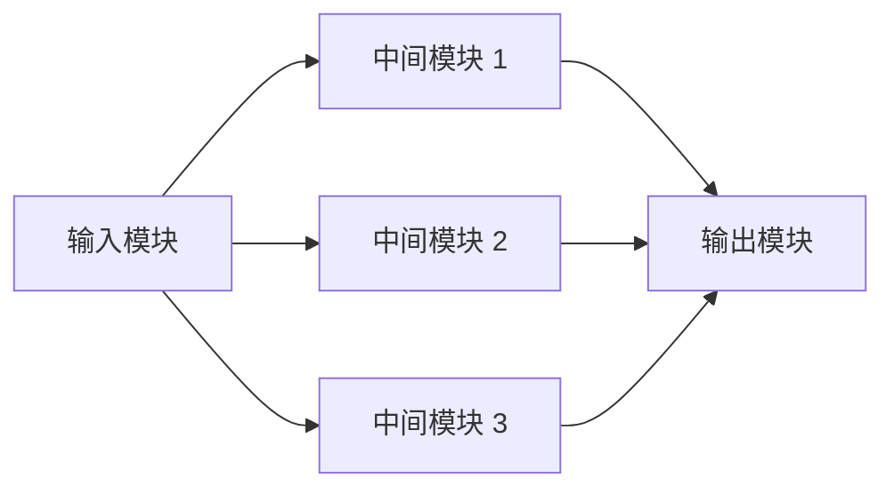

# Blocking 与 CLOS

> 本页属于：CEG5201 / Week 03
> 前置知识：[[CEG5201-Week03-MIN结构与路由]]
> 预计阅读时间：9 分钟

## Blocking

当输入端和输出端都空闲，但中间链路或交换单元被已有连接占用，新的连接仍然无法建立，这就是 blocking。问题不在端点，而在共享的中间资源。

## 三种性质

| 性质 | 含义 |
|---|---|
| Blocking | 某些连接排列会无法建立 |
| Strictly non-blocking | 只要输入/输出空闲，总能立即找到路径 |
| Rearrangeably non-blocking | 可能需要重排已有连接后再建立 |

## CLOS 直觉

CLOS 通常由输入级、中间级和输出级组成。多个中间模块提供路径选择，降低阻塞概率，但会增加交换单元、布线和控制复杂度。

图 1：CLOS 多中间级的自制示意图；课堂原图和证明应以 [Chap 2_3_CLOSNonBlkingProof.pdf](https://github.com/Kytolly/NUS-coursework-wiki/releases/download/CEG5201/Chap%202_3_CLOSNonBlkingProof.pdf) 为准（核对于 2026-09-01）。

## 待确认范围

当前材料提示 CLOS blocking proof 和课堂 switch-state convention 需要回看正式课堂 slides。Wiki 暂不把未核实的证明步骤写成定理。

## 下一步

- 上一页：[[CEG5201-Week03-MIN结构与路由]]
- 下一页：[[CEG5201-Week03-RC粒度比与性能模型]]
- 返回：[[Home]]

## 来源与更新日志

- 来源：[Chap 2_2_MINs.pdf](https://github.com/Kytolly/NUS-coursework-wiki/releases/download/CEG5201/Chap%202_2_MINs.pdf)、[Chap 2_3_CLOSNonBlkingProof.pdf](https://github.com/Kytolly/NUS-coursework-wiki/releases/download/CEG5201/Chap%202_3_CLOSNonBlkingProof.pdf)、`tmp/pdfs/clos/`；个人参考 `notebook/lecture3.md`。
- 2026-09-01：拆出 blocking、non-blocking 和 CLOS 设计直觉。