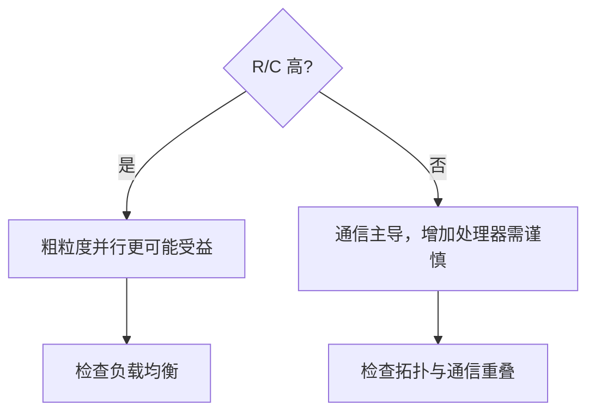

# R/C 粒度比与性能模型

> 本页属于：CEG5201 / Week 03
> 前置知识：[[CEG5201-Week03-Blocking与CLOS]]
> 预计阅读时间：9 分钟

## 粒度比

令每个任务计算时间为 $R$，跨处理器通信开销为 $C$，则 $R/C$ 是粒度的度量（[CG5201_Chap2 (2627).pdf](https://github.com/Kytolly/NUS-coursework-wiki/releases/download/CEG5201/CG5201_Chap2%20%282627%29.pdf) 第 36 页）：$R/C$ 高表示**粗粒度**，计算更可能掩盖通信；$R/C$ 低表示**细粒度**，通信主导，增加处理器可能没有收益。模型假设：每个任务执行 $R$ 单位时间；当通信的两个任务位于不同处理器时，每对任务产生 $C$ 单位开销。

## 两处理器、非重叠通信模型

设任务总数 $M$，一台处理器分配到 $k$ 个任务，另一台 $M-k$（第 38 页）：

$$
T(k) = R \cdot \max(M-k, k) + C \cdot (M-k)k
$$

第一项是线性计算项，关于 $k=M/2$ 对称；第二项是二次通信项（每对跨处理器任务都产生 $C$ 开销）。把线性项与二次项相加，最优 $k$ 依赖二者的相对大小（第 39 页）。讲义结论（第 41 页）：

- 当 $R/C < M/2$，最小值出现在 $k=0$（或 $k=M$），即**把所有任务集中到一个处理器**最优；
- 当 $R/C \ge M/2$，最小值出现在 $k=M/2$，即**均分**到两个处理器最优。

## 多处理器模型

$N$ 个处理器时（第 41–42 页）：

$$
T = R \cdot \max_i k_i + \frac{C}{2} \sum_i k_i(M - k_i)
$$

其中只能计不同任务间的成对通信。当 $R/C \ge M/2$ 且 $N$ 很大、$M$ 是 $N$ 的整数倍时，比较 $N$ 处理器与单处理器的总时间（第 43–44 页），可得 speed-up：

$$
S = \frac{RN/C}{R/C + \frac{M(N-1)}{2}}
$$

若 $R/C \gg \frac{M(N-1)}{2}$，则 speed-up 近似随 $N$ 线性增长；否则第二项占主导，speed-up 渐近趋于 $\frac{R}{C \cdot M}$，与处理器数无关——此时继续加处理器无收益（第 44 页）。

讲义还用：

$$
T_{\text{diff}} = \left[ \frac{R \cdot M}{N} + \frac{C \cdot M^2}{2} - \frac{C \cdot M^2}{2N} \right] - R \cdot M
$$

比较 $N$ 处理器与单处理器，并令 $T_{\text{diff}} = 0$ 解出 $R/C = M/2$（第 43 页），这正是两处理器结论的推广。

## 重叠模型的乐观情形

完全重叠时，通信被计算掩盖，执行时间取计算项与通信项的最大值而不是相加（第 45 页）：

$$
T = \max\left\{ R \cdot \max_i k_i, \, \frac{C}{2} \sum_i k_i(M - k_i) \right\}
$$

讲义还提出一个变体：若通信开销与处理器数成正比（$T = R \cdot \max k_i + C \cdot N$），则应分析“加更多处理器”的效果（第 46 页）。这个差异体现了“多个工人同时工作”和“必须等交接完成”两种不同现场。

## 一个数值例题

设 $M=100$、$R=2$、$C=1$，则 $R/C = 2 < M/2 = 50$，按讲义应在单个处理器上执行全部任务。此时无跨处理器通信，总时间约 $R \cdot M = 200$；若勉强均分（$k \approx 50$），计算项为 $2 \times 50 = 100$、通信项为 $1 \times 50 \times 50 = 2500$，总时间约 $2600$，远大于单处理器。反过来，设 $R=60$、$C=1$，则 $R/C = 60 > M/2 = 50$，均分更优：计算项 $60 \times 50 = 3000$、通信项 $2500$，总时间约 $5500$，仍低于单处理器 $6000$。可见阈值 $R/C = M/2$ 决定“是否值得拆任务”，而不是只看处理器数量。

图 1：R/C 选择直觉（自制，依据 [CG5201_Chap2 (2627).pdf](https://github.com/Kytolly/NUS-coursework-wiki/releases/download/CEG5201/CG5201_Chap2%20%282627%29.pdf) pp.36–46；核对于 2026-09-07）。

## 易错点

network diameter 是拓扑属性；MIN blocking 是连接状态造成的资源争用；两者不是同一个概念。speed-up 结论不能脱离 $R$、$C$、任务数 $M$、处理器数 $N$ 与是否重叠的假设，更不能只看处理器数量。

## 下一步

- 上一页：[[CEG5201-Week03-Blocking与CLOS]]
- 下一页：[[CEG5201-当前进度与待补内容]]
- 返回：[[Home]]

## 来源与更新日志

- 来源：[CG5201_Chap2 (2627).pdf](https://github.com/Kytolly/NUS-coursework-wiki/releases/download/CEG5201/CG5201_Chap2%20%282627%29.pdf) pp.36–46、[Chap 2_2_MINs.pdf](https://github.com/Kytolly/NUS-coursework-wiki/releases/download/CEG5201/Chap%202_2_MINs.pdf)；个人参考 `notebook/lecture3.md`。
- 2026-09-01：拆出 R/C、两/多处理器模型和易错点。
- 2026-09-07：补两处理器阈值推导、多处理器 speed-up 公式与重叠模型，并更新图注核对日期。
