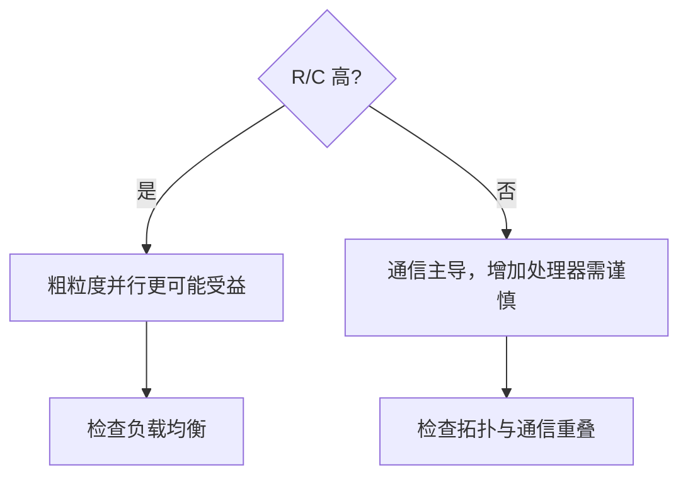

# R/C 粒度比与性能模型

> 本页属于：CEG5201 / Week 03
> 前置知识：[[CEG5201-Week03-Blocking与CLOS]]
> 预计阅读时间：9 分钟

## 粒度比

令每个任务计算时间为 `R`，跨处理器通信开销为 `C`。`R/C` 高表示计算较粗，通信更容易被掩盖；`R/C` 低表示通信主导，增加处理器可能没有收益。

## 两处理器模型

对总任务数 `M`、一台处理器分配 `k` 个任务的模型，讲义给出非重叠通信情形：

`T(k)=R·max(M−k,k)+C·(M−k)k`

讲义结论是：当 `R/C < M/2`，把任务集中在一个处理器上可能最优；当 `R/C ≥ M/2`，接近均分才可能有利。具体应用前要确认模型假设。

## 多处理器模型

`T = R·max_i k_i + (C/2)·Σ_i k_i(M−k_i)`

完全重叠的乐观模型则取计算项和通信项的最大值，而不是直接相加。这个差异体现了“多个工人同时工作”和“必须等交接完成”两种不同现场。

图 1：R/C 选择直觉（自制，依据 Chapter 2 pp.34–46；核对于 2026-09-01）。

## 易错点

network diameter 是拓扑属性；MIN blocking 是连接状态造成的资源争用；两者不是同一个概念。speed-up 结论也不能脱离 `R`、`C`、任务数和重叠假设。

## 下一步

- 上一页：[[CEG5201-Week03-Blocking与CLOS]]
- 下一页：[[CEG5201-当前进度与待补内容]]
- 返回：[[Home]]

## 来源与更新日志

- 来源：[CG5201_Chap2 (2627).pdf](https://github.com/Kytolly/NUS-coursework-wiki/releases/download/CEG5201/CG5201_Chap2%20%282627%29.pdf) pp.34–46、[Chap 2_2_MINs.pdf](https://github.com/Kytolly/NUS-coursework-wiki/releases/download/CEG5201/Chap%202_2_MINs.pdf)；个人参考 `notebook/lecture3.md`。
- 2026-09-01：拆出 R/C、两/多处理器模型和易错点。