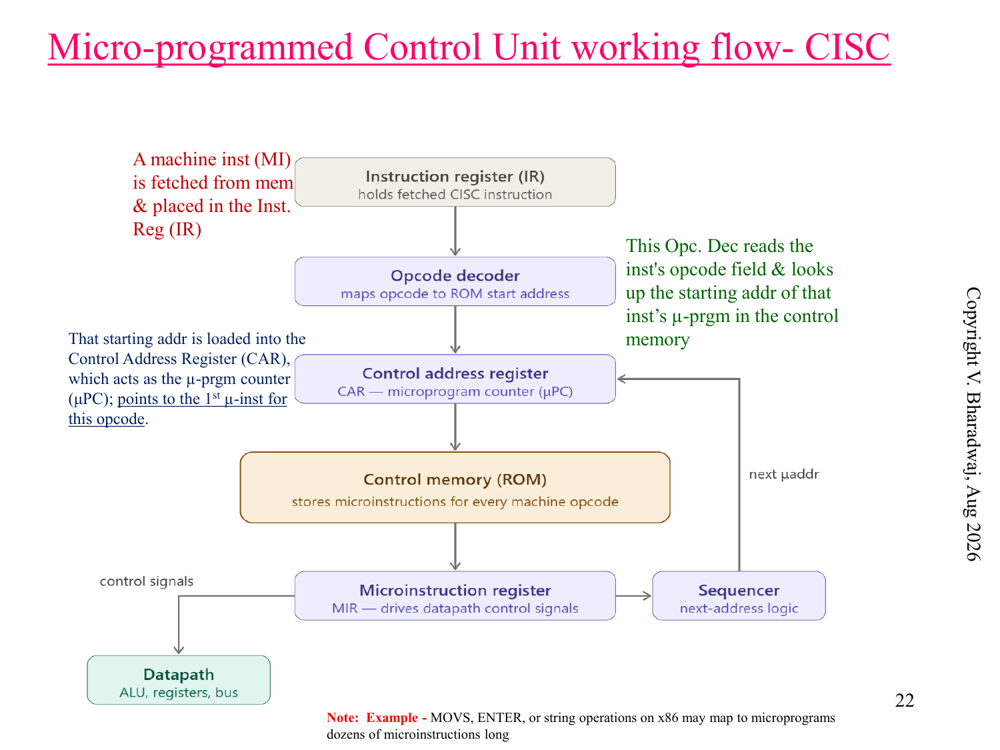
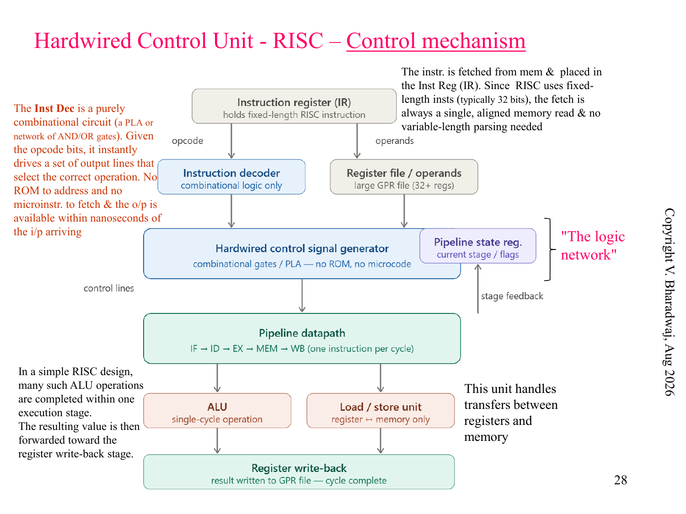
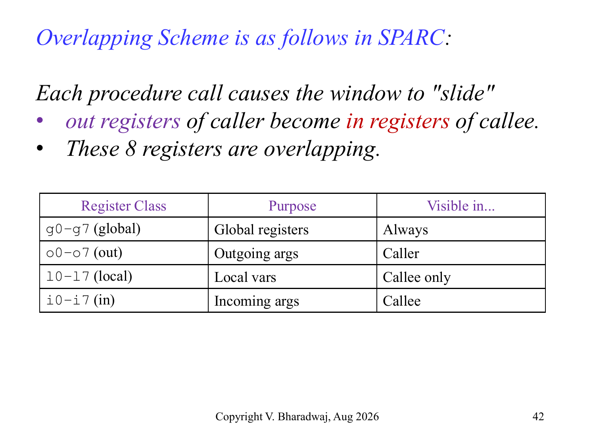

# CISC 微程序与 RISC 硬布线控制

> 本页属于：CEG5201 / Week 04 (Chapter 3 Part 1)
> 前置知识：[[CEG5201-Week04-现代处理器设计空间与流水线基础]]
> 预计阅读时间：9 分钟

---

## 1. 控制单元架构对决：微程序 vs 硬布线 (Control Unit Architectures)

中央处理器（CPU）的核心大脑是控制单元（Control Unit, CU），其任务是根据指令寄存器中的操作码（Opcode）生成全芯片各个数据通路的微操作控制电平信号。历史上形成了两种根本性的实现范式：

### 1.1 CISC 微程序控制器 (Microprogrammed Control Unit)

> **Figure Object 2**: CISC 微程序控制器工作原理  
> - 📘 **来源 (Source)**:   
> - 📍 **定位 (Locator)**: Slide 22 "Micro-programmed Control Unit working flow- CISC"  
> - 💡 **解读 (Explanation)**: 展示了复杂指令如何通过操作码译码器索引控制存储器（Control ROM/PLA）的起始地址，并在微地址定序器（Micro-address Sequencer）驱动下一步步读出微指令并生成硬件控制信号。  
> - 🔍 **看什么 (What to notice)**: 每一条机器指令本质上是一个存储在控制 ROM 中的“微程序”（Micro-program），由若干条微指令（Micro-instructions）组成。执行一条机器指令需要耗费多个时钟周期反复读取控制存储器，灵活性高但速度受限于 ROM 读延迟。

### 1.2 RISC 硬布线控制器 (Hardwired Control Unit)

> **Figure Object 3**: RISC 硬布线逻辑网络控制器  
> - 📘 **来源 (Source)**:   
> - 📍 **定位 (Locator)**: Slide 28 "Hardwired Control Unit - RISC – Control mechanism"  
> - 💡 **解读 (Explanation)**: 展示了基于组合逻辑网络（Logic Gates, Multiplexers, Decoders）直接从固定长度（32-bit）的指令中即时产生控制电平，配合状态计数器实现单周期执行。  
> - 🔍 **看什么 (What to notice)**: 硬布线控制器内部没有任何 ROM 查找开销，所有控制信号以光速通过组合逻辑门直接触发寄存器与 ALU，速度极快（单周期执行），代价是一旦芯片流片制造完成，指令集即被固化无法变更。

---

## 2. CISC vs RISC 架构综合对比 (Architectural Comparison)

| 特性维度 | CISC (复杂指令集计算机) | RISC (精简指令集计算机) |
| :--- | :--- | :--- |
| **指令数量与格式** | 庞大 (00 \sim 300+$ 条)，变长指令格式 ( \sim 15	ext{ bytes}$) | 精简 ($< 100$ 条)，统一固定长度 (2	ext{ bits}$) |
| **控制单元实现** | **微程序控制器 (Microprogrammed ROM)** | **硬布线纯组合逻辑 (Hardwired Logic)** |
| **寻址模式** | 丰富多样（直接、间接、基址变址、自增自减等） | 极少（通常仅基址偏移和寄存器寻址） |
| **内存访问方式** | 任何算术指令均可直接访问内存操作数 | **严格的 Load/Store 架构**（仅 Load/Store 能访存） |
| **时钟周期数 (CPI)** | 变化范围大，平均  \ge 4$ | 绝大部分指令在 $ 个周期内发射 ( pprox 1$) |
| **编译器角色** | 相对简单，目标代码体积小 | 极为关键，承担复杂的指令调度与流水线优化 |
| **典型代表芯片** | Intel x86 (8086, 386, Pentium), VAX, IBM 390 | MIPS, SPARC, ARM, RISC-V |

---

## 3. SPARC 重叠寄存器窗口机制 (Overlapped Register Windows)

RISC 处理器为了最大化消除子函数调用（Procedure Call）时向内存堆栈压栈与出栈的严重延迟，引入了著名的**重叠寄存器窗口 (Overlapped Register Windows)** 机制（以 Berkeley RISC 与 Sun SPARC 为典型代表）：

> **Figure Object 4**: SPARC 重叠寄存器窗口滑动机制  
> - 📘 **来源 (Source)**:   
> - 📍 **定位 (Locator)**: Slide 42 "Overlapping Scheme is as follows in SPARC"  
> - 💡 **解读 (Explanation)**: 展示了在函数嵌套调用过程中，当前窗口（Current Window Pointer, CWP）如何随着  指令向下滑动，使调用者（Caller）的  寄存器组直接无缝重叠映射为被调用者（Callee）的  寄存器组。  
> - 🔍 **看什么 (What to notice)**: 传递参数与返回值完全在寄存器内部“零拷贝”完成，完全不需要访存压栈（Push/Pop）。

### 3.1 窗口结构划分

在任何一个时刻，当前运行的函数可以访问的 32 个逻辑寄存器被划分为四大类（每组 8 个）：
1. **全局寄存器 (Global Registers,  = 8$)**：所有过程全局共享，固定驻留。
2. **入参寄存器 (In Registers)**：接收来自父调用函数传递进来的实参。
3. **本地寄存器 (Local Registers,  = 8$)**：当前函数私有的局部变量。
4. **出参寄存器 (Out Registers)**：传递给子被调用函数的实参；发生过程调用时，Caller 的 Out 寄存器组自动重叠变为 Callee 的 In 寄存器组。

### 3.2 物理寄存器总数推导公式 (Total Registers Formula)

假设处理器配置了 $ 个逻辑窗口，每个窗口包含：
- $ 个全局寄存器；
- $ 个局部寄存器；
- $ 个公共重叠寄存器（即 In/Out 共享组大小， = 	ext{size of In} = 	ext{size of Out}$）。

由于每个窗口由一个 Local 组和两个相邻重叠的 Common 组构成，整颗芯片物理寄存器堆（Register File）所需的实际物理寄存器总数 $ 为：
92884R = (L + 2C) \cdot W + G92884

在经典 SPARC 体系结构中， = 8, L = 8, C = 8$：
- 每个独立窗口的有效增量物理寄存器数为  + C = 8 + 8 = 16$ 个（因为相邻窗口共用 8 个重叠寄存器）；
- 当配置  = 8$ 个窗口时，全芯片总物理寄存器数计算为：
  92884R = (L + C) \cdot W + G = (8 + 8) 	imes 8 + 8 = 128 + 8 = 136	ext{ 个物理寄存器}92884
  *(注：若按环形首尾相接完全重叠算，总数为 W+G$；若末端不环接则为 W+G$ 减去边界)*。

---

## 4. 下一步

- 上一页：[[CEG5201-Week04-现代处理器设计空间与流水线基础]]
- 下一页：[[CEG5201-Week04-超标量流水线与指令级并行]]
- 返回：[[CEG5201-讲义与笔记索引]]

## 来源与更新日志

- 来源： Slide 18–43
- 2026-09-18：新建 CISC 微程序与 RISC 硬布线控制对比、SPARC 重叠寄存器窗口数学模型，配置 Figure Objects 2, 3, 4。
