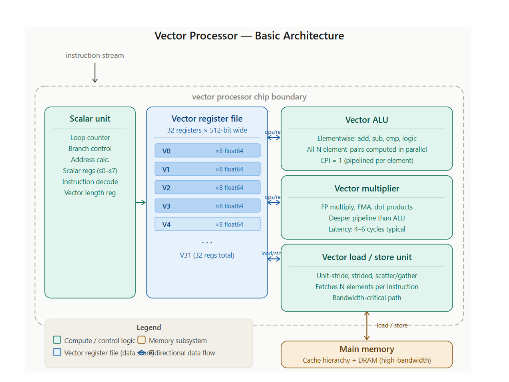

# 流水线冲突与超流水线向量处理

> 本页属于：CEG5201 / Week 04 (Chapter 3 Part 2)
> 前置知识：[[CEG5201-Week04-超标量流水线与指令级并行]]
> 预计阅读时间：9 分钟

---

## 1. 流水线三大险象与冲突消解 (Pipeline Hazards & Resolution)

在并发执行指令时，硬件资源的物理共享或数据流的不确定性会导致流水线无法在下一个时钟周期发射下一条指令，产生**流水线险象 (Hazards)**：

### 1.1 数据险象 (Data Hazards: RAW, WAR, WAW)

1. **写后读 (Read-After-Write, RAW) - 真相关 (True Dependence)**:
   - 指令 $ 需要读取指令 $ 写入的目的寄存器，但 $ 尚未完成写回。
   - 示例：
     
   - **解决策略**：硬件旁路转发（Bypassing / Forwarding）；若转发仍不能解决（如 Load-Use 延迟），则必须插入流水线气泡（Hardware Stall）。
2. **读后写 (Write-After-Read, WAR) - 反相关 (Anti-Dependence)**:
   - 指令 $ 试图覆盖指令 $ 正在读取的源寄存器。若 $ 先于 $ 写入，则 $ 读到错误的新值。
   - 发生在乱序执行（Out-of-Order）环境中。
   - **解决策略**：寄存器重命名（Register Renaming，将逻辑寄存器映射为内部物理重命名寄存器）。
3. **写后写 (Write-After-Write, WAW) - 输出相关 (Output Dependence)**:
   - 指令 $ 与指令 $ 写入同一个目的寄存器。若执行速度不一导致 $ 迟于 $ 写回，则寄存器留存了陈旧过期的值。
   - **解决策略**：重排序缓冲区（ROB）保证按程序顺序提交，或通过寄存器重命名彻底解耦。

### 1.2 结构险象 (Structural Hazards)

- 硬件功能部件不足以支持所有并发指令的同时请求。
- **经典案例**：冯·诺依曼统一内存总线架构中，取指单元（IF 阶段）需要从内存读取指令，而同一时钟周期的访存单元（MEM 阶段）需要向内存存取数据（LD/ST）。
- **解决策略**：哈佛架构（分离指令 Cache 与数据 Cache）或流水线仲裁停顿。

---

## 2. 超流水线处理器 (Superpipelined Processors)

超流水线（Superpipelining）的核心思想是将传统的单一流水级（Stage）进一步切分成 $ 个更短的微子级（Sub-stages），采用 $ 相时钟（Multiphase Clocks），使流水线的工作频率提升 $ 倍。

- 传统 4 级流水线（IF, ID, EX, WB）时钟周期为 $	au$。
- 若超流水线度数  = 3$，则基本时钟被细分为 3 个相位相差 20^\circ$ 的子时钟，每个子时钟周期仅为 $	au / 3$。
- **代价与权衡**：切分得越深，流水线寄存器（Latching Overhead）和时钟抖动（Clock Skew）在总周期中所占比例越大；同时分支预测失败时的惩罚气泡深度翻倍。

---

## 3. 向量处理器与 SIMD 计算 (Vector Processors & SIMD)

向量处理器是专为利用**数据级并行性 (Data-Level Parallelism, DLP)** 而设计的硬件架构，其单条指令可直接对整个数据向量（一维数组）执行相同的算术运算：

> **Figure Object 9**: 向量处理器经典内部体系结构  
> - 📘 **来源 (Source)**:   
> - 📍 **定位 (Locator)**: Slide 37 "Vector Processor Architecture"  
> - 💡 **解读 (Explanation)**: 展示了深流水化的向量寄存器堆（Vector Registers, 如 512 位的 VR0–VR31）、高度并行的向量流水功能部件（Vector Add, Multiply, Divide）以及支持高吞吐跨步访存（Stride Access）的向量内存控制器。  
> - 🔍 **看什么 (What to notice)**: 标量控制单元与向量执行单元并存；一条指令（如 ）即可驱动流水线连续产出 64 或 128 个结果，彻底消除循环分支跳转开销。

### 3.1 标量循环 vs 向量化执行对比

计算  = 64$ 个单精度浮点数数组相加 [i] = A[i] + B[i]$：
- **经典标量处理器**：需要执行 64 次循环迭代，每次包含数组寻址、Load A、Load B、ADD、Store C、循环变量递增以及条件跳转指令，总共约 4 	imes 6 = 384$ 条指令发射。
- **现代向量处理器 (如 AVX-512)**：使用 512 位向量寄存器（单寄存器可容纳 12/32 = 16$ 个单精度浮点数），仅需 4 次向量加载、4 次向量加法与 4 次向量写回，指令条数骤降至十几条！

### 3.2 向量分块技术 (Strip-Mining)

当待处理的向量长度 $ 超过了硬件物理向量寄存器的最大容量 {len}$ 时（例如  = 1000$ 而 {len} = 64$），编译器必须将长向量切分成若干个长度等于 {len}$ 的固定数据块（以及一个处理余数的第一块），在外部套一个控制循环：
92906	ext{Loop Count} = \left\lceil rac{N}{V_{len}} 
ight
ceil92906
这种将大向量切割为硬件原生向量大小的技术被称为**条带挖掘 (Strip-Mining)**。

---

## 4. 下一步

- 上一页：[[CEG5201-Week04-超标量流水线与指令级并行]]
- 下一页：[[CEG5201-Practice-Kai-Hwang-习题精选与解析]]
- 返回：[[CEG5201-讲义与笔记索引]]

## 来源与更新日志

- 来源： Slide 22–42
- 2026-09-18：新建流水线三大险象（RAW/WAR/WAW/结构/控制）、超流水线度数、向量处理器架构及 Strip-Mining 向量分块技术，配置 Figure Object 9。
