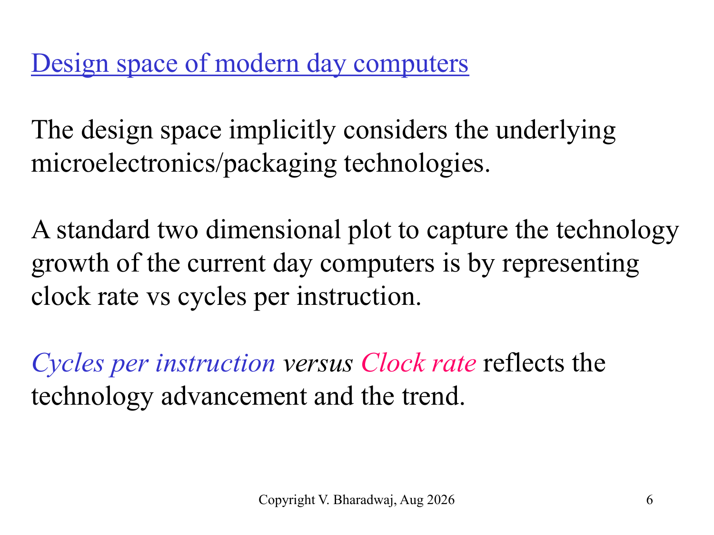

# 现代处理器设计空间与流水线基础

> 本页属于：CEG5201 / Week 04 (Chapter 3 Part 1)
> 前置知识：[[CEG5201-Week01-性能度量与可扩展性]]
> 预计阅读时间：8 分钟

---

## 1. 处理器技术演进与设计空间 (Processor Technology & Design Space)

处理器的微架构设计本质上是底层半导体制造工艺、封装散热技术与指令级并行度（ILP）之间的全局权衡。

> **Figure Object 1**: 现代计算机处理器的二维设计空间  
> - 📘 **来源 (Source)**:   
> - 📍 **定位 (Locator)**: Slide 6 "Design space of modern day computers"  
> - 💡 **解读 (Explanation)**: 以时钟周期/频率与每条指令周期数（CPI）构成的二维平面，清晰展现从经典标量处理器（Intel 486, VAX）向超标量（Superscalar）、超流水线（Superpipelined）及超流水线超标量处理器的演进轨迹。  
> - 🔍 **看什么 (What to notice)**: 经典标量处理器  \ge 1$ 且时钟基线为 $；超标量通过在一个周期发射多条指令使有效  < 1$；超流水线通过把时钟周期细分为子周期大幅拉升主频；两者结合代表了现代高性能 CPU（如 Intel Core, AMD Zen, Apple M 系列）的设计高地。

### 1.1 摩尔定律与功耗墙 (Moore's Law & Power Wall)

- **摩尔定律 (Moore's Law)**：每 8 \sim 24$ 个月，集成电路上可容纳的晶体管数目翻倍。
- **动态功耗模型 (Dynamic Power Model)**：
  92869P_{dynamic} = C \cdot V^2 \cdot f92869
  其中 $ 为有效负载电容 (Capacitance)，$ 为供电工作电压 (Supply Voltage)，$ 为时钟频率 (Clock Frequency)。
- **登纳德缩放定律失效 (Dennard Scaling Breakdown)**：在 2005 年之前，随着晶体管缩小，电压 $ 可以同步降低，使得在功耗密度不变的情况下大幅拉升频率 $。但当纳米制程进入亚微米和纳米级别后，漏电流（Leakage Current）与静态功耗激增，电压无法继续无限制降低，触碰了**功耗墙 (Power Wall)**。单核频率瓶颈停滞在  \sim 5	ext{ GHz}$，迫使体系结构转向多核并行与深层次指令流水线优化。

---

## 2. 处理器分类体系 (Taxonomy of Modern Processors)

根据指令发射率（Issue Rate）与流水线时钟机制，现代通用处理器分为四大类：

1. **基本标量处理器 (Base Scalar Processors)**:
   - 每个时钟周期最多发射 1 条指令（Issue Rate $= 1$）。
   - 指令执行需要固定的流水线周期，在无冲突理想状态下  = 1$。经典代表：Intel 80486, Motorola 68040, MIPS R2000。
2. **超标量处理器 (Superscalar Processors)**:
   - 具备多个独立的执行单元（ALU, FPU, Load/Store），每个时钟周期可以**并发发射多条独立指令**。
   - 超标量度数（Degree of Superscaling）记为 $（例如 =4$ 表示 4-way 超标量），理想情况下每个时钟周期完成 $ 条指令， = 1/m < 1$。
3. **超流水线处理器 (Superpipelined Processors)**:
   - 将传统的流水线执行阶段（如译码、执行、访存）进一步细切为 $ 个更短的微流水级。
   - 使用多相时钟（Multiphase Clocks），时钟周期缩短为基本周期的 /n$，超流水线度数记为 $。
4. **超流水线超标量处理器 (Superpipelined Superscalar Processors)**:
   - 结合两者：每个时钟子周期发射 $ 条指令，具有 $ 度超流水线深度，在每个基本时钟周期内最多可处理  	imes n$ 条指令。

---

## 3. 流水线核心时序参数 (Pipeline Metrics & Terminology)

根据 Kai Hwang 教材及课程定义，评估指令流水线有三个关键时序指标：

1. **指令流水线周期 (Instruction Pipeline Cycle, $	au$)**:
   - 处理器流水线单个时序阶段的时钟周期（Clock Period）。对于基本标量机，$	au$ 等于机频周期；对于度数为 $ 的超流水线机，子周期 $	au = \Delta t / n$。
2. **指令发射延迟 (Instruction Issue Latency, $)**:
   - 连续两条相邻指令被发射到流水线之间的最短等待时钟周期数。
   - 若发射延迟  = 1$，说明流水线每个周期都可以无缝发射新指令。
3. **指令发射率 (Instruction Issue Rate, $)**:
   - 每个时钟周期能够发射到流水线中的指令条数。对于 $ 路超标量机， = m$ 条指令/周期。

---

## 4. 下一步

- 上一页：[[CEG5201-Week03-RC粒度比与性能模型]]
- 下一页：[[CEG5201-Week04-CISC微程序与RISC硬布线控制]]
- 返回：[[CEG5201-讲义与笔记索引]]

## 来源与更新日志

- 来源： Slide 1–17
- 2026-09-18：新建 Chapter 3 现代处理器设计空间、功耗模型与流水线核心指标，配置 Figure Object 1。
