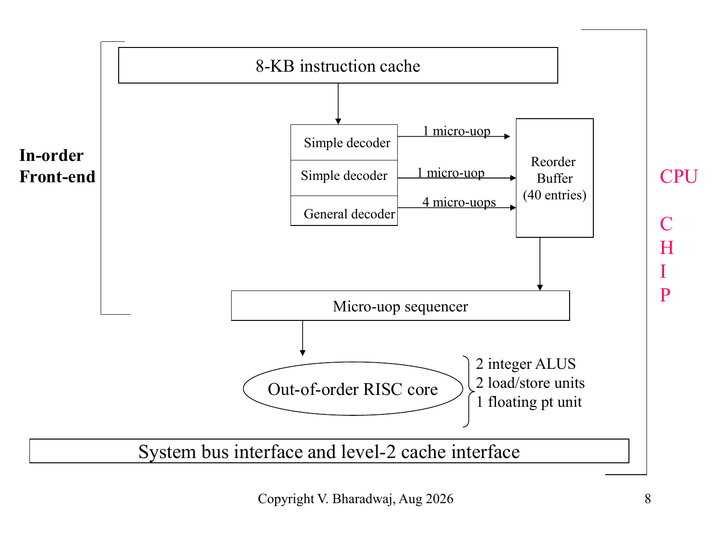
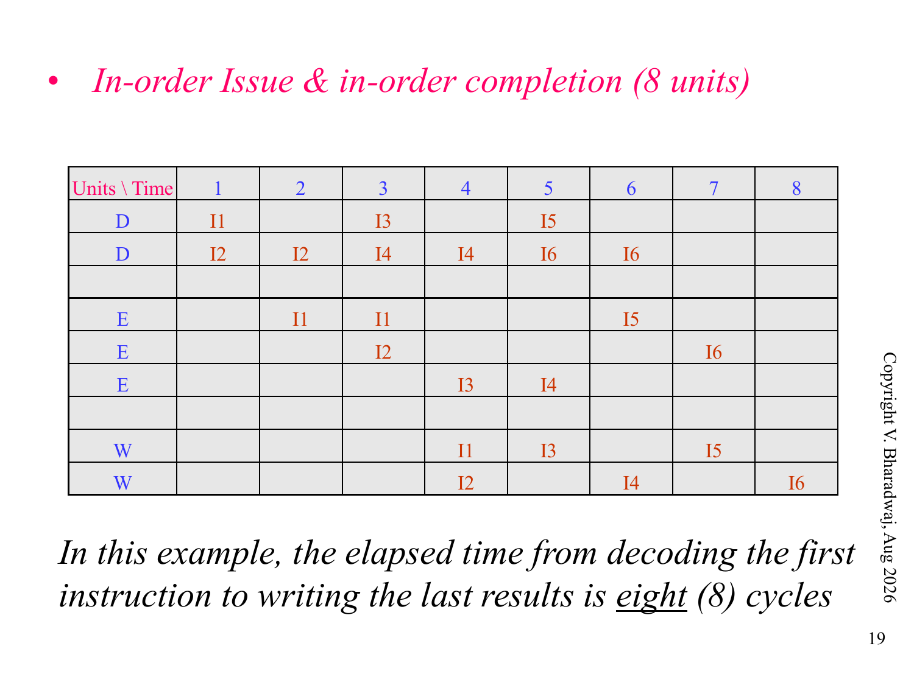
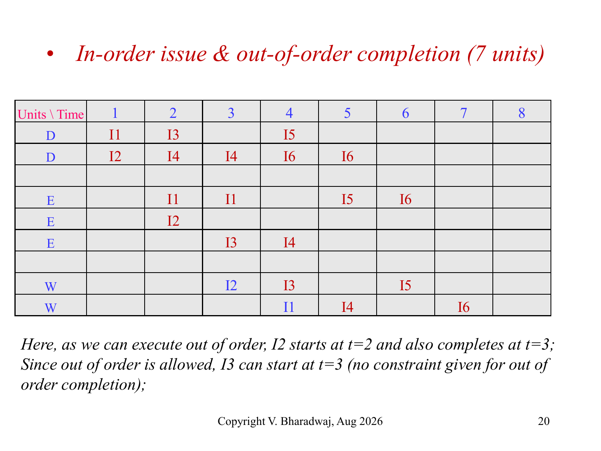
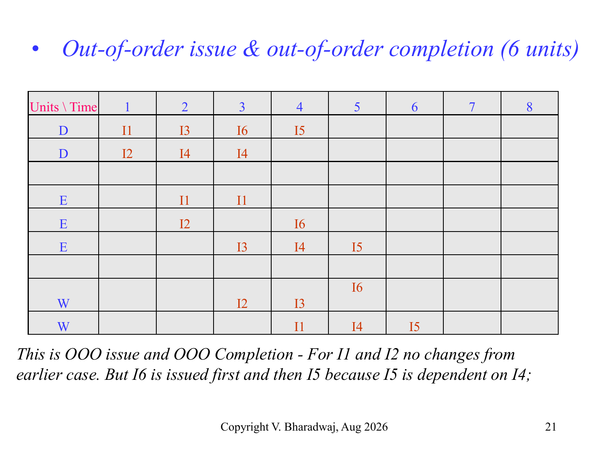

# 超标量流水线与指令级并行

> 本页属于：CEG5201 / Week 04 (Chapter 3 Part 2)
> 前置知识：[[CEG5201-Week04-CISC微程序与RISC硬布线控制]]
> 预计阅读时间：9 分钟

---

## 1. 超标量与解耦 CISC/RISC 架构 (Decoupled CISC/RISC Architecture)

现代高性能处理器（如 Intel Core, AMD Zen）在外部指令集架构（ISA）上保留了庞大的 x86 CISC 兼容性，但在芯片内部微架构上，完全采用了**解耦超标量 RISC 内核 (Decoupled CISC/RISC Architecture)**：

> **Figure Object 5**: Intel Pentium 经典解耦微架构  
> - 📘 **来源 (Source)**:   
> - 📍 **定位 (Locator)**: Slide 8 "Intel Pentium Decoupled CISC/RISC Architecture"  
> - 💡 **解读 (Explanation)**: 展示了指令高速缓存（8-KB I-Cache）、简单译码器与通用译码器、微操作定序器（Micro-uop sequencer）、40 项重排序缓冲区（Reorder Buffer, ROB）以及 5 路乱序执行流水线。  
> - 🔍 **看什么 (What to notice)**: 前端顺序取指并把复杂的 CISC 指令拆解为多个定长的**微操作 (Micro-ops, µops)**；后端的执行引擎则完全是一个纯粹的超标量 RISC 架构，支持 µops 的乱序调度、乱序执行与按序提交退休（Retirement），彻底解放硬件并行度。

---

## 2. 发射与完成的三种时序模型 (Three Issue & Completion Models)

评估超标量流水线的执行效率，取决于指令在调度发射（Issue）阶段与写回提交（Completion）阶段的有序性。对于包含 6 条指令（部分指令需要 2 个执行周期，部分需要 1 个）的典型程序片段，三种模型的时空调度对比极为深刻：

### 2.1 顺序发射 + 顺序完成 (In-Order Issue & In-Order Completion)

> **Figure Object 6**: 顺序发射与顺序完成时序图（耗时 8 个时间单位）  
> - 📘 **来源 (Source)**:   
> - 📍 **定位 (Locator)**: Slide 19 "In-order Issue & in-order completion (8 units)"  
> - 💡 **解读 (Explanation)**: 指令必须严格按照程序代码原本的书写顺序依次发射；并且即使某条后序指令已经执行完毕，只要前面的先序指令尚未写回，后序指令就必须停顿等待，按序写回寄存器。  
> - 🔍 **看什么 (What to notice)**: 总耗时高达 **8 个时间单位**。为了保证顺序完成，流水线在发生执行单元冲突或等待长周期指令时会产生大量流水线气泡（Stall）。

### 2.2 顺序发射 + 乱序完成 (In-Order Issue & Out-of-Order Completion)

> **Figure Object 7**: 顺序发射与乱序完成时序图（耗时 7 个时间单位）  
> - 📘 **来源 (Source)**:   
> - 📍 **定位 (Locator)**: Slide 20 "In-order issue & out-of-order completion (7 units)"  
> - 💡 **解读 (Explanation)**: 指令仍然按序发射，但一旦某条执行耗时短的指令计算完毕，允许立刻写回结果（Writeback），无需等待前面的长指令完成。  
> - 🔍 **看什么 (What to notice)**: 总耗时缩短至 **7 个时间单位**。但允许乱序完成引入了新的写后写（WAW）和读后写（WAR）反相关险象风险，必须由硬件寄存器重命名等机制保证语义正确。

### 2.3 乱序发射 + 乱序完成 (Out-of-Order Issue & Out-of-Order Completion)

> **Figure Object 8**: 乱序发射与乱序完成时序图（耗时 6 个时间单位）  
> - 📘 **来源 (Source)**:   
> - 📍 **定位 (Locator)**: Slide 21 "Out-of-order issue & out-of-order completion (6 units)"  
> - 💡 **解读 (Explanation)**: 现代高性能 Tomasulo 算法的完整形态。指令进入保留站（Reservation Stations）后，只要其源操作数就绪且执行单元空闲，即可立刻发射执行，完全打破程序文本顺序。  
> - 🔍 **看什么 (What to notice)**: 总耗时压降至仅需 **6 个时间单位**（性能相比纯按序提升 3\%$）。最后由重排序缓冲区（ROB）在架构提交阶段保证精确异常（Precise Exception）。

---

## 3. 三种执行模型性能对比表

| 执行与调度模型 | 发射约束 (Issue) | 完成约束 (Completion) | 硬件复杂度 | 消除的数据相关 | 典型耗时 (标准算例) |
| :--- | :--- | :--- | :--- | :--- | :---: |
| **In-Order / In-Order** | 严格程序顺序 | 严格程序顺序 | 最低 | 无（遇相关则全停顿） | **8 units** |
| **In-Order / OOO** | 严格程序顺序 | 任意先就绪先写回 | 中等 | 避免由于不同执行延迟引起的队头阻塞 | **7 units** |
| **OOO / OOO (动态调度)**| 数据就绪即发射 | 任意先就绪先写回 | 极高（ROB, 保留站, 寄存器重命名） | 完全消除 WAR 与 WAW 假相关，最大化挖掘 ILP | **6 units** |

---

## 4. 下一步

- 上一页：[[CEG5201-Week04-CISC微程序与RISC硬布线控制]]
- 下一页：[[CEG5201-Week04-流水线冲突与超流水线向量处理]]
- 返回：[[CEG5201-讲义与笔记索引]]

## 来源与更新日志

- 来源： Slide 1–21
- 2026-09-18：新建超标量解耦微架构、Pentium µops 机制以及三种指令调度时空图对比，注入 Figure Objects 5, 6, 7, 8。
