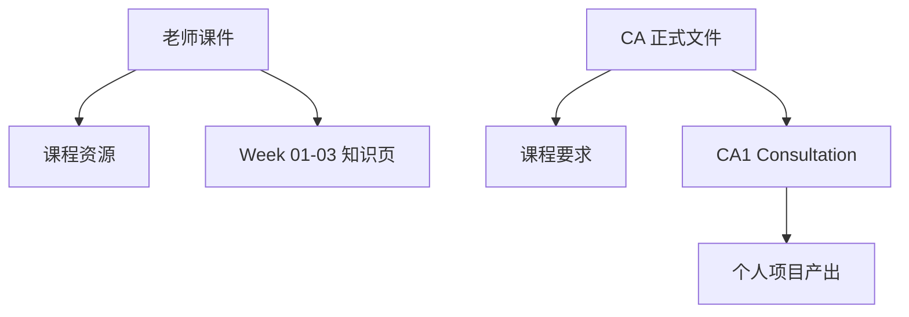

# CEG5201 课程总览

> 本页属于：CEG5201 课程入口
>
> 前置知识：无
>
> 预计阅读时间：5 分钟

## 课程范围

本课程资料围绕现代计算体系结构、并行编程、互连网络以及后续 CA 项目展开。当前 Wiki 只整理到 Week 03 已有讲义；课程目录显示目前进入 Week 04。

| 项目 | 当前状态 |
|---|---|
| 课程进度 | Week 04 |
| 讲义覆盖 | Week 01–03，已按主题拆页 |
| 当前 assessment | CA1 |
| 材料版本 | AY2026/27 |

!!! WARNING
**当前核实边界：**Week 04 及以后尚未进入知识页面；CA1 的渠道、文件命名和地点变更仍需以 Canvas 最新公告为准。

## 资料与页面关系

图 1：CEG5201 页面关系（自制，依据课程文件整理；2026-09-01）。

## 当前状态

- 已有 Lecture 01–03 个人笔记，可用于定位复习重点。
- 正式课程要求、CA1/CA2 细节已从现有文件建立索引；Canvas 新公告仍需持续核实。
- Week 04 及以后不在本批知识页范围内。
- `3_Discussions/` 和 `CA1/` 后续按实际出现的文件和产出增量归档。

## 快速入口

- [[CEG5201-课程资源总览]]：老师课件、CA 文件、Canvas 与工具入口。
- [[CEG5201-课程要求与截止日期]]：权重、时间线、提交物和 Open Questions。
- [[CEG5201-CA1-Consultation-总览]]：项目要求、Topics Guide、问题与教师答复。
- [[CEG5201-讲义与笔记索引]]：以老师讲义为准的 Week 01–03 主题拆分页。

## 来源

- [GitHub Release CEG5201](https://github.com/Kytolly/NUS-coursework-wiki/releases/tag/CEG5201)（PDF 原件下载；2026-09-01）
- 本地 `D:\Desktop\xqy\NUS\CEG5201\list.md` 仅用于本机核对。
- 本地 `1_LectureSlides/`、`2_CA_Documents/` 为本机原文件目录，已在公开页面改为提供在线原件链接。

## 下一步

- 上一页：[[Home]]
- 下一页：[[CEG5201-课程资源总览]]
- 返回：[[Home]]

## 更新日志

- 2026-09-01：建立课程入口并记录 Week 04 当前状态。
