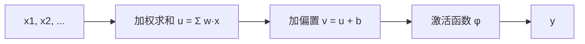

# 生物神经元与数学模型

> 本页属于：CEG5301 / Week 01
> 前置知识：[[CEG5301-讲义与笔记索引]]
> 预计阅读时间：3 分钟

## 结构与行为

生物神经元由**细胞体（cell body）**、**树突（dendrites）**（发状输入通道）、**轴突（axon）**（输出电缆，常分叉）组成。它接受许多来源的电气冲动，**有些兴奋、有些抑制**；兴奋足够就“放电”，沿轴突发脉冲（spike）影响其他神经元。放电是**带电离子**经细胞膜**分子门**进出轴突、局部改变膜电位形成的**动作电位（action potential）**。

## 全或无原则与放电频率

**全或无（all-or-none）**：要么放电要么不放电，无“弱 / 强放电”。刺激强度更大，产出的不是更强信号，而是**每秒更多脉冲（更高放电频率）**。

> 类比：按蜂鸣器——按轻按重都只响一下，但按得越急，响的次数越多。

## 突触与突触可塑性

**突触（synapse）**是轴突末端与树突间的**小间隙**，是神经元相互作用的**基本单元**，可施加**兴奋或抑制**。机制：释放化学信号到间隙 → 作用于接收细胞 → 分子门开、离子进出 → 局部电位改变。

**突触可塑性（synaptic plasticity）**指连接（突触）**强度可变**，这是**学习**的物理基础。

## 神经元的数学模型

模型是现实的近似，先从最简单开始。神经元树突多、轴突一个，最自然的想法是对输入求和：

```
y = Σ_i x_i
```

若 x_i 是 0/1 尖峰，和总是**正**——神经元几乎总在放电；m 很大时输出可很大，意味着“强 / 弱放电”，违背**全或无**。加入**阈值（偏置）b**：用**阶跃函数**输出 1 或 0，“不够高就不放电”，是**非线性**的。

求和不能表示“抑制”（输入不能为负），于是引入**突触权重 w_j**：负=抑制，正=兴奋。模型为：

```
y = φ( Σ_j w_j x_j − b )
```

三个基本部分：**(1) 突触（连接）**带权重；**(2) 加法器**（线性组合器）加权求和；**(3) 激活函数**限制输出幅值（常限到 [0,1] 或 [-1,1]）。

对神经元 k：

```
u_k = Σ_j w_kj x_j     （线性组合器输出）
v_k = u_k + b_k        （诱导局部场）
y_k = φ(v_k)           （神经元输出）
```

**v_k 为诱导局部场（induced local field）** = 其他神经元诱导的电位 + 背景电位。



## 模型三基本部分：参数表

| 部分 | 数学量 | 作用 |
|---|---|---|
| 突触/连接 | 权重 w_kj | 表示兴奋（正）或抑制（负）；负权可抑制放电 |
| 加法器（线性组合器） | u_k = Σ_j w_kj x_j | 对输入信号加权求和 |
| 激活函数 | φ(·) | 限制输出幅值，如 [0,1] 或 [-1,1]（One 第 44 页） |
| 偏置 | b_k | 阈值/背景电位，决定“多高才放电”（One 第 41、45 页） |


> 图注：来源 CEG5301_One.pdf 第 44 页；核对 2026-09-07。

## 数值示例：两输入神经元

令诱导局部场采用 `v = w₁x₁ + w₂x₂ + b`，阈值在 0，激活取阶跃 `φ(v)=1（v≥0），否则 0`。取 `w₁=0.5`、`w₂=-0.3`（负权表示抑制）、`b=0.2`：

- 输入 `x=(1,1)`：`u = 0.5×1 + (-0.3)×1 = 0.2`，`v = u + b = 0.4` → `y = 1`（放电）。
- 输入 `x=(0,1)`：`u = -0.3`，`v = -0.1` → `y = 0`（不放电）。
- 输入 `x=(1,0)`：`u = 0.5`，`v = 0.7` → `y = 1`。

可见负权重能把本来“正的求和”拉低到阈值以下，从而**抑制**神经元放电；这正是只用 `y=Σxᵢ`、输入不能为负时所无法建模的（One 第 40–43 页）。

> 图注：自绘，依据 CEG5301_One 第 38–45 页；核对 2026-09-07。

## 下一步

- 上一页：[[CEG5301-Week01-为什么需要神经网络]]
- 下一页：[[CEG5301-Week01-激活函数与网络结构]]
- 返回：[[Home]]

## 来源与更新日志

- 来源：[CEG5301_One.pdf](https://github.com/Kytolly/NUS-coursework-wiki/releases/download/CEG5301/CEG5301_One.pdf)，slide 28–45。
- 2026-09-07：从 Week 1 课件拆出该主题短页。
- 2026-09-07：补齐正文至约 700–1000 字；新增三基本部分参数表、两输入神经元数值示例，并嵌入原图 fig-001（CEG5301_One 第 44 页）。
